# Projects and dependencies analysis

This document provides a comprehensive overview of the projects and their dependencies in the context of upgrading to .NETCoreApp,Version=v10.0.

## Table of Contents

- [Executive Summary](#executive-Summary)
  - [Highlevel Metrics](#highlevel-metrics)
  - [Projects Compatibility](#projects-compatibility)
  - [Package Compatibility](#package-compatibility)
  - [API Compatibility](#api-compatibility)
- [Aggregate NuGet packages details](#aggregate-nuget-packages-details)
- [Top API Migration Challenges](#top-api-migration-challenges)
  - [Technologies and Features](#technologies-and-features)
  - [Most Frequent API Issues](#most-frequent-api-issues)
- [Projects Relationship Graph](#projects-relationship-graph)
- [Project Details](#project-details)

  - [Chapter03\A_WebApplication1\WebApplication1\WebApplication1.csproj](#chapter03a_webapplication1webapplication1webapplication1csproj)
  - [Chapter03\B_WebApplication1Extended\WebApplication1Extended\WebApplication1Extended.csproj](#chapter03b_webapplication1extendedwebapplication1extendedwebapplication1extendedcsproj)
  - [Chapter03\My_Application\MyApplication.csproj](#chapter03my_applicationmyapplicationcsproj)
  - [Chapter04\A_CreatingAHoldingPage\CreatingAHoldingPage\CreatingAHoldingPage.csproj](#chapter04a_creatingaholdingpagecreatingaholdingpagecreatingaholdingpagecsproj)
  - [Chapter04\B_CreatingAStaticFileWebsite\CreatingAStaticFileWebsite\CreatingAStaticFileWebsite.csproj](#chapter04b_creatingastaticfilewebsitecreatingastaticfilewebsitecreatingastaticfilewebsitecsproj)
  - [Chapter04\C_SimpleMinimalApisApplication\SimpleMinimalApisApplication\SimpleMinimalApisApplication.csproj](#chapter04c_simpleminimalapisapplicationsimpleminimalapisapplicationsimpleminimalapisapplicationcsproj)
  - [Chapter04\D_MinimalApisAndWelcomePage\MinimalApisAndWelcomePage\MinimalApisAndWelcomePage.csproj](#chapter04d_minimalapisandwelcomepageminimalapisandwelcomepageminimalapisandwelcomepagecsproj)
  - [Chapter04\E_DeveloperExceptionPage\DeveloperExceptionPage\DeveloperExceptionPage.csproj](#chapter04e_developerexceptionpagedeveloperexceptionpagedeveloperexceptionpagecsproj)
  - [Chapter04\F_ExceptionHandlerMidleware\ExceptionHandlerMidleware\ExceptionHandlerMidleware.csproj](#chapter04f_exceptionhandlermidlewareexceptionhandlermidlewareexceptionhandlermidlewarecsproj)
  - [Chapter05\A_BlazorWebAssemblyProject\BlazorWebAssemblyProject\BlazorWebAssemblyProject.csproj](#chapter05a_blazorwebassemblyprojectblazorwebassemblyprojectblazorwebassemblyprojectcsproj)
  - [Chapter05\B_BasicRoutingMinimalApi\BasicRoutingMinimalApi\BasicRoutingMinimalApi.csproj](#chapter05b_basicroutingminimalapibasicroutingminimalapibasicroutingminimalapicsproj)
  - [Chapter05\C_MultipleVerbMinimalApi\MultipleVerbMinimalApi\MultipleVerbMinimalApi.csproj](#chapter05c_multipleverbminimalapimultipleverbminimalapimultipleverbminimalapicsproj)
  - [Chapter05\D_MultipleVerbMinimalApiWithStatusCodes\MultipleVerbMinimalApiWithStatusCodes\MultipleVerbMinimalApiWithStatusCodes.csproj](#chapter05d_multipleverbminimalapiwithstatuscodesmultipleverbminimalapiwithstatuscodesmultipleverbminimalapiwithstatuscodescsproj)
  - [Chapter05\E_MultipleVerbMinimalApiWithProblemDetails\MultipleVerbMinimalApiWithProblemDetails\MultipleVerbMinimalApiWithProblemDetails.csproj](#chapter05e_multipleverbminimalapiwithproblemdetailsmultipleverbminimalapiwithproblemdetailsmultipleverbminimalapiwithproblemdetailscsproj)
  - [Chapter05\F_MinimalApiWithAutoProblemDetails\MinimalApiWithAutoProblemDetails\MinimalApiWithAutoProblemDetails.csproj](#chapter05f_minimalapiwithautoproblemdetailsminimalapiwithautoproblemdetailsminimalapiwithautoproblemdetailscsproj)
  - [Chapter05\G_MinimalApiFilters\MinimalApiFilters\MinimalApiFilters.csproj](#chapter05g_minimalapifiltersminimalapifiltersminimalapifilterscsproj)
  - [Chapter05\H_MinimalApiRouteGroups\MinimalApiRouteGroups\MinimalApiRouteGroups.csproj](#chapter05h_minimalapiroutegroupsminimalapiroutegroupsminimalapiroutegroupscsproj)
  - [Chapter06\A_RoutingExample\RoutingExample\RoutingExample.csproj](#chapter06a_routingexampleroutingexampleroutingexamplecsproj)
  - [Chapter06\B_RouteOptionsExample\RouteOptionsExample\RouteOptionsExample.csproj](#chapter06b_routeoptionsexamplerouteoptionsexamplerouteoptionsexamplecsproj)
  - [Chapter07\A_BasicModelBinding\BasicModelBinding\BasicModelBinding.csproj](#chapter07a_basicmodelbindingbasicmodelbindingbasicmodelbindingcsproj)
  - [Chapter07\B_ValidatingWithDataAnnotations\ValidatingWithDataAnnotations\ValidatingWithDataAnnotations.csproj](#chapter07b_validatingwithdataannotationsvalidatingwithdataannotationsvalidatingwithdataannotationscsproj)
  - [Chapter08\A_SendingAnEmailWithoutDI\SendingAnEmailWithoutDI\SendingAnEmailWithoutDI.csproj](#chapter08a_sendinganemailwithoutdisendinganemailwithoutdisendinganemailwithoutdicsproj)
  - [Chapter08\B_SendingAnEmailWithDI\SendingAnEmailWithDI\SendingAnEmailWithDI.csproj](#chapter08b_sendinganemailwithdisendinganemailwithdisendinganemailwithdicsproj)
  - [Chapter09\A_SendingAnEmailWithDI\SendingAnEmailWithDI\SendingAnEmailWithDI.csproj](#chapter09a_sendinganemailwithdisendinganemailwithdisendinganemailwithdicsproj)
  - [Chapter09\B_InjectingMultipleImplementations\InjectingMultipleImplementations\InjectingMultipleImplementations.csproj](#chapter09b_injectingmultipleimplementationsinjectingmultipleimplementationsinjectingmultipleimplementationscsproj)
  - [Chapter09\C_LifetimeExamples\LifetimeExamples\LifetimeExamples.csproj](#chapter09c_lifetimeexampleslifetimeexampleslifetimeexamplescsproj)
  - [Chapter10\A_StoreViewerApplication\StoreViewerApplication\StoreViewerApplication.csproj](#chapter10a_storeviewerapplicationstoreviewerapplicationstoreviewerapplicationcsproj)
  - [Chapter10\B_DesigningForAutomaticBinding\DesigningForAutomaticBinding\DesigningForAutomaticBinding.csproj](#chapter10b_designingforautomaticbindingdesigningforautomaticbindingdesigningforautomaticbindingcsproj)
  - [Chapter10\C_ReplacingTheDefaultProviders\ReplacingTheDefaultProviders\ReplacingTheDefaultProviders.csproj](#chapter10c_replacingthedefaultprovidersreplacingthedefaultprovidersreplacingthedefaultproviderscsproj)
  - [Chapter10\D_UsingDifferentEnvironments\UsingDifferentEnvironments\UsingDifferentEnvironments.csproj](#chapter10d_usingdifferentenvironmentsusingdifferentenvironmentsusingdifferentenvironmentscsproj)
  - [Chapter11\A_OpenApiExample_Swashbuckle\OpenApiExample\OpenApiExample.csproj](#chapter11a_openapiexample_swashbuckleopenapiexampleopenapiexamplecsproj)
  - [Chapter11\B_OpenApiExample_Nswag\OpenApiExample\OpenApiExample.csproj](#chapter11b_openapiexample_nswagopenapiexampleopenapiexamplecsproj)
  - [Chapter11\C_GeneratingOpenApiClient\ConsoleClient\ConsoleClient.csproj](#chapter11c_generatingopenapiclientconsoleclientconsoleclientcsproj)
  - [Chapter11\C_GeneratingOpenApiClient\OpenApiExample\OpenApiExample.csproj](#chapter11c_generatingopenapiclientopenapiexampleopenapiexamplecsproj)
  - [Chapter11\D_CustomisingGeneration\ConsoleClient\ConsoleClient.csproj](#chapter11d_customisinggenerationconsoleclientconsoleclientcsproj)
  - [Chapter11\D_CustomisingGeneration\OpenApiExample\OpenApiExample.csproj](#chapter11d_customisinggenerationopenapiexampleopenapiexamplecsproj)
  - [Chapter11\E_AddingDescriptions\ConsoleClient\ConsoleClient.csproj](#chapter11e_addingdescriptionsconsoleclientconsoleclientcsproj)
  - [Chapter11\E_AddingDescriptions\OpenApiExample\OpenApiExample.csproj](#chapter11e_addingdescriptionsopenapiexampleopenapiexamplecsproj)
  - [Chapter12\A_InstallEFCore\RecipeApplication\RecipeApplication.csproj](#chapter12a_installefcorerecipeapplicationrecipeapplicationcsproj)
  - [Chapter12\B_Migrate_LocalDb\RecipeApplication\RecipeApplication.csproj](#chapter12b_migrate_localdbrecipeapplicationrecipeapplicationcsproj)
  - [Chapter12\C_Migrate_SQLite\RecipeApplication\RecipeApplication.csproj](#chapter12c_migrate_sqliterecipeapplicationrecipeapplicationcsproj)
  - [Chapter12\D_RecipeApplication_LocalDb\RecipeApplication\RecipeApplication.csproj](#chapter12d_recipeapplication_localdbrecipeapplicationrecipeapplicationcsproj)
  - [Chapter12\E_RecipeApplication_SQLite\RecipeApplication\RecipeApplication.csproj](#chapter12e_recipeapplication_sqliterecipeapplicationrecipeapplicationcsproj)
  - [Chapter13\A_WebApplication1\WebApplication1\WebApplication1.csproj](#chapter13a_webapplication1webapplication1webapplication1csproj)
  - [Chapter13\B_ATypicalRazorPage\ATypicalRazorPage\ATypicalRazorPage.csproj](#chapter13b_atypicalrazorpageatypicalrazorpageatypicalrazorpagecsproj)
  - [Chapter14\A_RoutingExamples\RoutingExamples\RoutingExamples.csproj](#chapter14a_routingexamplesroutingexamplesroutingexamplescsproj)
  - [Chapter14\B_ChangingConventions\ChangingConventions\ChangingConventions.csproj](#chapter14b_changingconventionschangingconventionschangingconventionscsproj)
  - [Chapter15\A_PageHandlers\PageHandlers\PageHandlers.csproj](#chapter15a_pagehandlerspagehandlerspagehandlerscsproj)
  - [Chapter15\B_StatusCodePages\StatusCodePages\StatusCodePages.csproj](#chapter15b_statuscodepagesstatuscodepagesstatuscodepagescsproj)
  - [Chapter15\C_StatusCodePagesWithReExecute\StatusCodePagesWithReExecute\StatusCodePagesWithReExecute.csproj](#chapter15c_statuscodepageswithreexecutestatuscodepageswithreexecutestatuscodepageswithreexecutecsproj)
  - [Chapter15\D_StatusCodePagesWithReExecuteRazorPages\StatusCodePagesWithReExecuteRazorPages\StatusCodePagesWithReExecuteRazorPages.csproj](#chapter15d_statuscodepageswithreexecuterazorpagesstatuscodepageswithreexecuterazorpagesstatuscodepageswithreexecuterazorpagescsproj)
  - [Chapter15\E_StatusCodePagesWithRedirectRazorPages\StatusCodePagesWithRedirectRazorPages\StatusCodePagesWithRedirectRazorPages.csproj](#chapter15e_statuscodepageswithredirectrazorpagesstatuscodepageswithredirectrazorpagesstatuscodepageswithredirectrazorpagescsproj)
  - [Chapter16\A_ToDoList\ToDoList\ToDoList.csproj](#chapter16a_todolisttodolisttodolistcsproj)
  - [Chapter16\B_ExampleBinding_EditProduct\ExampleBinding\ExampleBinding.csproj](#chapter16b_examplebinding_editproductexamplebindingexamplebindingcsproj)
  - [Chapter16\C_ExampleBinding_Calculator\ExampleCalculatorBinding\ExampleCalculatorBinding.csproj](#chapter16c_examplebinding_calculatorexamplecalculatorbindingexamplecalculatorbindingcsproj)
  - [Chapter16\D_SimpleCurrencyConverterBindings\SimpleCurrencyConverterBindings\SimpleCurrencyConverterBindings.csproj](#chapter16d_simplecurrencyconverterbindingssimplecurrencyconverterbindingssimplecurrencyconverterbindingscsproj)
  - [Chapter16\E_ListBinding\ListBinding\ListBinding.csproj](#chapter16e_listbindinglistbindinglistbindingcsproj)
  - [Chapter16\F_ValidatingWithDataAnnotations\ValidatingWithDataAnnotations\ValidatingWithDataAnnotations.csproj](#chapter16f_validatingwithdataannotationsvalidatingwithdataannotationsvalidatingwithdataannotationscsproj)
  - [Chapter16\G_CurrencyConverter\CurrencyConverter\CurrencyConverter.csproj](#chapter16g_currencyconvertercurrencyconvertercurrencyconvertercsproj)
  - [Chapter16\H_RazorPageFormLayout\RazorPageFormLayout\RazorPageFormLayout.csproj](#chapter16h_razorpageformlayoutrazorpageformlayoutrazorpageformlayoutcsproj)
  - [Chapter17\A_ManageUsers\ManageUsers\ManageUsers.csproj](#chapter17a_manageusersmanageusersmanageuserscsproj)
  - [Chapter17\B_DyamicHtml\DyamicHtml\DyamicHtml.csproj](#chapter17b_dyamichtmldyamichtmldyamichtmlcsproj)
  - [Chapter17\C_ToDoList\ToDoList\ToDoList.csproj](#chapter17c_todolisttodolisttodolistcsproj)
  - [Chapter17\D_NestedLayouts\NestedLayouts\NestedLayouts.csproj](#chapter17d_nestedlayoutsnestedlayoutsnestedlayoutscsproj)
  - [Chapter17\E_PartialViews\PartialViews\PartialViews.csproj](#chapter17e_partialviewspartialviewspartialviewscsproj)
  - [Chapter18\A_CurrencyConverter\CurrencyConverter\CurrencyConverter.csproj](#chapter18a_currencyconvertercurrencyconvertercurrencyconvertercsproj)
  - [Chapter18\B_TagHelpers\TagHelpers\TagHelpers.csproj](#chapter18b_taghelperstaghelperstaghelperscsproj)
  - [Chapter18\C_SelectLists\SelectLists\SelectLists.csproj](#chapter18c_selectlistsselectlistsselectlistscsproj)
  - [Chapter18\D_EnvironmentTag\EnvironmentTag\EnvironmentTag.csproj](#chapter18d_environmenttagenvironmenttagenvironmenttagcsproj)
  - [Chapter19\A_WebApplication1\WebApplication1\WebApplication1.csproj](#chapter19a_webapplication1webapplication1webapplication1csproj)
  - [Chapter19\B_FindingAView\FindingAView\FindingAView.csproj](#chapter19b_findingaviewfindingaviewfindingaviewcsproj)
  - [Chapter20\A_DefaultWebApiProject\DefaultWebApiProject\DefaultWebApiProject.csproj](#chapter20a_defaultwebapiprojectdefaultwebapiprojectdefaultwebapiprojectcsproj)
  - [Chapter20\B_BasicWebApiProject\BasicWebApiProject\BasicWebApiProject.csproj](#chapter20b_basicwebapiprojectbasicwebapiprojectbasicwebapiprojectcsproj)
  - [Chapter20\C_ApiControllerAttribute\ApiControllerAttribute\ApiControllerAttribute.csproj](#chapter20c_apicontrollerattributeapicontrollerattributeapicontrollerattributecsproj)
  - [Chapter20\D_ProblemDetailsExample\ProblemDetailsExample\ProblemDetailsExample.csproj](#chapter20d_problemdetailsexampleproblemdetailsexampleproblemdetailsexamplecsproj)
  - [Chapter20\E_CarsWebApi\CarsWebApi\CarsWebApi.csproj](#chapter20e_carswebapicarswebapicarswebapicsproj)
  - [Chapter22\A_FilterPipelineExample\FilterPipelineExample\FilterPipelineExample.csproj](#chapter22a_filterpipelineexamplefilterpipelineexamplefilterpipelineexamplecsproj)
  - [Chapter22\B_RecipeApplication\RecipeApplication\RecipeApplication.csproj](#chapter22b_recipeapplicationrecipeapplicationrecipeapplicationcsproj)
  - [Chapter23\A_DefaultTemplate_LocalDB\DefaultTemplate\DefaultTemplate.csproj](#chapter23a_defaulttemplate_localdbdefaulttemplatedefaulttemplatecsproj)
  - [Chapter23\B_DefaultTemplate_SQLite\DefaultTemplate\DefaultTemplate.csproj](#chapter23b_defaulttemplate_sqlitedefaulttemplatedefaulttemplatecsproj)
  - [Chapter23\C_RecipeApplication_SQLite\RecipeApplication\RecipeApplication.csproj](#chapter23c_recipeapplication_sqliterecipeapplicationrecipeapplicationcsproj)
  - [Chapter23\D_RecipeApp_Identity_SQLite\RecipeApplication\RecipeApplication.csproj](#chapter23d_recipeapp_identity_sqliterecipeapplicationrecipeapplicationcsproj)
  - [Chapter23\E_RecipeApp_NameClaim_SQLite\RecipeApplication\RecipeApplication.csproj](#chapter23e_recipeapp_nameclaim_sqliterecipeapplicationrecipeapplicationcsproj)
  - [Chapter24\A_Airport\Airport\Airport.csproj](#chapter24a_airportairportairportcsproj)
  - [Chapter24\B_RecipeApp_Identity_SQLite\RecipeApplication\RecipeApplication.csproj](#chapter24b_recipeapp_identity_sqliterecipeapplicationrecipeapplicationcsproj)
  - [Chapter25\A_RecipeApi_Auth_SQLite\RecipeApi\RecipeApi.csproj](#chapter25a_recipeapi_auth_sqliterecipeapirecipeapicsproj)
  - [Chapter25\B_RecipeApi_Swagger_SQLite\RecipeApi\RecipeApi.csproj](#chapter25b_recipeapi_swagger_sqliterecipeapirecipeapicsproj)
  - [Chapter25\C_RecipeApi_Authorization_SQLite\RecipeApi\RecipeApi.csproj](#chapter25c_recipeapi_authorization_sqliterecipeapirecipeapicsproj)
  - [Chapter26\A_RecipeApplication_SQLite\RecipeApplication\RecipeApplication.csproj](#chapter26a_recipeapplication_sqliterecipeapplicationrecipeapplicationcsproj)
  - [Chapter26\B_FileLogger\FileLogger\FileLogger.csproj](#chapter26b_fileloggerfileloggerfileloggercsproj)
  - [Chapter26\C_LogFiltering\LogFiltering\LogFiltering.csproj](#chapter26c_logfilteringlogfilteringlogfilteringcsproj)
  - [Chapter26\D_SeqLogger\SeqLogger\SeqLogger.csproj](#chapter26d_seqloggerseqloggerseqloggercsproj)
  - [Chapter28\CustomHttpsCertificate\CustomHttpsCertificate\CustomHttpsCertificate.csproj](#chapter28customhttpscertificatecustomhttpscertificatecustomhttpscertificatecsproj)
  - [Chapter29\A_CrossSiteScripting\CrossSiteScripting\CrossSiteScripting.csproj](#chapter29a_crosssitescriptingcrosssitescriptingcrosssitescriptingcsproj)
  - [Chapter29\B_CrossSiteRequestForgery\BankingApplication\BankingApplication.csproj](#chapter29b_crosssiterequestforgerybankingapplicationbankingapplicationcsproj)
  - [Chapter29\B_CrossSiteRequestForgery\MaliciousAttackerWebsite\MaliciousAttackerWebsite.csproj](#chapter29b_crosssiterequestforgerymaliciousattackerwebsitemaliciousattackerwebsitecsproj)
  - [Chapter29\C_CorsApplication\api.shopping.com\api.shopping.com.csproj](#chapter29c_corsapplicationapishoppingcomapishoppingcomcsproj)
  - [Chapter29\C_CorsApplication\shopping.com\shopping.com.csproj](#chapter29c_corsapplicationshoppingcomshoppingcomcsproj)
  - [Chapter30\A_RecipeApplication_SQLite\RecipeApplication\RecipeApplication.csproj](#chapter30a_recipeapplication_sqliterecipeapplicationrecipeapplicationcsproj)
  - [Chapter31\A_CustomMiddleware\CustomMiddleware\CustomMiddleware.csproj](#chapter31a_custommiddlewarecustommiddlewarecustommiddlewarecsproj)
  - [Chapter31\B_ConfigureOptionsExample\ConfigureOptionsExample\ConfigureOptionsExample.csproj](#chapter31b_configureoptionsexampleconfigureoptionsexampleconfigureoptionsexamplecsproj)
  - [Chapter31\C_LamarExample\LamarExample\LamarExample.csproj](#chapter31c_lamarexamplelamarexamplelamarexamplecsproj)
  - [Chapter32\A_CustomTagHelpers\CustomTagHelpers\CustomTagHelpers.csproj](#chapter32a_customtaghelperscustomtaghelperscustomtaghelperscsproj)
  - [Chapter32\B_RecipeApplication_SQLite\RecipeApplication\RecipeApplication.csproj](#chapter32b_recipeapplication_sqliterecipeapplicationrecipeapplicationcsproj)
  - [Chapter32\C_CurrencyConverter\CurrencyConverter\CurrencyConverter.csproj](#chapter32c_currencyconvertercurrencyconvertercurrencyconvertercsproj)
  - [Chapter32\D_FluentValidationConverter\FluentValidationConverter\FluentValidationConverter.csproj](#chapter32d_fluentvalidationconverterfluentvalidationconverterfluentvalidationconvertercsproj)
  - [Chapter33\A_SocketExhaustion\SocketExhaustion\SocketExhaustion.csproj](#chapter33a_socketexhaustionsocketexhaustionsocketexhaustioncsproj)
  - [Chapter33\B_ExchangeRateViewer\ExchangeRateViewer\ExchangeRateViewer.csproj](#chapter33b_exchangerateviewerexchangerateviewerexchangerateviewercsproj)
  - [Chapter34\A_BackgroundServiceCache\BackgroundServiceCache\BackgroundServiceCache.csproj](#chapter34a_backgroundservicecachebackgroundservicecachebackgroundservicecachecsproj)
  - [Chapter34\B_BackgroundServiceDatabaseCache\BackgroundServiceDatabaseCache\BackgroundServiceDatabaseCache.csproj](#chapter34b_backgroundservicedatabasecachebackgroundservicedatabasecachebackgroundservicedatabasecachecsproj)
  - [Chapter34\C_SystemdService\SystemdService\SystemdService.csproj](#chapter34c_systemdservicesystemdservicesystemdservicecsproj)
  - [Chapter34\D_WindowsService\WindowsService\WindowsService.csproj](#chapter34d_windowsservicewindowsservicewindowsservicecsproj)
  - [Chapter34\E_QuartzHostedService\QuartzHostedService\QuartzHostedService.csproj](#chapter34e_quartzhostedservicequartzhostedservicequartzhostedservicecsproj)
  - [Chapter34\F_QuartzClustering\QuartzClustering\QuartzClustering.csproj](#chapter34f_quartzclusteringquartzclusteringquartzclusteringcsproj)
  - [Chapter35\A_ExchangeRatesWeb\src\ExchangeRates.Web\ExchangeRates.Web.csproj](#chapter35a_exchangerateswebsrcexchangerateswebexchangerateswebcsproj)
  - [Chapter35\A_ExchangeRatesWeb\test\ExchangeRates.Web.Tests\ExchangeRates.Web.Tests.csproj](#chapter35a_exchangerateswebtestexchangerateswebtestsexchangerateswebtestscsproj)
  - [Chapter36\A_ExchangeRatesWeb\src\ExchangeRates.Web\ExchangeRates.Web.csproj](#chapter36a_exchangerateswebsrcexchangerateswebexchangerateswebcsproj)
  - [Chapter36\A_ExchangeRatesWeb\test\ExchangeRates.Web.Tests\ExchangeRates.Web.Tests.csproj](#chapter36a_exchangerateswebtestexchangerateswebtestsexchangerateswebtestscsproj)
  - [Chapter36\B_RecipeApplication_SQLite\src\RecipeApplication\RecipeApplication.csproj](#chapter36b_recipeapplication_sqlitesrcrecipeapplicationrecipeapplicationcsproj)
  - [Chapter36\B_RecipeApplication_SQLite\test\RecipeApplication.Tests\RecipeApplication.Tests.csproj](#chapter36b_recipeapplication_sqlitetestrecipeapplicationtestsrecipeapplicationtestscsproj)


## Executive Summary

### Highlevel Metrics

| Metric | Count | Status |
| :--- | :---: | :--- |
| Total Projects | 120 | 119 require upgrade |
| Total NuGet Packages | 39 | 24 need upgrade |
| Total Code Files | 1141 |  |
| Total Code Files with Incidents | 204 |  |
| Total Lines of Code | 46223 |  |
| Total Number of Issues | 812 |  |
| Estimated LOC to modify | 540+ | at least 1.2% of codebase |

### Projects Compatibility

| Project | Target Framework | Difficulty | Package Issues | API Issues | Est. LOC Impact | Description |
| :--- | :---: | :---: | :---: | :---: | :---: | :--- |
| [Chapter03\A_WebApplication1\WebApplication1\WebApplication1.csproj](#chapter03a_webapplication1webapplication1webapplication1csproj) | net7.0 | 🟢 Low | 0 | 0 |  | AspNetCore, Sdk Style = True |
| [Chapter03\B_WebApplication1Extended\WebApplication1Extended\WebApplication1Extended.csproj](#chapter03b_webapplication1extendedwebapplication1extendedwebapplication1extendedcsproj) | net7.0 | 🟢 Low | 0 | 0 |  | AspNetCore, Sdk Style = True |
| [Chapter03\My_Application\MyApplication.csproj](#chapter03my_applicationmyapplicationcsproj) | net10.0 | ✅ None | 0 | 0 |  | AspNetCore, Sdk Style = True |
| [Chapter04\A_CreatingAHoldingPage\CreatingAHoldingPage\CreatingAHoldingPage.csproj](#chapter04a_creatingaholdingpagecreatingaholdingpagecreatingaholdingpagecsproj) | net7.0 | 🟢 Low | 0 | 0 |  | AspNetCore, Sdk Style = True |
| [Chapter04\B_CreatingAStaticFileWebsite\CreatingAStaticFileWebsite\CreatingAStaticFileWebsite.csproj](#chapter04b_creatingastaticfilewebsitecreatingastaticfilewebsitecreatingastaticfilewebsitecsproj) | net7.0 | 🟢 Low | 0 | 0 |  | AspNetCore, Sdk Style = True |
| [Chapter04\C_SimpleMinimalApisApplication\SimpleMinimalApisApplication\SimpleMinimalApisApplication.csproj](#chapter04c_simpleminimalapisapplicationsimpleminimalapisapplicationsimpleminimalapisapplicationcsproj) | net7.0 | 🟢 Low | 0 | 0 |  | AspNetCore, Sdk Style = True |
| [Chapter04\D_MinimalApisAndWelcomePage\MinimalApisAndWelcomePage\MinimalApisAndWelcomePage.csproj](#chapter04d_minimalapisandwelcomepageminimalapisandwelcomepageminimalapisandwelcomepagecsproj) | net7.0 | 🟢 Low | 0 | 0 |  | AspNetCore, Sdk Style = True |
| [Chapter04\E_DeveloperExceptionPage\DeveloperExceptionPage\DeveloperExceptionPage.csproj](#chapter04e_developerexceptionpagedeveloperexceptionpagedeveloperexceptionpagecsproj) | net7.0 | 🟢 Low | 0 | 0 |  | AspNetCore, Sdk Style = True |
| [Chapter04\F_ExceptionHandlerMidleware\ExceptionHandlerMidleware\ExceptionHandlerMidleware.csproj](#chapter04f_exceptionhandlermidlewareexceptionhandlermidlewareexceptionhandlermidlewarecsproj) | net7.0 | 🟢 Low | 0 | 2 | 2+ | AspNetCore, Sdk Style = True |
| [Chapter05\A_BlazorWebAssemblyProject\BlazorWebAssemblyProject\BlazorWebAssemblyProject.csproj](#chapter05a_blazorwebassemblyprojectblazorwebassemblyprojectblazorwebassemblyprojectcsproj) | net7.0 | 🟢 Low | 2 | 3 | 3+ | AspNetCore, Sdk Style = True |
| [Chapter05\B_BasicRoutingMinimalApi\BasicRoutingMinimalApi\BasicRoutingMinimalApi.csproj](#chapter05b_basicroutingminimalapibasicroutingminimalapibasicroutingminimalapicsproj) | net7.0 | 🟢 Low | 0 | 0 |  | AspNetCore, Sdk Style = True |
| [Chapter05\C_MultipleVerbMinimalApi\MultipleVerbMinimalApi\MultipleVerbMinimalApi.csproj](#chapter05c_multipleverbminimalapimultipleverbminimalapimultipleverbminimalapicsproj) | net7.0 | 🟢 Low | 0 | 0 |  | AspNetCore, Sdk Style = True |
| [Chapter05\D_MultipleVerbMinimalApiWithStatusCodes\MultipleVerbMinimalApiWithStatusCodes\MultipleVerbMinimalApiWithStatusCodes.csproj](#chapter05d_multipleverbminimalapiwithstatuscodesmultipleverbminimalapiwithstatuscodesmultipleverbminimalapiwithstatuscodescsproj) | net7.0 | 🟢 Low | 0 | 0 |  | AspNetCore, Sdk Style = True |
| [Chapter05\E_MultipleVerbMinimalApiWithProblemDetails\MultipleVerbMinimalApiWithProblemDetails\MultipleVerbMinimalApiWithProblemDetails.csproj](#chapter05e_multipleverbminimalapiwithproblemdetailsmultipleverbminimalapiwithproblemdetailsmultipleverbminimalapiwithproblemdetailscsproj) | net7.0 | 🟢 Low | 0 | 0 |  | AspNetCore, Sdk Style = True |
| [Chapter05\F_MinimalApiWithAutoProblemDetails\MinimalApiWithAutoProblemDetails\MinimalApiWithAutoProblemDetails.csproj](#chapter05f_minimalapiwithautoproblemdetailsminimalapiwithautoproblemdetailsminimalapiwithautoproblemdetailscsproj) | net7.0 | 🟢 Low | 0 | 1 | 1+ | AspNetCore, Sdk Style = True |
| [Chapter05\G_MinimalApiFilters\MinimalApiFilters\MinimalApiFilters.csproj](#chapter05g_minimalapifiltersminimalapifiltersminimalapifilterscsproj) | net7.0 | 🟢 Low | 0 | 0 |  | AspNetCore, Sdk Style = True |
| [Chapter05\H_MinimalApiRouteGroups\MinimalApiRouteGroups\MinimalApiRouteGroups.csproj](#chapter05h_minimalapiroutegroupsminimalapiroutegroupsminimalapiroutegroupscsproj) | net7.0 | 🟢 Low | 0 | 0 |  | AspNetCore, Sdk Style = True |
| [Chapter06\A_RoutingExample\RoutingExample\RoutingExample.csproj](#chapter06a_routingexampleroutingexampleroutingexamplecsproj) | net7.0 | 🟢 Low | 0 | 0 |  | AspNetCore, Sdk Style = True |
| [Chapter06\B_RouteOptionsExample\RouteOptionsExample\RouteOptionsExample.csproj](#chapter06b_routeoptionsexamplerouteoptionsexamplerouteoptionsexamplecsproj) | net7.0 | 🟢 Low | 0 | 0 |  | AspNetCore, Sdk Style = True |
| [Chapter07\A_BasicModelBinding\BasicModelBinding\BasicModelBinding.csproj](#chapter07a_basicmodelbindingbasicmodelbindingbasicmodelbindingcsproj) | net7.0 | 🟢 Low | 0 | 0 |  | AspNetCore, Sdk Style = True |
| [Chapter07\B_ValidatingWithDataAnnotations\ValidatingWithDataAnnotations\ValidatingWithDataAnnotations.csproj](#chapter07b_validatingwithdataannotationsvalidatingwithdataannotationsvalidatingwithdataannotationscsproj) | net7.0 | 🟢 Low | 0 | 0 |  | AspNetCore, Sdk Style = True |
| [Chapter08\A_SendingAnEmailWithoutDI\SendingAnEmailWithoutDI\SendingAnEmailWithoutDI.csproj](#chapter08a_sendinganemailwithoutdisendinganemailwithoutdisendinganemailwithoutdicsproj) | net7.0 | 🟢 Low | 0 | 0 |  | AspNetCore, Sdk Style = True |
| [Chapter08\B_SendingAnEmailWithDI\SendingAnEmailWithDI\SendingAnEmailWithDI.csproj](#chapter08b_sendinganemailwithdisendinganemailwithdisendinganemailwithdicsproj) | net7.0 | 🟢 Low | 0 | 0 |  | AspNetCore, Sdk Style = True |
| [Chapter09\A_SendingAnEmailWithDI\SendingAnEmailWithDI\SendingAnEmailWithDI.csproj](#chapter09a_sendinganemailwithdisendinganemailwithdisendinganemailwithdicsproj) | net7.0 | 🟢 Low | 0 | 0 |  | AspNetCore, Sdk Style = True |
| [Chapter09\B_InjectingMultipleImplementations\InjectingMultipleImplementations\InjectingMultipleImplementations.csproj](#chapter09b_injectingmultipleimplementationsinjectingmultipleimplementationsinjectingmultipleimplementationscsproj) | net7.0 | 🟢 Low | 0 | 0 |  | AspNetCore, Sdk Style = True |
| [Chapter09\C_LifetimeExamples\LifetimeExamples\LifetimeExamples.csproj](#chapter09c_lifetimeexampleslifetimeexampleslifetimeexamplescsproj) | net7.0 | 🟢 Low | 0 | 0 |  | AspNetCore, Sdk Style = True |
| [Chapter10\A_StoreViewerApplication\StoreViewerApplication\StoreViewerApplication.csproj](#chapter10a_storeviewerapplicationstoreviewerapplicationstoreviewerapplicationcsproj) | net7.0 | 🟢 Low | 0 | 3 | 3+ | AspNetCore, Sdk Style = True |
| [Chapter10\B_DesigningForAutomaticBinding\DesigningForAutomaticBinding\DesigningForAutomaticBinding.csproj](#chapter10b_designingforautomaticbindingdesigningforautomaticbindingdesigningforautomaticbindingcsproj) | net7.0 | 🟢 Low | 0 | 2 | 2+ | AspNetCore, Sdk Style = True |
| [Chapter10\C_ReplacingTheDefaultProviders\ReplacingTheDefaultProviders\ReplacingTheDefaultProviders.csproj](#chapter10c_replacingthedefaultprovidersreplacingthedefaultprovidersreplacingthedefaultproviderscsproj) | net7.0 | 🟢 Low | 0 | 0 |  | AspNetCore, Sdk Style = True |
| [Chapter10\D_UsingDifferentEnvironments\UsingDifferentEnvironments\UsingDifferentEnvironments.csproj](#chapter10d_usingdifferentenvironmentsusingdifferentenvironmentsusingdifferentenvironmentscsproj) | net7.0 | 🟢 Low | 0 | 1 | 1+ | AspNetCore, Sdk Style = True |
| [Chapter11\A_OpenApiExample_Swashbuckle\OpenApiExample\OpenApiExample.csproj](#chapter11a_openapiexample_swashbuckleopenapiexampleopenapiexamplecsproj) | net7.0 | 🟢 Low | 1 | 0 |  | AspNetCore, Sdk Style = True |
| [Chapter11\B_OpenApiExample_Nswag\OpenApiExample\OpenApiExample.csproj](#chapter11b_openapiexample_nswagopenapiexampleopenapiexamplecsproj) | net7.0 | 🟢 Low | 0 | 0 |  | AspNetCore, Sdk Style = True |
| [Chapter11\C_GeneratingOpenApiClient\ConsoleClient\ConsoleClient.csproj](#chapter11c_generatingopenapiclientconsoleclientconsoleclientcsproj) | net7.0 | 🟢 Low | 2 | 23 | 23+ | DotNetCoreApp, Sdk Style = True |
| [Chapter11\C_GeneratingOpenApiClient\OpenApiExample\OpenApiExample.csproj](#chapter11c_generatingopenapiclientopenapiexampleopenapiexamplecsproj) | net7.0 | 🟢 Low | 0 | 0 |  | AspNetCore, Sdk Style = True |
| [Chapter11\D_CustomisingGeneration\ConsoleClient\ConsoleClient.csproj](#chapter11d_customisinggenerationconsoleclientconsoleclientcsproj) | net7.0 | 🟢 Low | 1 | 26 | 26+ | DotNetCoreApp, Sdk Style = True |
| [Chapter11\D_CustomisingGeneration\OpenApiExample\OpenApiExample.csproj](#chapter11d_customisinggenerationopenapiexampleopenapiexamplecsproj) | net7.0 | 🟢 Low | 0 | 0 |  | AspNetCore, Sdk Style = True |
| [Chapter11\E_AddingDescriptions\ConsoleClient\ConsoleClient.csproj](#chapter11e_addingdescriptionsconsoleclientconsoleclientcsproj) | net7.0 | 🟢 Low | 1 | 44 | 44+ | DotNetCoreApp, Sdk Style = True |
| [Chapter11\E_AddingDescriptions\OpenApiExample\OpenApiExample.csproj](#chapter11e_addingdescriptionsopenapiexampleopenapiexamplecsproj) | net7.0 | 🟢 Low | 1 | 0 |  | AspNetCore, Sdk Style = True |
| [Chapter12\A_InstallEFCore\RecipeApplication\RecipeApplication.csproj](#chapter12a_installefcorerecipeapplicationrecipeapplicationcsproj) | net7.0 | 🟢 Low | 3 | 0 |  | AspNetCore, Sdk Style = True |
| [Chapter12\B_Migrate_LocalDb\RecipeApplication\RecipeApplication.csproj](#chapter12b_migrate_localdbrecipeapplicationrecipeapplicationcsproj) | net7.0 | 🟢 Low | 2 | 0 |  | AspNetCore, Sdk Style = True |
| [Chapter12\C_Migrate_SQLite\RecipeApplication\RecipeApplication.csproj](#chapter12c_migrate_sqliterecipeapplicationrecipeapplicationcsproj) | net7.0 | 🟢 Low | 2 | 0 |  | AspNetCore, Sdk Style = True |
| [Chapter12\D_RecipeApplication_LocalDb\RecipeApplication\RecipeApplication.csproj](#chapter12d_recipeapplication_localdbrecipeapplicationrecipeapplicationcsproj) | net7.0 | 🟢 Low | 3 | 1 | 1+ | AspNetCore, Sdk Style = True |
| [Chapter12\E_RecipeApplication_SQLite\RecipeApplication\RecipeApplication.csproj](#chapter12e_recipeapplication_sqliterecipeapplicationrecipeapplicationcsproj) | net7.0 | 🟢 Low | 3 | 1 | 1+ | AspNetCore, Sdk Style = True |
| [Chapter13\A_WebApplication1\WebApplication1\WebApplication1.csproj](#chapter13a_webapplication1webapplication1webapplication1csproj) | net7.0 | 🟢 Low | 0 | 1 | 1+ | AspNetCore, Sdk Style = True |
| [Chapter13\B_ATypicalRazorPage\ATypicalRazorPage\ATypicalRazorPage.csproj](#chapter13b_atypicalrazorpageatypicalrazorpageatypicalrazorpagecsproj) | net7.0 | 🟢 Low | 0 | 0 |  | AspNetCore, Sdk Style = True |
| [Chapter14\A_RoutingExamples\RoutingExamples\RoutingExamples.csproj](#chapter14a_routingexamplesroutingexamplesroutingexamplescsproj) | net7.0 | 🟢 Low | 0 | 0 |  | AspNetCore, Sdk Style = True |
| [Chapter14\B_ChangingConventions\ChangingConventions\ChangingConventions.csproj](#chapter14b_changingconventionschangingconventionschangingconventionscsproj) | net7.0 | 🟢 Low | 0 | 0 |  | AspNetCore, Sdk Style = True |
| [Chapter15\A_PageHandlers\PageHandlers\PageHandlers.csproj](#chapter15a_pagehandlerspagehandlerspagehandlerscsproj) | net7.0 | 🟢 Low | 0 | 0 |  | AspNetCore, Sdk Style = True |
| [Chapter15\B_StatusCodePages\StatusCodePages\StatusCodePages.csproj](#chapter15b_statuscodepagesstatuscodepagesstatuscodepagescsproj) | net7.0 | 🟢 Low | 0 | 0 |  | AspNetCore, Sdk Style = True |
| [Chapter15\C_StatusCodePagesWithReExecute\StatusCodePagesWithReExecute\StatusCodePagesWithReExecute.csproj](#chapter15c_statuscodepageswithreexecutestatuscodepageswithreexecutestatuscodepageswithreexecutecsproj) | net7.0 | 🟢 Low | 0 | 0 |  | AspNetCore, Sdk Style = True |
| [Chapter15\D_StatusCodePagesWithReExecuteRazorPages\StatusCodePagesWithReExecuteRazorPages\StatusCodePagesWithReExecuteRazorPages.csproj](#chapter15d_statuscodepageswithreexecuterazorpagesstatuscodepageswithreexecuterazorpagesstatuscodepageswithreexecuterazorpagescsproj) | net7.0 | 🟢 Low | 0 | 0 |  | AspNetCore, Sdk Style = True |
| [Chapter15\E_StatusCodePagesWithRedirectRazorPages\StatusCodePagesWithRedirectRazorPages\StatusCodePagesWithRedirectRazorPages.csproj](#chapter15e_statuscodepageswithredirectrazorpagesstatuscodepageswithredirectrazorpagesstatuscodepageswithredirectrazorpagescsproj) | net7.0 | 🟢 Low | 0 | 1 | 1+ | AspNetCore, Sdk Style = True |
| [Chapter16\A_ToDoList\ToDoList\ToDoList.csproj](#chapter16a_todolisttodolisttodolistcsproj) | net7.0 | 🟢 Low | 0 | 1 | 1+ | AspNetCore, Sdk Style = True |
| [Chapter16\B_ExampleBinding_EditProduct\ExampleBinding\ExampleBinding.csproj](#chapter16b_examplebinding_editproductexamplebindingexamplebindingcsproj) | net7.0 | 🟢 Low | 0 | 1 | 1+ | AspNetCore, Sdk Style = True |
| [Chapter16\C_ExampleBinding_Calculator\ExampleCalculatorBinding\ExampleCalculatorBinding.csproj](#chapter16c_examplebinding_calculatorexamplecalculatorbindingexamplecalculatorbindingcsproj) | net7.0 | 🟢 Low | 0 | 1 | 1+ | AspNetCore, Sdk Style = True |
| [Chapter16\D_SimpleCurrencyConverterBindings\SimpleCurrencyConverterBindings\SimpleCurrencyConverterBindings.csproj](#chapter16d_simplecurrencyconverterbindingssimplecurrencyconverterbindingssimplecurrencyconverterbindingscsproj) | net7.0 | 🟢 Low | 0 | 1 | 1+ | AspNetCore, Sdk Style = True |
| [Chapter16\E_ListBinding\ListBinding\ListBinding.csproj](#chapter16e_listbindinglistbindinglistbindingcsproj) | net7.0 | 🟢 Low | 0 | 1 | 1+ | AspNetCore, Sdk Style = True |
| [Chapter16\F_ValidatingWithDataAnnotations\ValidatingWithDataAnnotations\ValidatingWithDataAnnotations.csproj](#chapter16f_validatingwithdataannotationsvalidatingwithdataannotationsvalidatingwithdataannotationscsproj) | net7.0 | 🟢 Low | 0 | 1 | 1+ | AspNetCore, Sdk Style = True |
| [Chapter16\G_CurrencyConverter\CurrencyConverter\CurrencyConverter.csproj](#chapter16g_currencyconvertercurrencyconvertercurrencyconvertercsproj) | net7.0 | 🟢 Low | 0 | 1 | 1+ | AspNetCore, Sdk Style = True |
| [Chapter16\H_RazorPageFormLayout\RazorPageFormLayout\RazorPageFormLayout.csproj](#chapter16h_razorpageformlayoutrazorpageformlayoutrazorpageformlayoutcsproj) | net7.0 | 🟢 Low | 0 | 1 | 1+ | AspNetCore, Sdk Style = True |
| [Chapter17\A_ManageUsers\ManageUsers\ManageUsers.csproj](#chapter17a_manageusersmanageusersmanageuserscsproj) | net7.0 | 🟢 Low | 0 | 1 | 1+ | AspNetCore, Sdk Style = True |
| [Chapter17\B_DyamicHtml\DyamicHtml\DyamicHtml.csproj](#chapter17b_dyamichtmldyamichtmldyamichtmlcsproj) | net7.0 | 🟢 Low | 0 | 1 | 1+ | AspNetCore, Sdk Style = True |
| [Chapter17\C_ToDoList\ToDoList\ToDoList.csproj](#chapter17c_todolisttodolisttodolistcsproj) | net7.0 | 🟢 Low | 0 | 1 | 1+ | AspNetCore, Sdk Style = True |
| [Chapter17\D_NestedLayouts\NestedLayouts\NestedLayouts.csproj](#chapter17d_nestedlayoutsnestedlayoutsnestedlayoutscsproj) | net7.0 | 🟢 Low | 0 | 1 | 1+ | AspNetCore, Sdk Style = True |
| [Chapter17\E_PartialViews\PartialViews\PartialViews.csproj](#chapter17e_partialviewspartialviewspartialviewscsproj) | net7.0 | 🟢 Low | 0 | 1 | 1+ | AspNetCore, Sdk Style = True |
| [Chapter18\A_CurrencyConverter\CurrencyConverter\CurrencyConverter.csproj](#chapter18a_currencyconvertercurrencyconvertercurrencyconvertercsproj) | net7.0 | 🟢 Low | 0 | 1 | 1+ | AspNetCore, Sdk Style = True |
| [Chapter18\B_TagHelpers\TagHelpers\TagHelpers.csproj](#chapter18b_taghelperstaghelperstaghelperscsproj) | net7.0 | 🟢 Low | 0 | 1 | 1+ | AspNetCore, Sdk Style = True |
| [Chapter18\C_SelectLists\SelectLists\SelectLists.csproj](#chapter18c_selectlistsselectlistsselectlistscsproj) | net7.0 | 🟢 Low | 0 | 1 | 1+ | AspNetCore, Sdk Style = True |
| [Chapter18\D_EnvironmentTag\EnvironmentTag\EnvironmentTag.csproj](#chapter18d_environmenttagenvironmenttagenvironmenttagcsproj) | net7.0 | 🟢 Low | 0 | 1 | 1+ | AspNetCore, Sdk Style = True |
| [Chapter19\A_WebApplication1\WebApplication1\WebApplication1.csproj](#chapter19a_webapplication1webapplication1webapplication1csproj) | net7.0 | 🟢 Low | 0 | 1 | 1+ | AspNetCore, Sdk Style = True |
| [Chapter19\B_FindingAView\FindingAView\FindingAView.csproj](#chapter19b_findingaviewfindingaviewfindingaviewcsproj) | net7.0 | 🟢 Low | 0 | 1 | 1+ | AspNetCore, Sdk Style = True |
| [Chapter20\A_DefaultWebApiProject\DefaultWebApiProject\DefaultWebApiProject.csproj](#chapter20a_defaultwebapiprojectdefaultwebapiprojectdefaultwebapiprojectcsproj) | net7.0 | 🟢 Low | 1 | 0 |  | AspNetCore, Sdk Style = True |
| [Chapter20\B_BasicWebApiProject\BasicWebApiProject\BasicWebApiProject.csproj](#chapter20b_basicwebapiprojectbasicwebapiprojectbasicwebapiprojectcsproj) | net7.0 | 🟢 Low | 1 | 0 |  | AspNetCore, Sdk Style = True |
| [Chapter20\C_ApiControllerAttribute\ApiControllerAttribute\ApiControllerAttribute.csproj](#chapter20c_apicontrollerattributeapicontrollerattributeapicontrollerattributecsproj) | net7.0 | 🟢 Low | 1 | 0 |  | AspNetCore, Sdk Style = True |
| [Chapter20\D_ProblemDetailsExample\ProblemDetailsExample\ProblemDetailsExample.csproj](#chapter20d_problemdetailsexampleproblemdetailsexampleproblemdetailsexamplecsproj) | net7.0 | 🟢 Low | 1 | 0 |  | AspNetCore, Sdk Style = True |
| [Chapter20\E_CarsWebApi\CarsWebApi\CarsWebApi.csproj](#chapter20e_carswebapicarswebapicarswebapicsproj) | net7.0 | 🟢 Low | 2 | 0 |  | AspNetCore, Sdk Style = True |
| [Chapter22\A_FilterPipelineExample\FilterPipelineExample\FilterPipelineExample.csproj](#chapter22a_filterpipelineexamplefilterpipelineexamplefilterpipelineexamplecsproj) | net7.0 | 🟢 Low | 0 | 1 | 1+ | AspNetCore, Sdk Style = True |
| [Chapter22\B_RecipeApplication\RecipeApplication\RecipeApplication.csproj](#chapter22b_recipeapplicationrecipeapplicationrecipeapplicationcsproj) | net7.0 | 🟢 Low | 3 | 1 | 1+ | AspNetCore, Sdk Style = True |
| [Chapter23\A_DefaultTemplate_LocalDB\DefaultTemplate\DefaultTemplate.csproj](#chapter23a_defaulttemplate_localdbdefaulttemplatedefaulttemplatecsproj) | net7.0 | 🟢 Low | 6 | 12 | 12+ | AspNetCore, Sdk Style = True |
| [Chapter23\B_DefaultTemplate_SQLite\DefaultTemplate\DefaultTemplate.csproj](#chapter23b_defaulttemplate_sqlitedefaulttemplatedefaulttemplatecsproj) | net7.0 | 🟢 Low | 5 | 12 | 12+ | AspNetCore, Sdk Style = True |
| [Chapter23\C_RecipeApplication_SQLite\RecipeApplication\RecipeApplication.csproj](#chapter23c_recipeapplication_sqliterecipeapplicationrecipeapplicationcsproj) | net7.0 | 🟢 Low | 2 | 1 | 1+ | AspNetCore, Sdk Style = True |
| [Chapter23\D_RecipeApp_Identity_SQLite\RecipeApplication\RecipeApplication.csproj](#chapter23d_recipeapp_identity_sqliterecipeapplicationrecipeapplicationcsproj) | net7.0 | 🟢 Low | 6 | 43 | 43+ | AspNetCore, Sdk Style = True |
| [Chapter23\E_RecipeApp_NameClaim_SQLite\RecipeApplication\RecipeApplication.csproj](#chapter23e_recipeapp_nameclaim_sqliterecipeapplicationrecipeapplicationcsproj) | net7.0 | 🟢 Low | 7 | 5 | 5+ | AspNetCore, Sdk Style = True |
| [Chapter24\A_Airport\Airport\Airport.csproj](#chapter24a_airportairportairportcsproj) | net7.0 | 🟢 Low | 7 | 12 | 12+ | AspNetCore, Sdk Style = True |
| [Chapter24\B_RecipeApp_Identity_SQLite\RecipeApplication\RecipeApplication.csproj](#chapter24b_recipeapp_identity_sqliterecipeapplicationrecipeapplicationcsproj) | net7.0 | 🟢 Low | 6 | 43 | 43+ | AspNetCore, Sdk Style = True |
| [Chapter25\A_RecipeApi_Auth_SQLite\RecipeApi\RecipeApi.csproj](#chapter25a_recipeapi_auth_sqliterecipeapirecipeapicsproj) | net7.0 | 🟢 Low | 5 | 3 | 3+ | AspNetCore, Sdk Style = True |
| [Chapter25\B_RecipeApi_Swagger_SQLite\RecipeApi\RecipeApi.csproj](#chapter25b_recipeapi_swagger_sqliterecipeapirecipeapicsproj) | net7.0 | 🟢 Low | 5 | 5 | 5+ | AspNetCore, Sdk Style = True |
| [Chapter25\C_RecipeApi_Authorization_SQLite\RecipeApi\RecipeApi.csproj](#chapter25c_recipeapi_authorization_sqliterecipeapirecipeapicsproj) | net7.0 | 🟢 Low | 5 | 5 | 5+ | AspNetCore, Sdk Style = True |
| [Chapter26\A_RecipeApplication_SQLite\RecipeApplication\RecipeApplication.csproj](#chapter26a_recipeapplication_sqliterecipeapplicationrecipeapplicationcsproj) | net7.0 | 🟢 Low | 6 | 43 | 43+ | AspNetCore, Sdk Style = True |
| [Chapter26\B_FileLogger\FileLogger\FileLogger.csproj](#chapter26b_fileloggerfileloggerfileloggercsproj) | net7.0 | 🟢 Low | 0 | 0 |  | AspNetCore, Sdk Style = True |
| [Chapter26\C_LogFiltering\LogFiltering\LogFiltering.csproj](#chapter26c_logfilteringlogfilteringlogfilteringcsproj) | net7.0 | 🟢 Low | 0 | 0 |  | AspNetCore, Sdk Style = True |
| [Chapter26\D_SeqLogger\SeqLogger\SeqLogger.csproj](#chapter26d_seqloggerseqloggerseqloggercsproj) | net7.0 | 🟢 Low | 0 | 0 |  | AspNetCore, Sdk Style = True |
| [Chapter28\CustomHttpsCertificate\CustomHttpsCertificate\CustomHttpsCertificate.csproj](#chapter28customhttpscertificatecustomhttpscertificatecustomhttpscertificatecsproj) | net7.0 | 🟢 Low | 0 | 2 | 2+ | AspNetCore, Sdk Style = True |
| [Chapter29\A_CrossSiteScripting\CrossSiteScripting\CrossSiteScripting.csproj](#chapter29a_crosssitescriptingcrosssitescriptingcrosssitescriptingcsproj) | net7.0 | 🟢 Low | 0 | 1 | 1+ | AspNetCore, Sdk Style = True |
| [Chapter29\B_CrossSiteRequestForgery\BankingApplication\BankingApplication.csproj](#chapter29b_crosssiterequestforgerybankingapplicationbankingapplicationcsproj) | net7.0 | 🟢 Low | 5 | 12 | 12+ | AspNetCore, Sdk Style = True |
| [Chapter29\B_CrossSiteRequestForgery\MaliciousAttackerWebsite\MaliciousAttackerWebsite.csproj](#chapter29b_crosssiterequestforgerymaliciousattackerwebsitemaliciousattackerwebsitecsproj) | net7.0 | 🟢 Low | 0 | 1 | 1+ | AspNetCore, Sdk Style = True |
| [Chapter29\C_CorsApplication\api.shopping.com\api.shopping.com.csproj](#chapter29c_corsapplicationapishoppingcomapishoppingcomcsproj) | net7.0 | 🟢 Low | 0 | 0 |  | AspNetCore, Sdk Style = True |
| [Chapter29\C_CorsApplication\shopping.com\shopping.com.csproj](#chapter29c_corsapplicationshoppingcomshoppingcomcsproj) | net7.0 | 🟢 Low | 0 | 1 | 1+ | AspNetCore, Sdk Style = True |
| [Chapter30\A_RecipeApplication_SQLite\RecipeApplication\RecipeApplication.csproj](#chapter30a_recipeapplication_sqliterecipeapplicationrecipeapplicationcsproj) | net7.0 | 🟢 Low | 6 | 43 | 43+ | AspNetCore, Sdk Style = True |
| [Chapter31\A_CustomMiddleware\CustomMiddleware\CustomMiddleware.csproj](#chapter31a_custommiddlewarecustommiddlewarecustommiddlewarecsproj) | net7.0 | 🟢 Low | 0 | 1 | 1+ | AspNetCore, Sdk Style = True |
| [Chapter31\B_ConfigureOptionsExample\ConfigureOptionsExample\ConfigureOptionsExample.csproj](#chapter31b_configureoptionsexampleconfigureoptionsexampleconfigureoptionsexamplecsproj) | net7.0 | 🟢 Low | 0 | 1 | 1+ | AspNetCore, Sdk Style = True |
| [Chapter31\C_LamarExample\LamarExample\LamarExample.csproj](#chapter31c_lamarexamplelamarexamplelamarexamplecsproj) | net7.0 | 🟢 Low | 0 | 0 |  | AspNetCore, Sdk Style = True |
| [Chapter32\A_CustomTagHelpers\CustomTagHelpers\CustomTagHelpers.csproj](#chapter32a_customtaghelperscustomtaghelperscustomtaghelperscsproj) | net7.0 | 🟢 Low | 0 | 1 | 1+ | AspNetCore, Sdk Style = True |
| [Chapter32\B_RecipeApplication_SQLite\RecipeApplication\RecipeApplication.csproj](#chapter32b_recipeapplication_sqliterecipeapplicationrecipeapplicationcsproj) | net7.0 | 🟢 Low | 6 | 43 | 43+ | AspNetCore, Sdk Style = True |
| [Chapter32\C_CurrencyConverter\CurrencyConverter\CurrencyConverter.csproj](#chapter32c_currencyconvertercurrencyconvertercurrencyconvertercsproj) | net7.0 | 🟢 Low | 0 | 1 | 1+ | AspNetCore, Sdk Style = True |
| [Chapter32\D_FluentValidationConverter\FluentValidationConverter\FluentValidationConverter.csproj](#chapter32d_fluentvalidationconverterfluentvalidationconverterfluentvalidationconvertercsproj) | net7.0 | 🟢 Low | 1 | 1 | 1+ | AspNetCore, Sdk Style = True |
| [Chapter33\A_SocketExhaustion\SocketExhaustion\SocketExhaustion.csproj](#chapter33a_socketexhaustionsocketexhaustionsocketexhaustioncsproj) | net7.0 | 🟢 Low | 0 | 0 |  | DotNetCoreApp, Sdk Style = True |
| [Chapter33\B_ExchangeRateViewer\ExchangeRateViewer\ExchangeRateViewer.csproj](#chapter33b_exchangerateviewerexchangerateviewerexchangerateviewercsproj) | net7.0 | 🟢 Low | 1 | 27 | 27+ | AspNetCore, Sdk Style = True |
| [Chapter34\A_BackgroundServiceCache\BackgroundServiceCache\BackgroundServiceCache.csproj](#chapter34a_backgroundservicecachebackgroundservicecachebackgroundservicecachecsproj) | net7.0 | 🟢 Low | 1 | 4 | 4+ | AspNetCore, Sdk Style = True |
| [Chapter34\B_BackgroundServiceDatabaseCache\BackgroundServiceDatabaseCache\BackgroundServiceDatabaseCache.csproj](#chapter34b_backgroundservicedatabasecachebackgroundservicedatabasecachebackgroundservicedatabasecachecsproj) | net7.0 | 🟢 Low | 3 | 6 | 6+ | AspNetCore, Sdk Style = True |
| [Chapter34\C_SystemdService\SystemdService\SystemdService.csproj](#chapter34c_systemdservicesystemdservicesystemdservicecsproj) | net7.0 | 🟢 Low | 8 | 6 | 6+ | DotNetCoreApp, Sdk Style = True |
| [Chapter34\D_WindowsService\WindowsService\WindowsService.csproj](#chapter34d_windowsservicewindowsservicewindowsservicecsproj) | net7.0 | 🟢 Low | 8 | 6 | 6+ | DotNetCoreApp, Sdk Style = True |
| [Chapter34\E_QuartzHostedService\QuartzHostedService\QuartzHostedService.csproj](#chapter34e_quartzhostedservicequartzhostedservicequartzhostedservicecsproj) | net7.0 | 🟢 Low | 8 | 7 | 7+ | DotNetCoreApp, Sdk Style = True |
| [Chapter34\F_QuartzClustering\QuartzClustering\QuartzClustering.csproj](#chapter34f_quartzclusteringquartzclusteringquartzclusteringcsproj) | net7.0 | 🟢 Low | 8 | 6 | 6+ | DotNetCoreApp, Sdk Style = True |
| [Chapter35\A_ExchangeRatesWeb\src\ExchangeRates.Web\ExchangeRates.Web.csproj](#chapter35a_exchangerateswebsrcexchangerateswebexchangerateswebcsproj) | net7.0 | 🟢 Low | 0 | 1 | 1+ | AspNetCore, Sdk Style = True |
| [Chapter35\A_ExchangeRatesWeb\test\ExchangeRates.Web.Tests\ExchangeRates.Web.Tests.csproj](#chapter35a_exchangerateswebtestexchangerateswebtestsexchangerateswebtestscsproj) | net7.0 | 🟢 Low | 0 | 0 |  | DotNetCoreApp, Sdk Style = True |
| [Chapter36\A_ExchangeRatesWeb\src\ExchangeRates.Web\ExchangeRates.Web.csproj](#chapter36a_exchangerateswebsrcexchangerateswebexchangerateswebcsproj) | net7.0 | 🟢 Low | 0 | 1 | 1+ | AspNetCore, Sdk Style = True |
| [Chapter36\A_ExchangeRatesWeb\test\ExchangeRates.Web.Tests\ExchangeRates.Web.Tests.csproj](#chapter36a_exchangerateswebtestexchangerateswebtestsexchangerateswebtestscsproj) | net7.0 | 🟢 Low | 1 | 10 | 10+ | DotNetCoreApp, Sdk Style = True |
| [Chapter36\B_RecipeApplication_SQLite\src\RecipeApplication\RecipeApplication.csproj](#chapter36b_recipeapplication_sqlitesrcrecipeapplicationrecipeapplicationcsproj) | net7.0 | 🟢 Low | 6 | 43 | 43+ | AspNetCore, Sdk Style = True |
| [Chapter36\B_RecipeApplication_SQLite\test\RecipeApplication.Tests\RecipeApplication.Tests.csproj](#chapter36b_recipeapplication_sqlitetestrecipeapplicationtestsrecipeapplicationtestscsproj) | net7.0 | 🟢 Low | 1 | 1 | 1+ | DotNetCoreApp, Sdk Style = True |

### Package Compatibility

| Status | Count | Percentage |
| :--- | :---: | :---: |
| ✅ Compatible | 15 | 38.5% |
| ⚠️ Incompatible | 1 | 2.6% |
| 🔄 Upgrade Recommended | 23 | 59.0% |
| ***Total NuGet Packages*** | ***39*** | ***100%*** |

### API Compatibility

| Category | Count | Impact |
| :--- | :---: | :--- |
| 🔴 Binary Incompatible | 7 | High - Require code changes |
| 🟡 Source Incompatible | 317 | Medium - Needs re-compilation and potential conflicting API error fixing |
| 🔵 Behavioral change | 216 | Low - Behavioral changes that may require testing at runtime |
| ✅ Compatible | 146319 |  |
| ***Total APIs Analyzed*** | ***146859*** |  |

## Aggregate NuGet packages details

| Package | Current Version | Suggested Version | Projects | Description |
| :--- | :---: | :---: | :--- | :--- |
| coverlet.collector | 3.1.2 |  | [ExchangeRates.Web.Tests.csproj](#chapter36a_exchangerateswebtestexchangerateswebtestsexchangerateswebtestscsproj)<br/>[ExchangeRates.Web.Tests.csproj](#chapter35a_exchangerateswebtestexchangerateswebtestsexchangerateswebtestscsproj)<br/>[RecipeApplication.Tests.csproj](#chapter36b_recipeapplication_sqlitetestrecipeapplicationtestsrecipeapplicationtestscsproj) | ✅Compatible |
| FluentValidation.AspNetCore | 11.2.2 |  | [FluentValidationConverter.csproj](#chapter32d_fluentvalidationconverterfluentvalidationconverterfluentvalidationconvertercsproj) | ⚠️NuGet package is deprecated |
| Lamar.Microsoft.DependencyInjection | 10.0.0 |  | [LamarExample.csproj](#chapter31c_lamarexamplelamarexamplelamarexamplecsproj) | ✅Compatible |
| Markdig | 0.30.4 |  | [CustomTagHelpers.csproj](#chapter32a_customtaghelperscustomtaghelperscustomtaghelperscsproj) | ✅Compatible |
| Microsoft.AspNetCore.Authentication.JwtBearer | 7.0.0 | 10.0.3 | [RecipeApi.csproj](#chapter25c_recipeapi_authorization_sqliterecipeapirecipeapicsproj)<br/>[RecipeApi.csproj](#chapter25b_recipeapi_swagger_sqliterecipeapirecipeapicsproj)<br/>[RecipeApi.csproj](#chapter25a_recipeapi_auth_sqliterecipeapirecipeapicsproj) | NuGet package upgrade is recommended |
| Microsoft.AspNetCore.Components.WebAssembly | 7.0.0 | 10.0.3 | [BlazorWebAssemblyProject.csproj](#chapter05a_blazorwebassemblyprojectblazorwebassemblyprojectblazorwebassemblyprojectcsproj) | NuGet package upgrade is recommended |
| Microsoft.AspNetCore.Components.WebAssembly.DevServer | 7.0.0 | 10.0.3 | [BlazorWebAssemblyProject.csproj](#chapter05a_blazorwebassemblyprojectblazorwebassemblyprojectblazorwebassemblyprojectcsproj) | NuGet package upgrade is recommended |
| Microsoft.AspNetCore.Diagnostics.EntityFrameworkCore | 7.0.0 | 10.0.3 | [Airport.csproj](#chapter24a_airportairportairportcsproj)<br/>[BankingApplication.csproj](#chapter29b_crosssiterequestforgerybankingapplicationbankingapplicationcsproj)<br/>[DefaultTemplate.csproj](#chapter23b_defaulttemplate_sqlitedefaulttemplatedefaulttemplatecsproj)<br/>[DefaultTemplate.csproj](#chapter23a_defaulttemplate_localdbdefaulttemplatedefaulttemplatecsproj) | NuGet package upgrade is recommended |
| Microsoft.AspNetCore.Identity.EntityFrameworkCore | 7.0.0 | 10.0.3 | [Airport.csproj](#chapter24a_airportairportairportcsproj)<br/>[BankingApplication.csproj](#chapter29b_crosssiterequestforgerybankingapplicationbankingapplicationcsproj)<br/>[DefaultTemplate.csproj](#chapter23b_defaulttemplate_sqlitedefaulttemplatedefaulttemplatecsproj)<br/>[DefaultTemplate.csproj](#chapter23a_defaulttemplate_localdbdefaulttemplatedefaulttemplatecsproj)<br/>[RecipeApplication.csproj](#chapter36b_recipeapplication_sqlitesrcrecipeapplicationrecipeapplicationcsproj)<br/>[RecipeApplication.csproj](#chapter32b_recipeapplication_sqliterecipeapplicationrecipeapplicationcsproj)<br/>[RecipeApplication.csproj](#chapter30a_recipeapplication_sqliterecipeapplicationrecipeapplicationcsproj)<br/>[RecipeApplication.csproj](#chapter26a_recipeapplication_sqliterecipeapplicationrecipeapplicationcsproj)<br/>[RecipeApplication.csproj](#chapter24b_recipeapp_identity_sqliterecipeapplicationrecipeapplicationcsproj)<br/>[RecipeApplication.csproj](#chapter23e_recipeapp_nameclaim_sqliterecipeapplicationrecipeapplicationcsproj)<br/>[RecipeApplication.csproj](#chapter23d_recipeapp_identity_sqliterecipeapplicationrecipeapplicationcsproj) | NuGet package upgrade is recommended |
| Microsoft.AspNetCore.Identity.UI | 7.0.0 | 10.0.3 | [Airport.csproj](#chapter24a_airportairportairportcsproj)<br/>[BankingApplication.csproj](#chapter29b_crosssiterequestforgerybankingapplicationbankingapplicationcsproj)<br/>[DefaultTemplate.csproj](#chapter23b_defaulttemplate_sqlitedefaulttemplatedefaulttemplatecsproj)<br/>[DefaultTemplate.csproj](#chapter23a_defaulttemplate_localdbdefaulttemplatedefaulttemplatecsproj)<br/>[RecipeApplication.csproj](#chapter36b_recipeapplication_sqlitesrcrecipeapplicationrecipeapplicationcsproj)<br/>[RecipeApplication.csproj](#chapter32b_recipeapplication_sqliterecipeapplicationrecipeapplicationcsproj)<br/>[RecipeApplication.csproj](#chapter30a_recipeapplication_sqliterecipeapplicationrecipeapplicationcsproj)<br/>[RecipeApplication.csproj](#chapter26a_recipeapplication_sqliterecipeapplicationrecipeapplicationcsproj)<br/>[RecipeApplication.csproj](#chapter24b_recipeapp_identity_sqliterecipeapplicationrecipeapplicationcsproj)<br/>[RecipeApplication.csproj](#chapter23e_recipeapp_nameclaim_sqliterecipeapplicationrecipeapplicationcsproj)<br/>[RecipeApplication.csproj](#chapter23d_recipeapp_identity_sqliterecipeapplicationrecipeapplicationcsproj) | NuGet package upgrade is recommended |
| Microsoft.AspNetCore.MiddlewareAnalysis | 7.0.0 | 10.0.3 | [DefaultTemplate.csproj](#chapter23a_defaulttemplate_localdbdefaulttemplatedefaulttemplatecsproj) | NuGet package upgrade is recommended |
| Microsoft.AspNetCore.Mvc.NewtonsoftJson | 7.0.0 | 10.0.3 | [CarsWebApi.csproj](#chapter20e_carswebapicarswebapicarswebapicsproj) | NuGet package upgrade is recommended |
| Microsoft.AspNetCore.Mvc.Testing | 7.0.0 | 10.0.3 | [ExchangeRates.Web.Tests.csproj](#chapter36a_exchangerateswebtestexchangerateswebtestsexchangerateswebtestscsproj)<br/>[RecipeApplication.Tests.csproj](#chapter36b_recipeapplication_sqlitetestrecipeapplicationtestsrecipeapplicationtestscsproj) | NuGet package upgrade is recommended |
| Microsoft.AspNetCore.OpenApi | 7.0.0 | 10.0.3 | [ApiControllerAttribute.csproj](#chapter20c_apicontrollerattributeapicontrollerattributeapicontrollerattributecsproj)<br/>[BasicWebApiProject.csproj](#chapter20b_basicwebapiprojectbasicwebapiprojectbasicwebapiprojectcsproj)<br/>[CarsWebApi.csproj](#chapter20e_carswebapicarswebapicarswebapicsproj)<br/>[DefaultWebApiProject.csproj](#chapter20a_defaultwebapiprojectdefaultwebapiprojectdefaultwebapiprojectcsproj)<br/>[OpenApiExample.csproj](#chapter11e_addingdescriptionsopenapiexampleopenapiexamplecsproj)<br/>[OpenApiExample.csproj](#chapter11a_openapiexample_swashbuckleopenapiexampleopenapiexamplecsproj)<br/>[ProblemDetailsExample.csproj](#chapter20d_problemdetailsexampleproblemdetailsexampleproblemdetailsexamplecsproj)<br/>[RecipeApi.csproj](#chapter25c_recipeapi_authorization_sqliterecipeapirecipeapicsproj)<br/>[RecipeApi.csproj](#chapter25b_recipeapi_swagger_sqliterecipeapirecipeapicsproj)<br/>[RecipeApi.csproj](#chapter25a_recipeapi_auth_sqliterecipeapirecipeapicsproj)<br/>[RecipeApplication.csproj](#chapter22b_recipeapplicationrecipeapplicationrecipeapplicationcsproj)<br/>[RecipeApplication.csproj](#chapter12e_recipeapplication_sqliterecipeapplicationrecipeapplicationcsproj)<br/>[RecipeApplication.csproj](#chapter12d_recipeapplication_localdbrecipeapplicationrecipeapplicationcsproj) | NuGet package upgrade is recommended |
| Microsoft.EntityFrameworkCore.Design | 7.0.0 | 10.0.3 | [BackgroundServiceDatabaseCache.csproj](#chapter34b_backgroundservicedatabasecachebackgroundservicedatabasecachebackgroundservicedatabasecachecsproj)<br/>[QuartzClustering.csproj](#chapter34f_quartzclusteringquartzclusteringquartzclusteringcsproj)<br/>[QuartzHostedService.csproj](#chapter34e_quartzhostedservicequartzhostedservicequartzhostedservicecsproj)<br/>[RecipeApi.csproj](#chapter25c_recipeapi_authorization_sqliterecipeapirecipeapicsproj)<br/>[RecipeApi.csproj](#chapter25b_recipeapi_swagger_sqliterecipeapirecipeapicsproj)<br/>[RecipeApi.csproj](#chapter25a_recipeapi_auth_sqliterecipeapirecipeapicsproj)<br/>[RecipeApplication.csproj](#chapter36b_recipeapplication_sqlitesrcrecipeapplicationrecipeapplicationcsproj)<br/>[RecipeApplication.csproj](#chapter32b_recipeapplication_sqliterecipeapplicationrecipeapplicationcsproj)<br/>[RecipeApplication.csproj](#chapter30a_recipeapplication_sqliterecipeapplicationrecipeapplicationcsproj)<br/>[RecipeApplication.csproj](#chapter26a_recipeapplication_sqliterecipeapplicationrecipeapplicationcsproj)<br/>[RecipeApplication.csproj](#chapter24b_recipeapp_identity_sqliterecipeapplicationrecipeapplicationcsproj)<br/>[RecipeApplication.csproj](#chapter23e_recipeapp_nameclaim_sqliterecipeapplicationrecipeapplicationcsproj)<br/>[RecipeApplication.csproj](#chapter23d_recipeapp_identity_sqliterecipeapplicationrecipeapplicationcsproj)<br/>[RecipeApplication.csproj](#chapter23c_recipeapplication_sqliterecipeapplicationrecipeapplicationcsproj)<br/>[RecipeApplication.csproj](#chapter22b_recipeapplicationrecipeapplicationrecipeapplicationcsproj)<br/>[RecipeApplication.csproj](#chapter12e_recipeapplication_sqliterecipeapplicationrecipeapplicationcsproj)<br/>[RecipeApplication.csproj](#chapter12d_recipeapplication_localdbrecipeapplicationrecipeapplicationcsproj)<br/>[RecipeApplication.csproj](#chapter12c_migrate_sqliterecipeapplicationrecipeapplicationcsproj)<br/>[RecipeApplication.csproj](#chapter12b_migrate_localdbrecipeapplicationrecipeapplicationcsproj)<br/>[RecipeApplication.csproj](#chapter12a_installefcorerecipeapplicationrecipeapplicationcsproj)<br/>[SystemdService.csproj](#chapter34c_systemdservicesystemdservicesystemdservicecsproj)<br/>[WindowsService.csproj](#chapter34d_windowsservicewindowsservicewindowsservicecsproj) | NuGet package upgrade is recommended |
| Microsoft.EntityFrameworkCore.SQLite | 7.0.0 | 10.0.3 | [Airport.csproj](#chapter24a_airportairportairportcsproj)<br/>[BackgroundServiceDatabaseCache.csproj](#chapter34b_backgroundservicedatabasecachebackgroundservicedatabasecachebackgroundservicedatabasecachecsproj)<br/>[BankingApplication.csproj](#chapter29b_crosssiterequestforgerybankingapplicationbankingapplicationcsproj)<br/>[DefaultTemplate.csproj](#chapter23b_defaulttemplate_sqlitedefaulttemplatedefaulttemplatecsproj)<br/>[QuartzHostedService.csproj](#chapter34e_quartzhostedservicequartzhostedservicequartzhostedservicecsproj)<br/>[RecipeApi.csproj](#chapter25c_recipeapi_authorization_sqliterecipeapirecipeapicsproj)<br/>[RecipeApi.csproj](#chapter25b_recipeapi_swagger_sqliterecipeapirecipeapicsproj)<br/>[RecipeApi.csproj](#chapter25a_recipeapi_auth_sqliterecipeapirecipeapicsproj)<br/>[RecipeApplication.csproj](#chapter36b_recipeapplication_sqlitesrcrecipeapplicationrecipeapplicationcsproj)<br/>[RecipeApplication.csproj](#chapter32b_recipeapplication_sqliterecipeapplicationrecipeapplicationcsproj)<br/>[RecipeApplication.csproj](#chapter30a_recipeapplication_sqliterecipeapplicationrecipeapplicationcsproj)<br/>[RecipeApplication.csproj](#chapter26a_recipeapplication_sqliterecipeapplicationrecipeapplicationcsproj)<br/>[RecipeApplication.csproj](#chapter24b_recipeapp_identity_sqliterecipeapplicationrecipeapplicationcsproj)<br/>[RecipeApplication.csproj](#chapter23e_recipeapp_nameclaim_sqliterecipeapplicationrecipeapplicationcsproj)<br/>[RecipeApplication.csproj](#chapter23d_recipeapp_identity_sqliterecipeapplicationrecipeapplicationcsproj)<br/>[RecipeApplication.csproj](#chapter23c_recipeapplication_sqliterecipeapplicationrecipeapplicationcsproj)<br/>[RecipeApplication.csproj](#chapter22b_recipeapplicationrecipeapplicationrecipeapplicationcsproj)<br/>[RecipeApplication.csproj](#chapter12e_recipeapplication_sqliterecipeapplicationrecipeapplicationcsproj)<br/>[RecipeApplication.csproj](#chapter12c_migrate_sqliterecipeapplicationrecipeapplicationcsproj)<br/>[RecipeApplication.csproj](#chapter12a_installefcorerecipeapplicationrecipeapplicationcsproj)<br/>[SystemdService.csproj](#chapter34c_systemdservicesystemdservicesystemdservicecsproj)<br/>[WindowsService.csproj](#chapter34d_windowsservicewindowsservicewindowsservicecsproj) | NuGet package upgrade is recommended |
| Microsoft.EntityFrameworkCore.SqlServer | 7.0.0 | 10.0.3 | [Airport.csproj](#chapter24a_airportairportairportcsproj)<br/>[DefaultTemplate.csproj](#chapter23a_defaulttemplate_localdbdefaulttemplatedefaulttemplatecsproj)<br/>[QuartzClustering.csproj](#chapter34f_quartzclusteringquartzclusteringquartzclusteringcsproj)<br/>[RecipeApplication.csproj](#chapter23e_recipeapp_nameclaim_sqliterecipeapplicationrecipeapplicationcsproj)<br/>[RecipeApplication.csproj](#chapter12d_recipeapplication_localdbrecipeapplicationrecipeapplicationcsproj)<br/>[RecipeApplication.csproj](#chapter12b_migrate_localdbrecipeapplicationrecipeapplicationcsproj)<br/>[RecipeApplication.csproj](#chapter12a_installefcorerecipeapplicationrecipeapplicationcsproj) | NuGet package upgrade is recommended |
| Microsoft.EntityFrameworkCore.Tools | 7.0.0 | 10.0.3 | [Airport.csproj](#chapter24a_airportairportairportcsproj)<br/>[BackgroundServiceDatabaseCache.csproj](#chapter34b_backgroundservicedatabasecachebackgroundservicedatabasecachebackgroundservicedatabasecachecsproj)<br/>[BankingApplication.csproj](#chapter29b_crosssiterequestforgerybankingapplicationbankingapplicationcsproj)<br/>[DefaultTemplate.csproj](#chapter23b_defaulttemplate_sqlitedefaulttemplatedefaulttemplatecsproj)<br/>[DefaultTemplate.csproj](#chapter23a_defaulttemplate_localdbdefaulttemplatedefaulttemplatecsproj)<br/>[QuartzClustering.csproj](#chapter34f_quartzclusteringquartzclusteringquartzclusteringcsproj)<br/>[QuartzHostedService.csproj](#chapter34e_quartzhostedservicequartzhostedservicequartzhostedservicecsproj)<br/>[RecipeApi.csproj](#chapter25c_recipeapi_authorization_sqliterecipeapirecipeapicsproj)<br/>[RecipeApi.csproj](#chapter25b_recipeapi_swagger_sqliterecipeapirecipeapicsproj)<br/>[RecipeApi.csproj](#chapter25a_recipeapi_auth_sqliterecipeapirecipeapicsproj)<br/>[RecipeApplication.csproj](#chapter36b_recipeapplication_sqlitesrcrecipeapplicationrecipeapplicationcsproj)<br/>[RecipeApplication.csproj](#chapter32b_recipeapplication_sqliterecipeapplicationrecipeapplicationcsproj)<br/>[RecipeApplication.csproj](#chapter30a_recipeapplication_sqliterecipeapplicationrecipeapplicationcsproj)<br/>[RecipeApplication.csproj](#chapter26a_recipeapplication_sqliterecipeapplicationrecipeapplicationcsproj)<br/>[RecipeApplication.csproj](#chapter24b_recipeapp_identity_sqliterecipeapplicationrecipeapplicationcsproj)<br/>[RecipeApplication.csproj](#chapter23e_recipeapp_nameclaim_sqliterecipeapplicationrecipeapplicationcsproj)<br/>[RecipeApplication.csproj](#chapter23d_recipeapp_identity_sqliterecipeapplicationrecipeapplicationcsproj)<br/>[SystemdService.csproj](#chapter34c_systemdservicesystemdservicesystemdservicecsproj)<br/>[WindowsService.csproj](#chapter34d_windowsservicewindowsservicewindowsservicecsproj) | NuGet package upgrade is recommended |
| Microsoft.Extensions.ApiDescription.Client | 7.0.0 | 10.0.3 | [ConsoleClient.csproj](#chapter11e_addingdescriptionsconsoleclientconsoleclientcsproj)<br/>[ConsoleClient.csproj](#chapter11d_customisinggenerationconsoleclientconsoleclientcsproj)<br/>[ConsoleClient.csproj](#chapter11c_generatingopenapiclientconsoleclientconsoleclientcsproj) | NuGet package upgrade is recommended |
| Microsoft.Extensions.DiagnosticAdapter | 3.1.30 |  | [DefaultTemplate.csproj](#chapter23a_defaulttemplate_localdbdefaulttemplatedefaulttemplatecsproj) | ✅Compatible |
| Microsoft.Extensions.Hosting | 7.0.0 | 10.0.3 | [QuartzClustering.csproj](#chapter34f_quartzclusteringquartzclusteringquartzclusteringcsproj)<br/>[QuartzHostedService.csproj](#chapter34e_quartzhostedservicequartzhostedservicequartzhostedservicecsproj)<br/>[SystemdService.csproj](#chapter34c_systemdservicesystemdservicesystemdservicecsproj)<br/>[WindowsService.csproj](#chapter34d_windowsservicewindowsservicewindowsservicecsproj) | NuGet package upgrade is recommended |
| Microsoft.Extensions.Hosting.Systemd | 7.0.0 | 10.0.3 | [QuartzClustering.csproj](#chapter34f_quartzclusteringquartzclusteringquartzclusteringcsproj)<br/>[QuartzHostedService.csproj](#chapter34e_quartzhostedservicequartzhostedservicequartzhostedservicecsproj)<br/>[SystemdService.csproj](#chapter34c_systemdservicesystemdservicesystemdservicecsproj) | NuGet package upgrade is recommended |
| Microsoft.Extensions.Hosting.WindowsServices | 7.0.0 | 10.0.3 | [WindowsService.csproj](#chapter34d_windowsservicewindowsservicewindowsservicecsproj) | NuGet package upgrade is recommended |
| Microsoft.Extensions.Http | 7.0.0 | 10.0.3 | [QuartzClustering.csproj](#chapter34f_quartzclusteringquartzclusteringquartzclusteringcsproj)<br/>[QuartzHostedService.csproj](#chapter34e_quartzhostedservicequartzhostedservicequartzhostedservicecsproj)<br/>[SystemdService.csproj](#chapter34c_systemdservicesystemdservicesystemdservicecsproj)<br/>[WindowsService.csproj](#chapter34d_windowsservicewindowsservicewindowsservicecsproj) | NuGet package upgrade is recommended |
| Microsoft.Extensions.Http.Polly | 7.0.0 | 10.0.3 | [BackgroundServiceCache.csproj](#chapter34a_backgroundservicecachebackgroundservicecachebackgroundservicecachecsproj)<br/>[ExchangeRateViewer.csproj](#chapter33b_exchangerateviewerexchangerateviewerexchangerateviewercsproj) | NuGet package upgrade is recommended |
| Microsoft.Net.Http.Headers | 2.2.8 | 10.0.3 | [QuartzClustering.csproj](#chapter34f_quartzclusteringquartzclusteringquartzclusteringcsproj)<br/>[QuartzHostedService.csproj](#chapter34e_quartzhostedservicequartzhostedservicequartzhostedservicecsproj)<br/>[SystemdService.csproj](#chapter34c_systemdservicesystemdservicesystemdservicecsproj)<br/>[WindowsService.csproj](#chapter34d_windowsservicewindowsservicewindowsservicecsproj) | NuGet package upgrade is recommended |
| Microsoft.NET.Test.Sdk | 17.3.2 |  | [ExchangeRates.Web.Tests.csproj](#chapter36a_exchangerateswebtestexchangerateswebtestsexchangerateswebtestscsproj)<br/>[ExchangeRates.Web.Tests.csproj](#chapter35a_exchangerateswebtestexchangerateswebtestsexchangerateswebtestscsproj)<br/>[RecipeApplication.Tests.csproj](#chapter36b_recipeapplication_sqlitetestrecipeapplicationtestsrecipeapplicationtestscsproj) | ✅Compatible |
| Microsoft.VisualStudio.Web.CodeGeneration.Design | 7.0.0 | 10.0.2 | [Airport.csproj](#chapter24a_airportairportairportcsproj)<br/>[RecipeApplication.csproj](#chapter36b_recipeapplication_sqlitesrcrecipeapplicationrecipeapplicationcsproj)<br/>[RecipeApplication.csproj](#chapter32b_recipeapplication_sqliterecipeapplicationrecipeapplicationcsproj)<br/>[RecipeApplication.csproj](#chapter30a_recipeapplication_sqliterecipeapplicationrecipeapplicationcsproj)<br/>[RecipeApplication.csproj](#chapter26a_recipeapplication_sqliterecipeapplicationrecipeapplicationcsproj)<br/>[RecipeApplication.csproj](#chapter24b_recipeapp_identity_sqliterecipeapplicationrecipeapplicationcsproj)<br/>[RecipeApplication.csproj](#chapter23e_recipeapp_nameclaim_sqliterecipeapplicationrecipeapplicationcsproj)<br/>[RecipeApplication.csproj](#chapter23d_recipeapp_identity_sqliterecipeapplicationrecipeapplicationcsproj) | NuGet package upgrade is recommended |
| MinimalApis.Extensions | 0.10.1 |  | [ExchangeRates.Web.csproj](#chapter36a_exchangerateswebsrcexchangerateswebexchangerateswebcsproj)<br/>[ExchangeRates.Web.csproj](#chapter35a_exchangerateswebsrcexchangerateswebexchangerateswebcsproj)<br/>[RecipeApi.csproj](#chapter25c_recipeapi_authorization_sqliterecipeapirecipeapicsproj)<br/>[RecipeApi.csproj](#chapter25b_recipeapi_swagger_sqliterecipeapirecipeapicsproj)<br/>[RecipeApi.csproj](#chapter25a_recipeapi_auth_sqliterecipeapirecipeapicsproj)<br/>[RecipeApplication.csproj](#chapter22b_recipeapplicationrecipeapplicationrecipeapplicationcsproj)<br/>[RecipeApplication.csproj](#chapter12e_recipeapplication_sqliterecipeapplicationrecipeapplicationcsproj)<br/>[RecipeApplication.csproj](#chapter12d_recipeapplication_localdbrecipeapplicationrecipeapplicationcsproj)<br/>[ValidatingWithDataAnnotations.csproj](#chapter07b_validatingwithdataannotationsvalidatingwithdataannotationsvalidatingwithdataannotationscsproj) | ✅Compatible |
| NetEscapades.Extensions.Logging.RollingFile | 2.5.0 |  | [FileLogger.csproj](#chapter26b_fileloggerfileloggerfileloggercsproj)<br/>[LogFiltering.csproj](#chapter26c_logfilteringlogfilteringlogfilteringcsproj) | ✅Compatible |
| Newtonsoft.Json | 13.0.1 | 13.0.4 | [ConsoleClient.csproj](#chapter11c_generatingopenapiclientconsoleclientconsoleclientcsproj) | NuGet package upgrade is recommended |
| NSwag.ApiDescription.Client | 13.18.2 |  | [ConsoleClient.csproj](#chapter11e_addingdescriptionsconsoleclientconsoleclientcsproj)<br/>[ConsoleClient.csproj](#chapter11d_customisinggenerationconsoleclientconsoleclientcsproj)<br/>[ConsoleClient.csproj](#chapter11c_generatingopenapiclientconsoleclientconsoleclientcsproj) | ✅Compatible |
| Nswag.Aspnetcore | 13.17.0 |  | [OpenApiExample.csproj](#chapter11b_openapiexample_nswagopenapiexampleopenapiexamplecsproj) | ✅Compatible |
| Quartz.Extensions.Hosting | 3.5.0 |  | [QuartzClustering.csproj](#chapter34f_quartzclusteringquartzclusteringquartzclusteringcsproj)<br/>[QuartzHostedService.csproj](#chapter34e_quartzhostedservicequartzhostedservicequartzhostedservicecsproj) | ✅Compatible |
| Quartz.Serialization.Json | 3.5.0 |  | [QuartzClustering.csproj](#chapter34f_quartzclusteringquartzclusteringquartzclusteringcsproj) | ✅Compatible |
| Seq.Extensions.Logging | 6.1.0 |  | [RecipeApplication.csproj](#chapter36b_recipeapplication_sqlitesrcrecipeapplicationrecipeapplicationcsproj)<br/>[RecipeApplication.csproj](#chapter32b_recipeapplication_sqliterecipeapplicationrecipeapplicationcsproj)<br/>[RecipeApplication.csproj](#chapter30a_recipeapplication_sqliterecipeapplicationrecipeapplicationcsproj)<br/>[RecipeApplication.csproj](#chapter26a_recipeapplication_sqliterecipeapplicationrecipeapplicationcsproj)<br/>[SeqLogger.csproj](#chapter26d_seqloggerseqloggerseqloggercsproj) | ✅Compatible |
| Swashbuckle.AspNetCore | 6.4.0 |  | [ApiControllerAttribute.csproj](#chapter20c_apicontrollerattributeapicontrollerattributeapicontrollerattributecsproj)<br/>[BasicWebApiProject.csproj](#chapter20b_basicwebapiprojectbasicwebapiprojectbasicwebapiprojectcsproj)<br/>[CarsWebApi.csproj](#chapter20e_carswebapicarswebapicarswebapicsproj)<br/>[ConfigureOptionsExample.csproj](#chapter31b_configureoptionsexampleconfigureoptionsexampleconfigureoptionsexamplecsproj)<br/>[DefaultWebApiProject.csproj](#chapter20a_defaultwebapiprojectdefaultwebapiprojectdefaultwebapiprojectcsproj)<br/>[ExchangeRateViewer.csproj](#chapter33b_exchangerateviewerexchangerateviewerexchangerateviewercsproj)<br/>[OpenApiExample.csproj](#chapter11e_addingdescriptionsopenapiexampleopenapiexamplecsproj)<br/>[OpenApiExample.csproj](#chapter11d_customisinggenerationopenapiexampleopenapiexamplecsproj)<br/>[OpenApiExample.csproj](#chapter11c_generatingopenapiclientopenapiexampleopenapiexamplecsproj)<br/>[OpenApiExample.csproj](#chapter11a_openapiexample_swashbuckleopenapiexampleopenapiexamplecsproj)<br/>[ProblemDetailsExample.csproj](#chapter20d_problemdetailsexampleproblemdetailsexampleproblemdetailsexamplecsproj)<br/>[RecipeApi.csproj](#chapter25c_recipeapi_authorization_sqliterecipeapirecipeapicsproj)<br/>[RecipeApi.csproj](#chapter25b_recipeapi_swagger_sqliterecipeapirecipeapicsproj)<br/>[RecipeApi.csproj](#chapter25a_recipeapi_auth_sqliterecipeapirecipeapicsproj)<br/>[RecipeApplication.csproj](#chapter22b_recipeapplicationrecipeapplicationrecipeapplicationcsproj)<br/>[RecipeApplication.csproj](#chapter12e_recipeapplication_sqliterecipeapplicationrecipeapplicationcsproj)<br/>[RecipeApplication.csproj](#chapter12d_recipeapplication_localdbrecipeapplicationrecipeapplicationcsproj) | ✅Compatible |
| xunit | 2.4.2 |  | [ExchangeRates.Web.Tests.csproj](#chapter36a_exchangerateswebtestexchangerateswebtestsexchangerateswebtestscsproj)<br/>[ExchangeRates.Web.Tests.csproj](#chapter35a_exchangerateswebtestexchangerateswebtestsexchangerateswebtestscsproj)<br/>[RecipeApplication.Tests.csproj](#chapter36b_recipeapplication_sqlitetestrecipeapplicationtestsrecipeapplicationtestscsproj) | ✅Compatible |
| xunit.runner.visualstudio | 2.4.5 |  | [ExchangeRates.Web.Tests.csproj](#chapter36a_exchangerateswebtestexchangerateswebtestsexchangerateswebtestscsproj)<br/>[ExchangeRates.Web.Tests.csproj](#chapter35a_exchangerateswebtestexchangerateswebtestsexchangerateswebtestscsproj)<br/>[RecipeApplication.Tests.csproj](#chapter36b_recipeapplication_sqlitetestrecipeapplicationtestsrecipeapplicationtestscsproj) | ✅Compatible |

## Top API Migration Challenges

### Technologies and Features

| Technology | Issues | Percentage | Migration Path |
| :--- | :---: | :---: | :--- |

### Most Frequent API Issues

| API | Count | Percentage | Category |
| :--- | :---: | :---: | :--- |
| T:System.Net.Http.HttpContent | 66 | 12.2% | Behavioral Change |
| T:System.Uri | 62 | 11.5% | Behavioral Change |
| T:Microsoft.AspNetCore.Identity.UI.V5.Pages.Account.Internal.RegisterModel.InputModel | 54 | 10.0% | Source Incompatible |
| P:Microsoft.AspNetCore.Identity.UI.V5.Pages.Account.Internal.RegisterModel.Input | 54 | 10.0% | Source Incompatible |
| M:Microsoft.AspNetCore.Builder.ExceptionHandlerExtensions.UseExceptionHandler(Microsoft.AspNetCore.Builder.IApplicationBuilder,System.String) | 45 | 8.3% | Behavioral Change |
| T:Microsoft.AspNetCore.Identity.UI.V5.Pages.Account.Internal.RegisterModel | 42 | 7.8% | Source Incompatible |
| M:System.Uri.#ctor(System.String) | 19 | 3.5% | Behavioral Change |
| P:Microsoft.AspNetCore.Identity.UI.V5.Pages.Account.Internal.RegisterModel.InputModel.ConfirmPassword | 18 | 3.3% | Source Incompatible |
| P:Microsoft.AspNetCore.Identity.UI.V5.Pages.Account.Internal.RegisterModel.InputModel.Password | 18 | 3.3% | Source Incompatible |
| P:Microsoft.AspNetCore.Identity.UI.V5.Pages.Account.Internal.RegisterModel.InputModel.Email | 18 | 3.3% | Source Incompatible |
| P:Microsoft.AspNetCore.Identity.UI.V5.Pages.Account.Internal.RegisterModel.ReturnUrl | 12 | 2.2% | Source Incompatible |
| P:Microsoft.AspNetCore.Identity.UI.V5.Pages.Account.Internal.RegisterModel.ExternalLogins | 12 | 2.2% | Source Incompatible |
| T:Microsoft.Extensions.DependencyInjection.IdentityServiceCollectionUIExtensions | 11 | 2.0% | Source Incompatible |
| M:Microsoft.Extensions.DependencyInjection.IdentityServiceCollectionUIExtensions.AddDefaultIdentity''1(Microsoft.Extensions.DependencyInjection.IServiceCollection,System.Action{Microsoft.AspNetCore.Identity.IdentityOptions}) | 11 | 2.0% | Source Incompatible |
| T:Microsoft.Extensions.DependencyInjection.IdentityEntityFrameworkBuilderExtensions | 11 | 2.0% | Source Incompatible |
| M:Microsoft.Extensions.DependencyInjection.IdentityEntityFrameworkBuilderExtensions.AddEntityFrameworkStores''1(Microsoft.AspNetCore.Identity.IdentityBuilder) | 11 | 2.0% | Source Incompatible |
| M:Microsoft.AspNetCore.Identity.EntityFrameworkCore.IdentityDbContext.#ctor(Microsoft.EntityFrameworkCore.DbContextOptions) | 8 | 1.5% | Source Incompatible |
| M:System.Uri.#ctor(System.String,System.UriKind) | 8 | 1.5% | Behavioral Change |
| M:Microsoft.Extensions.DependencyInjection.OptionsConfigurationServiceCollectionExtensions.Configure''1(Microsoft.Extensions.DependencyInjection.IServiceCollection,Microsoft.Extensions.Configuration.IConfiguration) | 7 | 1.3% | Binary Incompatible |
| M:System.Net.Http.HttpContent.ReadAsStreamAsync | 7 | 1.3% | Behavioral Change |
| M:Microsoft.AspNetCore.Builder.ExceptionHandlerExtensions.UseExceptionHandler(Microsoft.AspNetCore.Builder.IApplicationBuilder) | 7 | 1.3% | Behavioral Change |
| T:Microsoft.AspNetCore.Identity.EntityFrameworkCore.IdentityDbContext | 4 | 0.7% | Source Incompatible |
| T:Microsoft.AspNetCore.Builder.MigrationsEndPointExtensions | 4 | 0.7% | Source Incompatible |
| M:Microsoft.AspNetCore.Builder.MigrationsEndPointExtensions.UseMigrationsEndPoint(Microsoft.AspNetCore.Builder.IApplicationBuilder) | 4 | 0.7% | Source Incompatible |
| T:Microsoft.Extensions.DependencyInjection.DatabaseDeveloperPageExceptionFilterServiceExtensions | 4 | 0.7% | Source Incompatible |
| M:Microsoft.Extensions.DependencyInjection.DatabaseDeveloperPageExceptionFilterServiceExtensions.AddDatabaseDeveloperPageExceptionFilter(Microsoft.Extensions.DependencyInjection.IServiceCollection) | 4 | 0.7% | Source Incompatible |
| T:Microsoft.Extensions.DependencyInjection.JwtBearerExtensions | 3 | 0.6% | Source Incompatible |
| M:Microsoft.Extensions.DependencyInjection.JwtBearerExtensions.AddJwtBearer(Microsoft.AspNetCore.Authentication.AuthenticationBuilder) | 3 | 0.6% | Source Incompatible |
| M:System.TimeSpan.FromMilliseconds(System.Double) | 2 | 0.4% | Source Incompatible |
| M:System.TimeSpan.FromHours(System.Double) | 2 | 0.4% | Source Incompatible |
| M:System.TimeSpan.FromSeconds(System.Double) | 2 | 0.4% | Source Incompatible |
| T:Microsoft.AspNetCore.Authentication.JwtBearer.JwtBearerDefaults | 2 | 0.4% | Source Incompatible |
| F:Microsoft.AspNetCore.Authentication.JwtBearer.JwtBearerDefaults.AuthenticationScheme | 2 | 0.4% | Source Incompatible |
| T:Microsoft.Extensions.Hosting.HostBuilder | 1 | 0.2% | Behavioral Change |
| M:Microsoft.Extensions.DependencyInjection.HttpClientFactoryServiceCollectionExtensions.AddHttpClient(Microsoft.Extensions.DependencyInjection.IServiceCollection,System.String,System.Action{System.Net.Http.HttpClient}) | 1 | 0.2% | Behavioral Change |
| M:System.TimeSpan.FromMinutes(System.Double) | 1 | 0.2% | Source Incompatible |

## Projects Relationship Graph

Legend:
📦 SDK-style project
⚙️ Classic project

```mermaid
flowchart LR
    P1["<b>📦&nbsp;WebApplication1.csproj</b><br/><small>net7.0</small>"]
    P2["<b>📦&nbsp;WebApplication1Extended.csproj</b><br/><small>net7.0</small>"]
    P3["<b>📦&nbsp;CreatingAHoldingPage.csproj</b><br/><small>net7.0</small>"]
    P4["<b>📦&nbsp;CreatingAStaticFileWebsite.csproj</b><br/><small>net7.0</small>"]
    P5["<b>📦&nbsp;SimpleMinimalApisApplication.csproj</b><br/><small>net7.0</small>"]
    P6["<b>📦&nbsp;MinimalApisAndWelcomePage.csproj</b><br/><small>net7.0</small>"]
    P7["<b>📦&nbsp;DeveloperExceptionPage.csproj</b><br/><small>net7.0</small>"]
    P8["<b>📦&nbsp;ExceptionHandlerMidleware.csproj</b><br/><small>net7.0</small>"]
    P9["<b>📦&nbsp;BlazorWebAssemblyProject.csproj</b><br/><small>net7.0</small>"]
    P10["<b>📦&nbsp;BasicRoutingMinimalApi.csproj</b><br/><small>net7.0</small>"]
    P11["<b>📦&nbsp;MultipleVerbMinimalApi.csproj</b><br/><small>net7.0</small>"]
    P12["<b>📦&nbsp;MultipleVerbMinimalApiWithStatusCodes.csproj</b><br/><small>net7.0</small>"]
    P13["<b>📦&nbsp;MultipleVerbMinimalApiWithProblemDetails.csproj</b><br/><small>net7.0</small>"]
    P14["<b>📦&nbsp;MinimalApiWithAutoProblemDetails.csproj</b><br/><small>net7.0</small>"]
    P15["<b>📦&nbsp;MinimalApiFilters.csproj</b><br/><small>net7.0</small>"]
    P16["<b>📦&nbsp;MinimalApiRouteGroups.csproj</b><br/><small>net7.0</small>"]
    P17["<b>📦&nbsp;RoutingExample.csproj</b><br/><small>net7.0</small>"]
    P18["<b>📦&nbsp;RouteOptionsExample.csproj</b><br/><small>net7.0</small>"]
    P19["<b>📦&nbsp;BasicModelBinding.csproj</b><br/><small>net7.0</small>"]
    P20["<b>📦&nbsp;ValidatingWithDataAnnotations.csproj</b><br/><small>net7.0</small>"]
    P21["<b>📦&nbsp;SendingAnEmailWithoutDI.csproj</b><br/><small>net7.0</small>"]
    P22["<b>📦&nbsp;SendingAnEmailWithDI.csproj</b><br/><small>net7.0</small>"]
    P23["<b>📦&nbsp;SendingAnEmailWithDI.csproj</b><br/><small>net7.0</small>"]
    P24["<b>📦&nbsp;InjectingMultipleImplementations.csproj</b><br/><small>net7.0</small>"]
    P25["<b>📦&nbsp;LifetimeExamples.csproj</b><br/><small>net7.0</small>"]
    P26["<b>📦&nbsp;StoreViewerApplication.csproj</b><br/><small>net7.0</small>"]
    P27["<b>📦&nbsp;DesigningForAutomaticBinding.csproj</b><br/><small>net7.0</small>"]
    P28["<b>📦&nbsp;ReplacingTheDefaultProviders.csproj</b><br/><small>net7.0</small>"]
    P29["<b>📦&nbsp;UsingDifferentEnvironments.csproj</b><br/><small>net7.0</small>"]
    P30["<b>📦&nbsp;OpenApiExample.csproj</b><br/><small>net7.0</small>"]
    P31["<b>📦&nbsp;OpenApiExample.csproj</b><br/><small>net7.0</small>"]
    P32["<b>📦&nbsp;ConsoleClient.csproj</b><br/><small>net7.0</small>"]
    P33["<b>📦&nbsp;OpenApiExample.csproj</b><br/><small>net7.0</small>"]
    P34["<b>📦&nbsp;ConsoleClient.csproj</b><br/><small>net7.0</small>"]
    P35["<b>📦&nbsp;OpenApiExample.csproj</b><br/><small>net7.0</small>"]
    P36["<b>📦&nbsp;ConsoleClient.csproj</b><br/><small>net7.0</small>"]
    P37["<b>📦&nbsp;OpenApiExample.csproj</b><br/><small>net7.0</small>"]
    P38["<b>📦&nbsp;RecipeApplication.csproj</b><br/><small>net7.0</small>"]
    P39["<b>📦&nbsp;RecipeApplication.csproj</b><br/><small>net7.0</small>"]
    P40["<b>📦&nbsp;RecipeApplication.csproj</b><br/><small>net7.0</small>"]
    P41["<b>📦&nbsp;RecipeApplication.csproj</b><br/><small>net7.0</small>"]
    P42["<b>📦&nbsp;RecipeApplication.csproj</b><br/><small>net7.0</small>"]
    P43["<b>📦&nbsp;WebApplication1.csproj</b><br/><small>net7.0</small>"]
    P44["<b>📦&nbsp;ATypicalRazorPage.csproj</b><br/><small>net7.0</small>"]
    P45["<b>📦&nbsp;RoutingExamples.csproj</b><br/><small>net7.0</small>"]
    P46["<b>📦&nbsp;ChangingConventions.csproj</b><br/><small>net7.0</small>"]
    P47["<b>📦&nbsp;PageHandlers.csproj</b><br/><small>net7.0</small>"]
    P48["<b>📦&nbsp;StatusCodePages.csproj</b><br/><small>net7.0</small>"]
    P49["<b>📦&nbsp;StatusCodePagesWithReExecute.csproj</b><br/><small>net7.0</small>"]
    P50["<b>📦&nbsp;StatusCodePagesWithReExecuteRazorPages.csproj</b><br/><small>net7.0</small>"]
    P51["<b>📦&nbsp;StatusCodePagesWithRedirectRazorPages.csproj</b><br/><small>net7.0</small>"]
    P52["<b>📦&nbsp;ToDoList.csproj</b><br/><small>net7.0</small>"]
    P53["<b>📦&nbsp;ExampleBinding.csproj</b><br/><small>net7.0</small>"]
    P54["<b>📦&nbsp;ExampleCalculatorBinding.csproj</b><br/><small>net7.0</small>"]
    P55["<b>📦&nbsp;SimpleCurrencyConverterBindings.csproj</b><br/><small>net7.0</small>"]
    P56["<b>📦&nbsp;ListBinding.csproj</b><br/><small>net7.0</small>"]
    P57["<b>📦&nbsp;ValidatingWithDataAnnotations.csproj</b><br/><small>net7.0</small>"]
    P58["<b>📦&nbsp;CurrencyConverter.csproj</b><br/><small>net7.0</small>"]
    P59["<b>📦&nbsp;RazorPageFormLayout.csproj</b><br/><small>net7.0</small>"]
    P60["<b>📦&nbsp;ManageUsers.csproj</b><br/><small>net7.0</small>"]
    P61["<b>📦&nbsp;DyamicHtml.csproj</b><br/><small>net7.0</small>"]
    P62["<b>📦&nbsp;ToDoList.csproj</b><br/><small>net7.0</small>"]
    P63["<b>📦&nbsp;NestedLayouts.csproj</b><br/><small>net7.0</small>"]
    P64["<b>📦&nbsp;PartialViews.csproj</b><br/><small>net7.0</small>"]
    P65["<b>📦&nbsp;CurrencyConverter.csproj</b><br/><small>net7.0</small>"]
    P66["<b>📦&nbsp;TagHelpers.csproj</b><br/><small>net7.0</small>"]
    P67["<b>📦&nbsp;SelectLists.csproj</b><br/><small>net7.0</small>"]
    P68["<b>📦&nbsp;EnvironmentTag.csproj</b><br/><small>net7.0</small>"]
    P69["<b>📦&nbsp;WebApplication1.csproj</b><br/><small>net7.0</small>"]
    P70["<b>📦&nbsp;FindingAView.csproj</b><br/><small>net7.0</small>"]
    P71["<b>📦&nbsp;DefaultWebApiProject.csproj</b><br/><small>net7.0</small>"]
    P72["<b>📦&nbsp;BasicWebApiProject.csproj</b><br/><small>net7.0</small>"]
    P73["<b>📦&nbsp;ApiControllerAttribute.csproj</b><br/><small>net7.0</small>"]
    P74["<b>📦&nbsp;ProblemDetailsExample.csproj</b><br/><small>net7.0</small>"]
    P75["<b>📦&nbsp;CarsWebApi.csproj</b><br/><small>net7.0</small>"]
    P76["<b>📦&nbsp;FilterPipelineExample.csproj</b><br/><small>net7.0</small>"]
    P77["<b>📦&nbsp;RecipeApplication.csproj</b><br/><small>net7.0</small>"]
    P78["<b>📦&nbsp;DefaultTemplate.csproj</b><br/><small>net7.0</small>"]
    P79["<b>📦&nbsp;DefaultTemplate.csproj</b><br/><small>net7.0</small>"]
    P80["<b>📦&nbsp;RecipeApplication.csproj</b><br/><small>net7.0</small>"]
    P81["<b>📦&nbsp;RecipeApplication.csproj</b><br/><small>net7.0</small>"]
    P82["<b>📦&nbsp;RecipeApplication.csproj</b><br/><small>net7.0</small>"]
    P83["<b>📦&nbsp;Airport.csproj</b><br/><small>net7.0</small>"]
    P84["<b>📦&nbsp;RecipeApplication.csproj</b><br/><small>net7.0</small>"]
    P85["<b>📦&nbsp;RecipeApi.csproj</b><br/><small>net7.0</small>"]
    P86["<b>📦&nbsp;RecipeApi.csproj</b><br/><small>net7.0</small>"]
    P87["<b>📦&nbsp;RecipeApi.csproj</b><br/><small>net7.0</small>"]
    P88["<b>📦&nbsp;RecipeApplication.csproj</b><br/><small>net7.0</small>"]
    P89["<b>📦&nbsp;FileLogger.csproj</b><br/><small>net7.0</small>"]
    P90["<b>📦&nbsp;LogFiltering.csproj</b><br/><small>net7.0</small>"]
    P91["<b>📦&nbsp;SeqLogger.csproj</b><br/><small>net7.0</small>"]
    P92["<b>📦&nbsp;CustomHttpsCertificate.csproj</b><br/><small>net7.0</small>"]
    P93["<b>📦&nbsp;CrossSiteScripting.csproj</b><br/><small>net7.0</small>"]
    P94["<b>📦&nbsp;BankingApplication.csproj</b><br/><small>net7.0</small>"]
    P95["<b>📦&nbsp;MaliciousAttackerWebsite.csproj</b><br/><small>net7.0</small>"]
    P96["<b>📦&nbsp;api.shopping.com.csproj</b><br/><small>net7.0</small>"]
    P97["<b>📦&nbsp;shopping.com.csproj</b><br/><small>net7.0</small>"]
    P98["<b>📦&nbsp;RecipeApplication.csproj</b><br/><small>net7.0</small>"]
    P99["<b>📦&nbsp;CustomMiddleware.csproj</b><br/><small>net7.0</small>"]
    P100["<b>📦&nbsp;ConfigureOptionsExample.csproj</b><br/><small>net7.0</small>"]
    P101["<b>📦&nbsp;LamarExample.csproj</b><br/><small>net7.0</small>"]
    P102["<b>📦&nbsp;CustomTagHelpers.csproj</b><br/><small>net7.0</small>"]
    P103["<b>📦&nbsp;RecipeApplication.csproj</b><br/><small>net7.0</small>"]
    P104["<b>📦&nbsp;CurrencyConverter.csproj</b><br/><small>net7.0</small>"]
    P105["<b>📦&nbsp;FluentValidationConverter.csproj</b><br/><small>net7.0</small>"]
    P106["<b>📦&nbsp;SocketExhaustion.csproj</b><br/><small>net7.0</small>"]
    P107["<b>📦&nbsp;ExchangeRateViewer.csproj</b><br/><small>net7.0</small>"]
    P108["<b>📦&nbsp;BackgroundServiceCache.csproj</b><br/><small>net7.0</small>"]
    P109["<b>📦&nbsp;BackgroundServiceDatabaseCache.csproj</b><br/><small>net7.0</small>"]
    P110["<b>📦&nbsp;SystemdService.csproj</b><br/><small>net7.0</small>"]
    P111["<b>📦&nbsp;WindowsService.csproj</b><br/><small>net7.0</small>"]
    P112["<b>📦&nbsp;QuartzHostedService.csproj</b><br/><small>net7.0</small>"]
    P113["<b>📦&nbsp;QuartzClustering.csproj</b><br/><small>net7.0</small>"]
    P114["<b>📦&nbsp;ExchangeRates.Web.csproj</b><br/><small>net7.0</small>"]
    P115["<b>📦&nbsp;ExchangeRates.Web.Tests.csproj</b><br/><small>net7.0</small>"]
    P116["<b>📦&nbsp;ExchangeRates.Web.csproj</b><br/><small>net7.0</small>"]
    P117["<b>📦&nbsp;ExchangeRates.Web.Tests.csproj</b><br/><small>net7.0</small>"]
    P118["<b>📦&nbsp;RecipeApplication.csproj</b><br/><small>net7.0</small>"]
    P119["<b>📦&nbsp;RecipeApplication.Tests.csproj</b><br/><small>net7.0</small>"]
    P120["<b>📦&nbsp;MyApplication.csproj</b><br/><small>net10.0</small>"]
    P115 --> P114
    P117 --> P116
    P119 --> P118
    click P1 "#chapter03a_webapplication1webapplication1webapplication1csproj"
    click P2 "#chapter03b_webapplication1extendedwebapplication1extendedwebapplication1extendedcsproj"
    click P3 "#chapter04a_creatingaholdingpagecreatingaholdingpagecreatingaholdingpagecsproj"
    click P4 "#chapter04b_creatingastaticfilewebsitecreatingastaticfilewebsitecreatingastaticfilewebsitecsproj"
    click P5 "#chapter04c_simpleminimalapisapplicationsimpleminimalapisapplicationsimpleminimalapisapplicationcsproj"
    click P6 "#chapter04d_minimalapisandwelcomepageminimalapisandwelcomepageminimalapisandwelcomepagecsproj"
    click P7 "#chapter04e_developerexceptionpagedeveloperexceptionpagedeveloperexceptionpagecsproj"
    click P8 "#chapter04f_exceptionhandlermidlewareexceptionhandlermidlewareexceptionhandlermidlewarecsproj"
    click P9 "#chapter05a_blazorwebassemblyprojectblazorwebassemblyprojectblazorwebassemblyprojectcsproj"
    click P10 "#chapter05b_basicroutingminimalapibasicroutingminimalapibasicroutingminimalapicsproj"
    click P11 "#chapter05c_multipleverbminimalapimultipleverbminimalapimultipleverbminimalapicsproj"
    click P12 "#chapter05d_multipleverbminimalapiwithstatuscodesmultipleverbminimalapiwithstatuscodesmultipleverbminimalapiwithstatuscodescsproj"
    click P13 "#chapter05e_multipleverbminimalapiwithproblemdetailsmultipleverbminimalapiwithproblemdetailsmultipleverbminimalapiwithproblemdetailscsproj"
    click P14 "#chapter05f_minimalapiwithautoproblemdetailsminimalapiwithautoproblemdetailsminimalapiwithautoproblemdetailscsproj"
    click P15 "#chapter05g_minimalapifiltersminimalapifiltersminimalapifilterscsproj"
    click P16 "#chapter05h_minimalapiroutegroupsminimalapiroutegroupsminimalapiroutegroupscsproj"
    click P17 "#chapter06a_routingexampleroutingexampleroutingexamplecsproj"
    click P18 "#chapter06b_routeoptionsexamplerouteoptionsexamplerouteoptionsexamplecsproj"
    click P19 "#chapter07a_basicmodelbindingbasicmodelbindingbasicmodelbindingcsproj"
    click P20 "#chapter07b_validatingwithdataannotationsvalidatingwithdataannotationsvalidatingwithdataannotationscsproj"
    click P21 "#chapter08a_sendinganemailwithoutdisendinganemailwithoutdisendinganemailwithoutdicsproj"
    click P22 "#chapter08b_sendinganemailwithdisendinganemailwithdisendinganemailwithdicsproj"
    click P23 "#chapter09a_sendinganemailwithdisendinganemailwithdisendinganemailwithdicsproj"
    click P24 "#chapter09b_injectingmultipleimplementationsinjectingmultipleimplementationsinjectingmultipleimplementationscsproj"
    click P25 "#chapter09c_lifetimeexampleslifetimeexampleslifetimeexamplescsproj"
    click P26 "#chapter10a_storeviewerapplicationstoreviewerapplicationstoreviewerapplicationcsproj"
    click P27 "#chapter10b_designingforautomaticbindingdesigningforautomaticbindingdesigningforautomaticbindingcsproj"
    click P28 "#chapter10c_replacingthedefaultprovidersreplacingthedefaultprovidersreplacingthedefaultproviderscsproj"
    click P29 "#chapter10d_usingdifferentenvironmentsusingdifferentenvironmentsusingdifferentenvironmentscsproj"
    click P30 "#chapter11a_openapiexample_swashbuckleopenapiexampleopenapiexamplecsproj"
    click P31 "#chapter11b_openapiexample_nswagopenapiexampleopenapiexamplecsproj"
    click P32 "#chapter11c_generatingopenapiclientconsoleclientconsoleclientcsproj"
    click P33 "#chapter11c_generatingopenapiclientopenapiexampleopenapiexamplecsproj"
    click P34 "#chapter11d_customisinggenerationconsoleclientconsoleclientcsproj"
    click P35 "#chapter11d_customisinggenerationopenapiexampleopenapiexamplecsproj"
    click P36 "#chapter11e_addingdescriptionsconsoleclientconsoleclientcsproj"
    click P37 "#chapter11e_addingdescriptionsopenapiexampleopenapiexamplecsproj"
    click P38 "#chapter12a_installefcorerecipeapplicationrecipeapplicationcsproj"
    click P39 "#chapter12b_migrate_localdbrecipeapplicationrecipeapplicationcsproj"
    click P40 "#chapter12c_migrate_sqliterecipeapplicationrecipeapplicationcsproj"
    click P41 "#chapter12d_recipeapplication_localdbrecipeapplicationrecipeapplicationcsproj"
    click P42 "#chapter12e_recipeapplication_sqliterecipeapplicationrecipeapplicationcsproj"
    click P43 "#chapter13a_webapplication1webapplication1webapplication1csproj"
    click P44 "#chapter13b_atypicalrazorpageatypicalrazorpageatypicalrazorpagecsproj"
    click P45 "#chapter14a_routingexamplesroutingexamplesroutingexamplescsproj"
    click P46 "#chapter14b_changingconventionschangingconventionschangingconventionscsproj"
    click P47 "#chapter15a_pagehandlerspagehandlerspagehandlerscsproj"
    click P48 "#chapter15b_statuscodepagesstatuscodepagesstatuscodepagescsproj"
    click P49 "#chapter15c_statuscodepageswithreexecutestatuscodepageswithreexecutestatuscodepageswithreexecutecsproj"
    click P50 "#chapter15d_statuscodepageswithreexecuterazorpagesstatuscodepageswithreexecuterazorpagesstatuscodepageswithreexecuterazorpagescsproj"
    click P51 "#chapter15e_statuscodepageswithredirectrazorpagesstatuscodepageswithredirectrazorpagesstatuscodepageswithredirectrazorpagescsproj"
    click P52 "#chapter16a_todolisttodolisttodolistcsproj"
    click P53 "#chapter16b_examplebinding_editproductexamplebindingexamplebindingcsproj"
    click P54 "#chapter16c_examplebinding_calculatorexamplecalculatorbindingexamplecalculatorbindingcsproj"
    click P55 "#chapter16d_simplecurrencyconverterbindingssimplecurrencyconverterbindingssimplecurrencyconverterbindingscsproj"
    click P56 "#chapter16e_listbindinglistbindinglistbindingcsproj"
    click P57 "#chapter16f_validatingwithdataannotationsvalidatingwithdataannotationsvalidatingwithdataannotationscsproj"
    click P58 "#chapter16g_currencyconvertercurrencyconvertercurrencyconvertercsproj"
    click P59 "#chapter16h_razorpageformlayoutrazorpageformlayoutrazorpageformlayoutcsproj"
    click P60 "#chapter17a_manageusersmanageusersmanageuserscsproj"
    click P61 "#chapter17b_dyamichtmldyamichtmldyamichtmlcsproj"
    click P62 "#chapter17c_todolisttodolisttodolistcsproj"
    click P63 "#chapter17d_nestedlayoutsnestedlayoutsnestedlayoutscsproj"
    click P64 "#chapter17e_partialviewspartialviewspartialviewscsproj"
    click P65 "#chapter18a_currencyconvertercurrencyconvertercurrencyconvertercsproj"
    click P66 "#chapter18b_taghelperstaghelperstaghelperscsproj"
    click P67 "#chapter18c_selectlistsselectlistsselectlistscsproj"
    click P68 "#chapter18d_environmenttagenvironmenttagenvironmenttagcsproj"
    click P69 "#chapter19a_webapplication1webapplication1webapplication1csproj"
    click P70 "#chapter19b_findingaviewfindingaviewfindingaviewcsproj"
    click P71 "#chapter20a_defaultwebapiprojectdefaultwebapiprojectdefaultwebapiprojectcsproj"
    click P72 "#chapter20b_basicwebapiprojectbasicwebapiprojectbasicwebapiprojectcsproj"
    click P73 "#chapter20c_apicontrollerattributeapicontrollerattributeapicontrollerattributecsproj"
    click P74 "#chapter20d_problemdetailsexampleproblemdetailsexampleproblemdetailsexamplecsproj"
    click P75 "#chapter20e_carswebapicarswebapicarswebapicsproj"
    click P76 "#chapter22a_filterpipelineexamplefilterpipelineexamplefilterpipelineexamplecsproj"
    click P77 "#chapter22b_recipeapplicationrecipeapplicationrecipeapplicationcsproj"
    click P78 "#chapter23a_defaulttemplate_localdbdefaulttemplatedefaulttemplatecsproj"
    click P79 "#chapter23b_defaulttemplate_sqlitedefaulttemplatedefaulttemplatecsproj"
    click P80 "#chapter23c_recipeapplication_sqliterecipeapplicationrecipeapplicationcsproj"
    click P81 "#chapter23d_recipeapp_identity_sqliterecipeapplicationrecipeapplicationcsproj"
    click P82 "#chapter23e_recipeapp_nameclaim_sqliterecipeapplicationrecipeapplicationcsproj"
    click P83 "#chapter24a_airportairportairportcsproj"
    click P84 "#chapter24b_recipeapp_identity_sqliterecipeapplicationrecipeapplicationcsproj"
    click P85 "#chapter25a_recipeapi_auth_sqliterecipeapirecipeapicsproj"
    click P86 "#chapter25b_recipeapi_swagger_sqliterecipeapirecipeapicsproj"
    click P87 "#chapter25c_recipeapi_authorization_sqliterecipeapirecipeapicsproj"
    click P88 "#chapter26a_recipeapplication_sqliterecipeapplicationrecipeapplicationcsproj"
    click P89 "#chapter26b_fileloggerfileloggerfileloggercsproj"
    click P90 "#chapter26c_logfilteringlogfilteringlogfilteringcsproj"
    click P91 "#chapter26d_seqloggerseqloggerseqloggercsproj"
    click P92 "#chapter28customhttpscertificatecustomhttpscertificatecustomhttpscertificatecsproj"
    click P93 "#chapter29a_crosssitescriptingcrosssitescriptingcrosssitescriptingcsproj"
    click P94 "#chapter29b_crosssiterequestforgerybankingapplicationbankingapplicationcsproj"
    click P95 "#chapter29b_crosssiterequestforgerymaliciousattackerwebsitemaliciousattackerwebsitecsproj"
    click P96 "#chapter29c_corsapplicationapishoppingcomapishoppingcomcsproj"
    click P97 "#chapter29c_corsapplicationshoppingcomshoppingcomcsproj"
    click P98 "#chapter30a_recipeapplication_sqliterecipeapplicationrecipeapplicationcsproj"
    click P99 "#chapter31a_custommiddlewarecustommiddlewarecustommiddlewarecsproj"
    click P100 "#chapter31b_configureoptionsexampleconfigureoptionsexampleconfigureoptionsexamplecsproj"
    click P101 "#chapter31c_lamarexamplelamarexamplelamarexamplecsproj"
    click P102 "#chapter32a_customtaghelperscustomtaghelperscustomtaghelperscsproj"
    click P103 "#chapter32b_recipeapplication_sqliterecipeapplicationrecipeapplicationcsproj"
    click P104 "#chapter32c_currencyconvertercurrencyconvertercurrencyconvertercsproj"
    click P105 "#chapter32d_fluentvalidationconverterfluentvalidationconverterfluentvalidationconvertercsproj"
    click P106 "#chapter33a_socketexhaustionsocketexhaustionsocketexhaustioncsproj"
    click P107 "#chapter33b_exchangerateviewerexchangerateviewerexchangerateviewercsproj"
    click P108 "#chapter34a_backgroundservicecachebackgroundservicecachebackgroundservicecachecsproj"
    click P109 "#chapter34b_backgroundservicedatabasecachebackgroundservicedatabasecachebackgroundservicedatabasecachecsproj"
    click P110 "#chapter34c_systemdservicesystemdservicesystemdservicecsproj"
    click P111 "#chapter34d_windowsservicewindowsservicewindowsservicecsproj"
    click P112 "#chapter34e_quartzhostedservicequartzhostedservicequartzhostedservicecsproj"
    click P113 "#chapter34f_quartzclusteringquartzclusteringquartzclusteringcsproj"
    click P114 "#chapter35a_exchangerateswebsrcexchangerateswebexchangerateswebcsproj"
    click P115 "#chapter35a_exchangerateswebtestexchangerateswebtestsexchangerateswebtestscsproj"
    click P116 "#chapter36a_exchangerateswebsrcexchangerateswebexchangerateswebcsproj"
    click P117 "#chapter36a_exchangerateswebtestexchangerateswebtestsexchangerateswebtestscsproj"
    click P118 "#chapter36b_recipeapplication_sqlitesrcrecipeapplicationrecipeapplicationcsproj"
    click P119 "#chapter36b_recipeapplication_sqlitetestrecipeapplicationtestsrecipeapplicationtestscsproj"
    click P120 "#chapter03my_applicationmyapplicationcsproj"

```

## Project Details

<a id="chapter03a_webapplication1webapplication1webapplication1csproj"></a>
### Chapter03\A_WebApplication1\WebApplication1\WebApplication1.csproj

#### Project Info

- **Current Target Framework:** net7.0
- **Proposed Target Framework:** net10.0
- **SDK-style**: True
- **Project Kind:** AspNetCore
- **Dependencies**: 0
- **Dependants**: 0
- **Number of Files**: 3
- **Number of Files with Incidents**: 1
- **Lines of Code**: 6
- **Estimated LOC to modify**: 0+ (at least 0.0% of the project)

#### Dependency Graph

Legend:
📦 SDK-style project
⚙️ Classic project

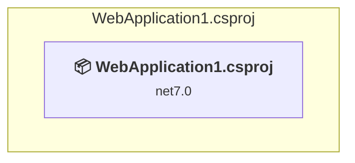

### API Compatibility

| Category | Count | Impact |
| :--- | :---: | :--- |
| 🔴 Binary Incompatible | 0 | High - Require code changes |
| 🟡 Source Incompatible | 0 | Medium - Needs re-compilation and potential conflicting API error fixing |
| 🔵 Behavioral change | 0 | Low - Behavioral changes that may require testing at runtime |
| ✅ Compatible | 11 |  |
| ***Total APIs Analyzed*** | ***11*** |  |

<a id="chapter03b_webapplication1extendedwebapplication1extendedwebapplication1extendedcsproj"></a>
### Chapter03\B_WebApplication1Extended\WebApplication1Extended\WebApplication1Extended.csproj

#### Project Info

- **Current Target Framework:** net7.0
- **Proposed Target Framework:** net10.0
- **SDK-style**: True
- **Project Kind:** AspNetCore
- **Dependencies**: 0
- **Dependants**: 0
- **Number of Files**: 3
- **Number of Files with Incidents**: 1
- **Lines of Code**: 23
- **Estimated LOC to modify**: 0+ (at least 0.0% of the project)

#### Dependency Graph

Legend:
📦 SDK-style project
⚙️ Classic project

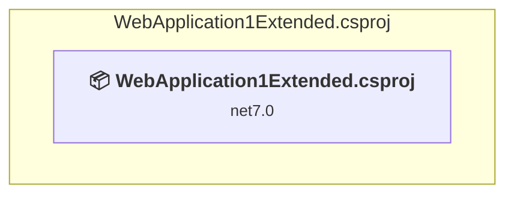

### API Compatibility

| Category | Count | Impact |
| :--- | :---: | :--- |
| 🔴 Binary Incompatible | 0 | High - Require code changes |
| 🟡 Source Incompatible | 0 | Medium - Needs re-compilation and potential conflicting API error fixing |
| 🔵 Behavioral change | 0 | Low - Behavioral changes that may require testing at runtime |
| ✅ Compatible | 58 |  |
| ***Total APIs Analyzed*** | ***58*** |  |

<a id="chapter03my_applicationmyapplicationcsproj"></a>
### Chapter03\My_Application\MyApplication.csproj

#### Project Info

- **Current Target Framework:** net10.0✅
- **SDK-style**: True
- **Project Kind:** AspNetCore
- **Dependencies**: 0
- **Dependants**: 0
- **Number of Files**: 4
- **Lines of Code**: 26
- **Estimated LOC to modify**: 0+ (at least 0.0% of the project)

#### Dependency Graph

Legend:
📦 SDK-style project
⚙️ Classic project

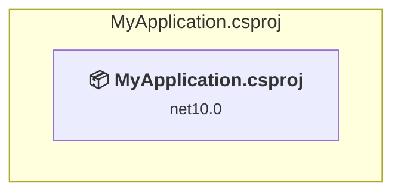

### API Compatibility

| Category | Count | Impact |
| :--- | :---: | :--- |
| 🔴 Binary Incompatible | 0 | High - Require code changes |
| 🟡 Source Incompatible | 0 | Medium - Needs re-compilation and potential conflicting API error fixing |
| 🔵 Behavioral change | 0 | Low - Behavioral changes that may require testing at runtime |
| ✅ Compatible | 0 |  |
| ***Total APIs Analyzed*** | ***0*** |  |

<a id="chapter04a_creatingaholdingpagecreatingaholdingpagecreatingaholdingpagecsproj"></a>
### Chapter04\A_CreatingAHoldingPage\CreatingAHoldingPage\CreatingAHoldingPage.csproj

#### Project Info

- **Current Target Framework:** net7.0
- **Proposed Target Framework:** net10.0
- **SDK-style**: True
- **Project Kind:** AspNetCore
- **Dependencies**: 0
- **Dependants**: 0
- **Number of Files**: 3
- **Number of Files with Incidents**: 1
- **Lines of Code**: 6
- **Estimated LOC to modify**: 0+ (at least 0.0% of the project)

#### Dependency Graph

Legend:
📦 SDK-style project
⚙️ Classic project

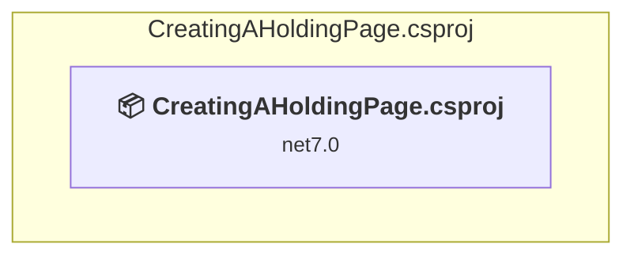

### API Compatibility

| Category | Count | Impact |
| :--- | :---: | :--- |
| 🔴 Binary Incompatible | 0 | High - Require code changes |
| 🟡 Source Incompatible | 0 | Medium - Needs re-compilation and potential conflicting API error fixing |
| 🔵 Behavioral change | 0 | Low - Behavioral changes that may require testing at runtime |
| ✅ Compatible | 11 |  |
| ***Total APIs Analyzed*** | ***11*** |  |

<a id="chapter04b_creatingastaticfilewebsitecreatingastaticfilewebsitecreatingastaticfilewebsitecsproj"></a>
### Chapter04\B_CreatingAStaticFileWebsite\CreatingAStaticFileWebsite\CreatingAStaticFileWebsite.csproj

#### Project Info

- **Current Target Framework:** net7.0
- **Proposed Target Framework:** net10.0
- **SDK-style**: True
- **Project Kind:** AspNetCore
- **Dependencies**: 0
- **Dependants**: 0
- **Number of Files**: 5
- **Number of Files with Incidents**: 1
- **Lines of Code**: 6
- **Estimated LOC to modify**: 0+ (at least 0.0% of the project)

#### Dependency Graph

Legend:
📦 SDK-style project
⚙️ Classic project

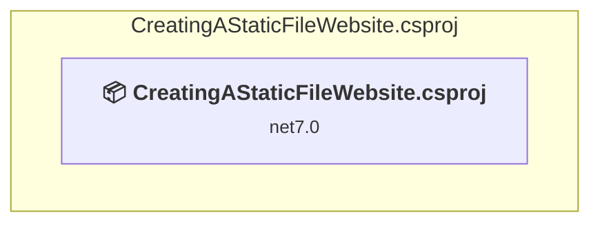

### API Compatibility

| Category | Count | Impact |
| :--- | :---: | :--- |
| 🔴 Binary Incompatible | 0 | High - Require code changes |
| 🟡 Source Incompatible | 0 | Medium - Needs re-compilation and potential conflicting API error fixing |
| 🔵 Behavioral change | 0 | Low - Behavioral changes that may require testing at runtime |
| ✅ Compatible | 11 |  |
| ***Total APIs Analyzed*** | ***11*** |  |

<a id="chapter04c_simpleminimalapisapplicationsimpleminimalapisapplicationsimpleminimalapisapplicationcsproj"></a>
### Chapter04\C_SimpleMinimalApisApplication\SimpleMinimalApisApplication\SimpleMinimalApisApplication.csproj

#### Project Info

- **Current Target Framework:** net7.0
- **Proposed Target Framework:** net10.0
- **SDK-style**: True
- **Project Kind:** AspNetCore
- **Dependencies**: 0
- **Dependants**: 0
- **Number of Files**: 5
- **Number of Files with Incidents**: 1
- **Lines of Code**: 10
- **Estimated LOC to modify**: 0+ (at least 0.0% of the project)

#### Dependency Graph

Legend:
📦 SDK-style project
⚙️ Classic project

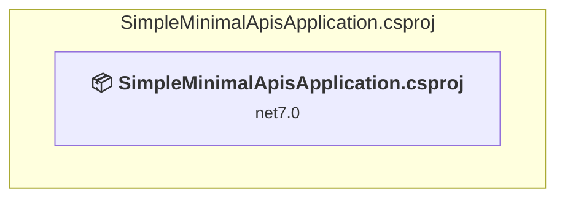

### API Compatibility

| Category | Count | Impact |
| :--- | :---: | :--- |
| 🔴 Binary Incompatible | 0 | High - Require code changes |
| 🟡 Source Incompatible | 0 | Medium - Needs re-compilation and potential conflicting API error fixing |
| 🔵 Behavioral change | 0 | Low - Behavioral changes that may require testing at runtime |
| ✅ Compatible | 20 |  |
| ***Total APIs Analyzed*** | ***20*** |  |

<a id="chapter04d_minimalapisandwelcomepageminimalapisandwelcomepageminimalapisandwelcomepagecsproj"></a>
### Chapter04\D_MinimalApisAndWelcomePage\MinimalApisAndWelcomePage\MinimalApisAndWelcomePage.csproj

#### Project Info

- **Current Target Framework:** net7.0
- **Proposed Target Framework:** net10.0
- **SDK-style**: True
- **Project Kind:** AspNetCore
- **Dependencies**: 0
- **Dependants**: 0
- **Number of Files**: 5
- **Number of Files with Incidents**: 1
- **Lines of Code**: 11
- **Estimated LOC to modify**: 0+ (at least 0.0% of the project)

#### Dependency Graph

Legend:
📦 SDK-style project
⚙️ Classic project

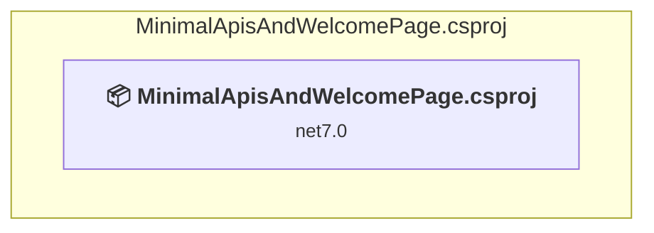

### API Compatibility

| Category | Count | Impact |
| :--- | :---: | :--- |
| 🔴 Binary Incompatible | 0 | High - Require code changes |
| 🟡 Source Incompatible | 0 | Medium - Needs re-compilation and potential conflicting API error fixing |
| 🔵 Behavioral change | 0 | Low - Behavioral changes that may require testing at runtime |
| ✅ Compatible | 23 |  |
| ***Total APIs Analyzed*** | ***23*** |  |

<a id="chapter04e_developerexceptionpagedeveloperexceptionpagedeveloperexceptionpagecsproj"></a>
### Chapter04\E_DeveloperExceptionPage\DeveloperExceptionPage\DeveloperExceptionPage.csproj

#### Project Info

- **Current Target Framework:** net7.0
- **Proposed Target Framework:** net10.0
- **SDK-style**: True
- **Project Kind:** AspNetCore
- **Dependencies**: 0
- **Dependants**: 0
- **Number of Files**: 3
- **Number of Files with Incidents**: 1
- **Lines of Code**: 17
- **Estimated LOC to modify**: 0+ (at least 0.0% of the project)

#### Dependency Graph

Legend:
📦 SDK-style project
⚙️ Classic project

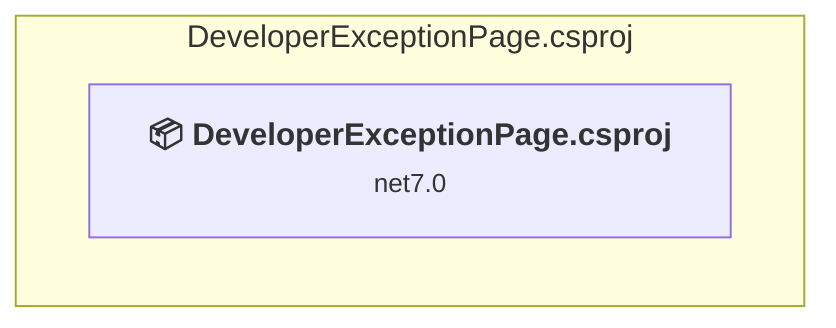

### API Compatibility

| Category | Count | Impact |
| :--- | :---: | :--- |
| 🔴 Binary Incompatible | 0 | High - Require code changes |
| 🟡 Source Incompatible | 0 | Medium - Needs re-compilation and potential conflicting API error fixing |
| 🔵 Behavioral change | 0 | Low - Behavioral changes that may require testing at runtime |
| ✅ Compatible | 18 |  |
| ***Total APIs Analyzed*** | ***18*** |  |

<a id="chapter04f_exceptionhandlermidlewareexceptionhandlermidlewareexceptionhandlermidlewarecsproj"></a>
### Chapter04\F_ExceptionHandlerMidleware\ExceptionHandlerMidleware\ExceptionHandlerMidleware.csproj

#### Project Info

- **Current Target Framework:** net7.0
- **Proposed Target Framework:** net10.0
- **SDK-style**: True
- **Project Kind:** AspNetCore
- **Dependencies**: 0
- **Dependants**: 0
- **Number of Files**: 3
- **Number of Files with Incidents**: 2
- **Lines of Code**: 25
- **Estimated LOC to modify**: 2+ (at least 8.0% of the project)

#### Dependency Graph

Legend:
📦 SDK-style project
⚙️ Classic project

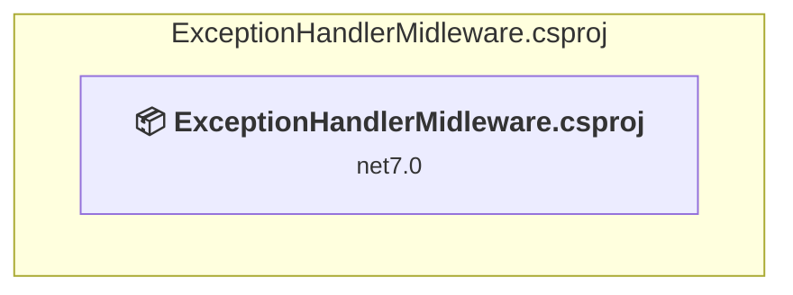

### API Compatibility

| Category | Count | Impact |
| :--- | :---: | :--- |
| 🔴 Binary Incompatible | 0 | High - Require code changes |
| 🟡 Source Incompatible | 0 | Medium - Needs re-compilation and potential conflicting API error fixing |
| 🔵 Behavioral change | 2 | Low - Behavioral changes that may require testing at runtime |
| ✅ Compatible | 27 |  |
| ***Total APIs Analyzed*** | ***29*** |  |

<a id="chapter05a_blazorwebassemblyprojectblazorwebassemblyprojectblazorwebassemblyprojectcsproj"></a>
### Chapter05\A_BlazorWebAssemblyProject\BlazorWebAssemblyProject\BlazorWebAssemblyProject.csproj

#### Project Info

- **Current Target Framework:** net7.0
- **Proposed Target Framework:** net10.0
- **SDK-style**: True
- **Project Kind:** AspNetCore
- **Dependencies**: 0
- **Dependants**: 0
- **Number of Files**: 25
- **Number of Files with Incidents**: 2
- **Lines of Code**: 11
- **Estimated LOC to modify**: 3+ (at least 27.3% of the project)

#### Dependency Graph

Legend:
📦 SDK-style project
⚙️ Classic project

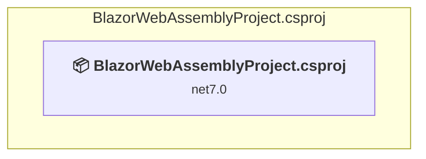

### API Compatibility

| Category | Count | Impact |
| :--- | :---: | :--- |
| 🔴 Binary Incompatible | 0 | High - Require code changes |
| 🟡 Source Incompatible | 0 | Medium - Needs re-compilation and potential conflicting API error fixing |
| 🔵 Behavioral change | 3 | Low - Behavioral changes that may require testing at runtime |
| ✅ Compatible | 484 |  |
| ***Total APIs Analyzed*** | ***487*** |  |

<a id="chapter05b_basicroutingminimalapibasicroutingminimalapibasicroutingminimalapicsproj"></a>
### Chapter05\B_BasicRoutingMinimalApi\BasicRoutingMinimalApi\BasicRoutingMinimalApi.csproj

#### Project Info

- **Current Target Framework:** net7.0
- **Proposed Target Framework:** net10.0
- **SDK-style**: True
- **Project Kind:** AspNetCore
- **Dependencies**: 0
- **Dependants**: 0
- **Number of Files**: 3
- **Number of Files with Incidents**: 1
- **Lines of Code**: 22
- **Estimated LOC to modify**: 0+ (at least 0.0% of the project)

#### Dependency Graph

Legend:
📦 SDK-style project
⚙️ Classic project

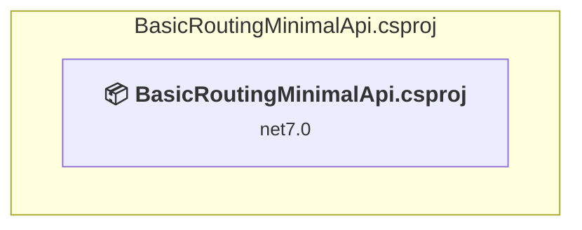

### API Compatibility

| Category | Count | Impact |
| :--- | :---: | :--- |
| 🔴 Binary Incompatible | 0 | High - Require code changes |
| 🟡 Source Incompatible | 0 | Medium - Needs re-compilation and potential conflicting API error fixing |
| 🔵 Behavioral change | 0 | Low - Behavioral changes that may require testing at runtime |
| ✅ Compatible | 58 |  |
| ***Total APIs Analyzed*** | ***58*** |  |

<a id="chapter05c_multipleverbminimalapimultipleverbminimalapimultipleverbminimalapicsproj"></a>
### Chapter05\C_MultipleVerbMinimalApi\MultipleVerbMinimalApi\MultipleVerbMinimalApi.csproj

#### Project Info

- **Current Target Framework:** net7.0
- **Proposed Target Framework:** net10.0
- **SDK-style**: True
- **Project Kind:** AspNetCore
- **Dependencies**: 0
- **Dependants**: 0
- **Number of Files**: 3
- **Number of Files with Incidents**: 1
- **Lines of Code**: 39
- **Estimated LOC to modify**: 0+ (at least 0.0% of the project)

#### Dependency Graph

Legend:
📦 SDK-style project
⚙️ Classic project

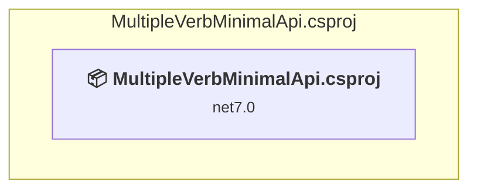

### API Compatibility

| Category | Count | Impact |
| :--- | :---: | :--- |
| 🔴 Binary Incompatible | 0 | High - Require code changes |
| 🟡 Source Incompatible | 0 | Medium - Needs re-compilation and potential conflicting API error fixing |
| 🔵 Behavioral change | 0 | Low - Behavioral changes that may require testing at runtime |
| ✅ Compatible | 65 |  |
| ***Total APIs Analyzed*** | ***65*** |  |

<a id="chapter05d_multipleverbminimalapiwithstatuscodesmultipleverbminimalapiwithstatuscodesmultipleverbminimalapiwithstatuscodescsproj"></a>
### Chapter05\D_MultipleVerbMinimalApiWithStatusCodes\MultipleVerbMinimalApiWithStatusCodes\MultipleVerbMinimalApiWithStatusCodes.csproj

#### Project Info

- **Current Target Framework:** net7.0
- **Proposed Target Framework:** net10.0
- **SDK-style**: True
- **Project Kind:** AspNetCore
- **Dependencies**: 0
- **Dependants**: 0
- **Number of Files**: 3
- **Number of Files with Incidents**: 1
- **Lines of Code**: 42
- **Estimated LOC to modify**: 0+ (at least 0.0% of the project)

#### Dependency Graph

Legend:
📦 SDK-style project
⚙️ Classic project

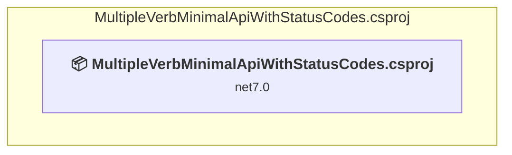

### API Compatibility

| Category | Count | Impact |
| :--- | :---: | :--- |
| 🔴 Binary Incompatible | 0 | High - Require code changes |
| 🟡 Source Incompatible | 0 | Medium - Needs re-compilation and potential conflicting API error fixing |
| 🔵 Behavioral change | 0 | Low - Behavioral changes that may require testing at runtime |
| ✅ Compatible | 90 |  |
| ***Total APIs Analyzed*** | ***90*** |  |

<a id="chapter05e_multipleverbminimalapiwithproblemdetailsmultipleverbminimalapiwithproblemdetailsmultipleverbminimalapiwithproblemdetailscsproj"></a>
### Chapter05\E_MultipleVerbMinimalApiWithProblemDetails\MultipleVerbMinimalApiWithProblemDetails\MultipleVerbMinimalApiWithProblemDetails.csproj

#### Project Info

- **Current Target Framework:** net7.0
- **Proposed Target Framework:** net10.0
- **SDK-style**: True
- **Project Kind:** AspNetCore
- **Dependencies**: 0
- **Dependants**: 0
- **Number of Files**: 3
- **Number of Files with Incidents**: 1
- **Lines of Code**: 44
- **Estimated LOC to modify**: 0+ (at least 0.0% of the project)

#### Dependency Graph

Legend:
📦 SDK-style project
⚙️ Classic project

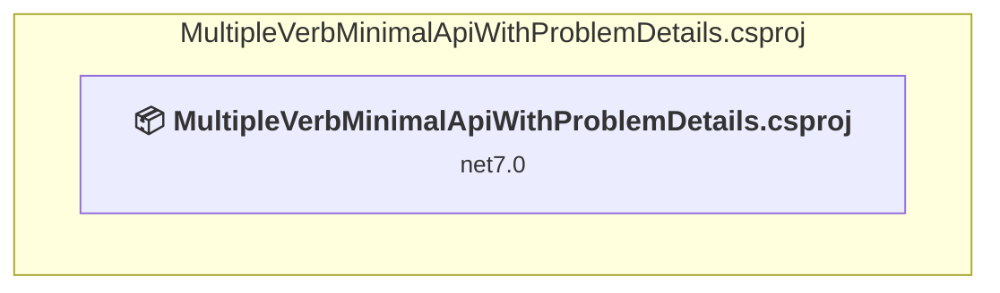

### API Compatibility

| Category | Count | Impact |
| :--- | :---: | :--- |
| 🔴 Binary Incompatible | 0 | High - Require code changes |
| 🟡 Source Incompatible | 0 | Medium - Needs re-compilation and potential conflicting API error fixing |
| 🔵 Behavioral change | 0 | Low - Behavioral changes that may require testing at runtime |
| ✅ Compatible | 93 |  |
| ***Total APIs Analyzed*** | ***93*** |  |

<a id="chapter05f_minimalapiwithautoproblemdetailsminimalapiwithautoproblemdetailsminimalapiwithautoproblemdetailscsproj"></a>
### Chapter05\F_MinimalApiWithAutoProblemDetails\MinimalApiWithAutoProblemDetails\MinimalApiWithAutoProblemDetails.csproj

#### Project Info

- **Current Target Framework:** net7.0
- **Proposed Target Framework:** net10.0
- **SDK-style**: True
- **Project Kind:** AspNetCore
- **Dependencies**: 0
- **Dependants**: 0
- **Number of Files**: 3
- **Number of Files with Incidents**: 2
- **Lines of Code**: 49
- **Estimated LOC to modify**: 1+ (at least 2.0% of the project)

#### Dependency Graph

Legend:
📦 SDK-style project
⚙️ Classic project

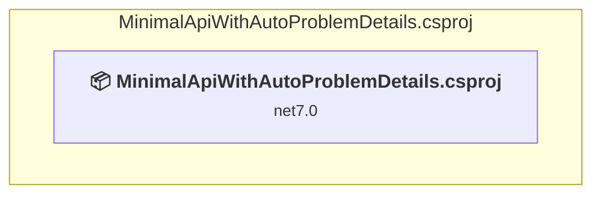

### API Compatibility

| Category | Count | Impact |
| :--- | :---: | :--- |
| 🔴 Binary Incompatible | 0 | High - Require code changes |
| 🟡 Source Incompatible | 0 | Medium - Needs re-compilation and potential conflicting API error fixing |
| 🔵 Behavioral change | 1 | Low - Behavioral changes that may require testing at runtime |
| ✅ Compatible | 95 |  |
| ***Total APIs Analyzed*** | ***96*** |  |

<a id="chapter05g_minimalapifiltersminimalapifiltersminimalapifilterscsproj"></a>
### Chapter05\G_MinimalApiFilters\MinimalApiFilters\MinimalApiFilters.csproj

#### Project Info

- **Current Target Framework:** net7.0
- **Proposed Target Framework:** net10.0
- **SDK-style**: True
- **Project Kind:** AspNetCore
- **Dependencies**: 0
- **Dependants**: 0
- **Number of Files**: 3
- **Number of Files with Incidents**: 1
- **Lines of Code**: 163
- **Estimated LOC to modify**: 0+ (at least 0.0% of the project)

#### Dependency Graph

Legend:
📦 SDK-style project
⚙️ Classic project

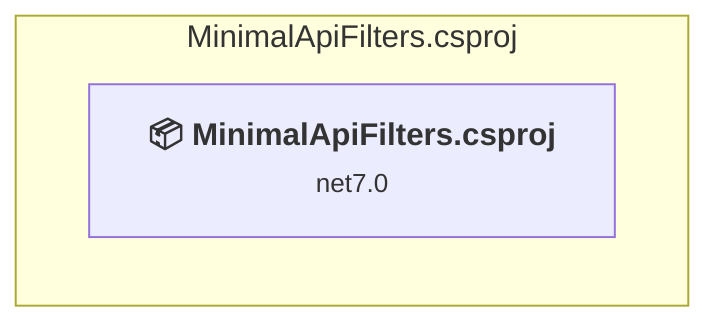

### API Compatibility

| Category | Count | Impact |
| :--- | :---: | :--- |
| 🔴 Binary Incompatible | 0 | High - Require code changes |
| 🟡 Source Incompatible | 0 | Medium - Needs re-compilation and potential conflicting API error fixing |
| 🔵 Behavioral change | 0 | Low - Behavioral changes that may require testing at runtime |
| ✅ Compatible | 157 |  |
| ***Total APIs Analyzed*** | ***157*** |  |

<a id="chapter05h_minimalapiroutegroupsminimalapiroutegroupsminimalapiroutegroupscsproj"></a>
### Chapter05\H_MinimalApiRouteGroups\MinimalApiRouteGroups\MinimalApiRouteGroups.csproj

#### Project Info

- **Current Target Framework:** net7.0
- **Proposed Target Framework:** net10.0
- **SDK-style**: True
- **Project Kind:** AspNetCore
- **Dependencies**: 0
- **Dependants**: 0
- **Number of Files**: 3
- **Number of Files with Incidents**: 1
- **Lines of Code**: 126
- **Estimated LOC to modify**: 0+ (at least 0.0% of the project)

#### Dependency Graph

Legend:
📦 SDK-style project
⚙️ Classic project

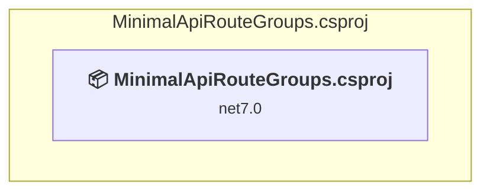

### API Compatibility

| Category | Count | Impact |
| :--- | :---: | :--- |
| 🔴 Binary Incompatible | 0 | High - Require code changes |
| 🟡 Source Incompatible | 0 | Medium - Needs re-compilation and potential conflicting API error fixing |
| 🔵 Behavioral change | 0 | Low - Behavioral changes that may require testing at runtime |
| ✅ Compatible | 178 |  |
| ***Total APIs Analyzed*** | ***178*** |  |

<a id="chapter06a_routingexampleroutingexampleroutingexamplecsproj"></a>
### Chapter06\A_RoutingExample\RoutingExample\RoutingExample.csproj

#### Project Info

- **Current Target Framework:** net7.0
- **Proposed Target Framework:** net10.0
- **SDK-style**: True
- **Project Kind:** AspNetCore
- **Dependencies**: 0
- **Dependants**: 0
- **Number of Files**: 5
- **Number of Files with Incidents**: 1
- **Lines of Code**: 92
- **Estimated LOC to modify**: 0+ (at least 0.0% of the project)

#### Dependency Graph

Legend:
📦 SDK-style project
⚙️ Classic project

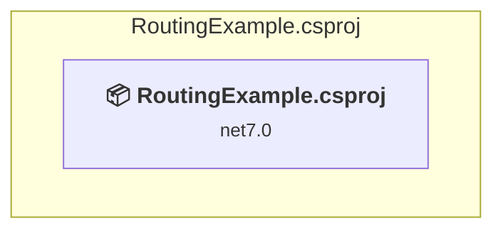

### API Compatibility

| Category | Count | Impact |
| :--- | :---: | :--- |
| 🔴 Binary Incompatible | 0 | High - Require code changes |
| 🟡 Source Incompatible | 0 | Medium - Needs re-compilation and potential conflicting API error fixing |
| 🔵 Behavioral change | 0 | Low - Behavioral changes that may require testing at runtime |
| ✅ Compatible | 113 |  |
| ***Total APIs Analyzed*** | ***113*** |  |

<a id="chapter06b_routeoptionsexamplerouteoptionsexamplerouteoptionsexamplecsproj"></a>
### Chapter06\B_RouteOptionsExample\RouteOptionsExample\RouteOptionsExample.csproj

#### Project Info

- **Current Target Framework:** net7.0
- **Proposed Target Framework:** net10.0
- **SDK-style**: True
- **Project Kind:** AspNetCore
- **Dependencies**: 0
- **Dependants**: 0
- **Number of Files**: 3
- **Number of Files with Incidents**: 1
- **Lines of Code**: 20
- **Estimated LOC to modify**: 0+ (at least 0.0% of the project)

#### Dependency Graph

Legend:
📦 SDK-style project
⚙️ Classic project

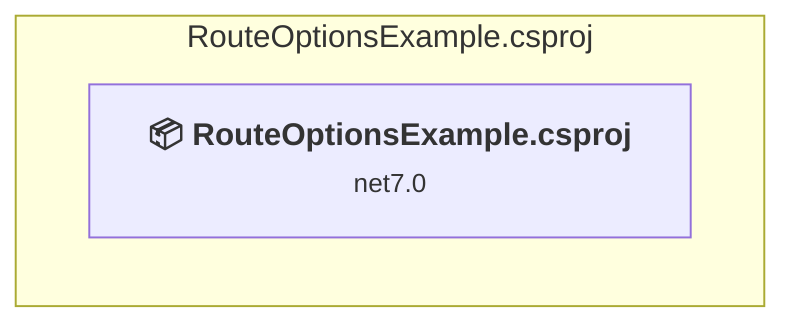

### API Compatibility

| Category | Count | Impact |
| :--- | :---: | :--- |
| 🔴 Binary Incompatible | 0 | High - Require code changes |
| 🟡 Source Incompatible | 0 | Medium - Needs re-compilation and potential conflicting API error fixing |
| 🔵 Behavioral change | 0 | Low - Behavioral changes that may require testing at runtime |
| ✅ Compatible | 49 |  |
| ***Total APIs Analyzed*** | ***49*** |  |

<a id="chapter07a_basicmodelbindingbasicmodelbindingbasicmodelbindingcsproj"></a>
### Chapter07\A_BasicModelBinding\BasicModelBinding\BasicModelBinding.csproj

#### Project Info

- **Current Target Framework:** net7.0
- **Proposed Target Framework:** net10.0
- **SDK-style**: True
- **Project Kind:** AspNetCore
- **Dependencies**: 0
- **Dependants**: 0
- **Number of Files**: 3
- **Number of Files with Incidents**: 1
- **Lines of Code**: 214
- **Estimated LOC to modify**: 0+ (at least 0.0% of the project)

#### Dependency Graph

Legend:
📦 SDK-style project
⚙️ Classic project

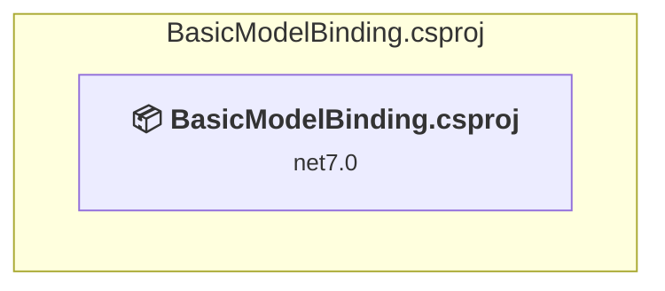

### API Compatibility

| Category | Count | Impact |
| :--- | :---: | :--- |
| 🔴 Binary Incompatible | 0 | High - Require code changes |
| 🟡 Source Incompatible | 0 | Medium - Needs re-compilation and potential conflicting API error fixing |
| 🔵 Behavioral change | 0 | Low - Behavioral changes that may require testing at runtime |
| ✅ Compatible | 256 |  |
| ***Total APIs Analyzed*** | ***256*** |  |

<a id="chapter07b_validatingwithdataannotationsvalidatingwithdataannotationsvalidatingwithdataannotationscsproj"></a>
### Chapter07\B_ValidatingWithDataAnnotations\ValidatingWithDataAnnotations\ValidatingWithDataAnnotations.csproj

#### Project Info

- **Current Target Framework:** net7.0
- **Proposed Target Framework:** net10.0
- **SDK-style**: True
- **Project Kind:** AspNetCore
- **Dependencies**: 0
- **Dependants**: 0
- **Number of Files**: 3
- **Number of Files with Incidents**: 1
- **Lines of Code**: 79
- **Estimated LOC to modify**: 0+ (at least 0.0% of the project)

#### Dependency Graph

Legend:
📦 SDK-style project
⚙️ Classic project

```mermaid
flowchart TB
    subgraph current["ValidatingWithDataAnnotations.csproj"]
        MAIN["<b>📦&nbsp;ValidatingWithDataAnnotations.csproj</b><br/><small>net7.0</small>"]
        click MAIN "#chapter07b_validatingwithdataannotationsvalidatingwithdataannotationsvalidatingwithdataannotationscsproj"
    end

```

### API Compatibility

| Category | Count | Impact |
| :--- | :---: | :--- |
| 🔴 Binary Incompatible | 0 | High - Require code changes |
| 🟡 Source Incompatible | 0 | Medium - Needs re-compilation and potential conflicting API error fixing |
| 🔵 Behavioral change | 0 | Low - Behavioral changes that may require testing at runtime |
| ✅ Compatible | 151 |  |
| ***Total APIs Analyzed*** | ***151*** |  |

<a id="chapter08a_sendinganemailwithoutdisendinganemailwithoutdisendinganemailwithoutdicsproj"></a>
### Chapter08\A_SendingAnEmailWithoutDI\SendingAnEmailWithoutDI\SendingAnEmailWithoutDI.csproj

#### Project Info

- **Current Target Framework:** net7.0
- **Proposed Target Framework:** net10.0
- **SDK-style**: True
- **Project Kind:** AspNetCore
- **Dependencies**: 0
- **Dependants**: 0
- **Number of Files**: 3
- **Number of Files with Incidents**: 1
- **Lines of Code**: 69
- **Estimated LOC to modify**: 0+ (at least 0.0% of the project)

#### Dependency Graph

Legend:
📦 SDK-style project
⚙️ Classic project

```mermaid
flowchart TB
    subgraph current["SendingAnEmailWithoutDI.csproj"]
        MAIN["<b>📦&nbsp;SendingAnEmailWithoutDI.csproj</b><br/><small>net7.0</small>"]
        click MAIN "#chapter08a_sendinganemailwithoutdisendinganemailwithoutdisendinganemailwithoutdicsproj"
    end

```

### API Compatibility

| Category | Count | Impact |
| :--- | :---: | :--- |
| 🔴 Binary Incompatible | 0 | High - Require code changes |
| 🟡 Source Incompatible | 0 | Medium - Needs re-compilation and potential conflicting API error fixing |
| 🔵 Behavioral change | 0 | Low - Behavioral changes that may require testing at runtime |
| ✅ Compatible | 107 |  |
| ***Total APIs Analyzed*** | ***107*** |  |

<a id="chapter08b_sendinganemailwithdisendinganemailwithdisendinganemailwithdicsproj"></a>
### Chapter08\B_SendingAnEmailWithDI\SendingAnEmailWithDI\SendingAnEmailWithDI.csproj

#### Project Info

- **Current Target Framework:** net7.0
- **Proposed Target Framework:** net10.0
- **SDK-style**: True
- **Project Kind:** AspNetCore
- **Dependencies**: 0
- **Dependants**: 0
- **Number of Files**: 3
- **Number of Files with Incidents**: 1
- **Lines of Code**: 74
- **Estimated LOC to modify**: 0+ (at least 0.0% of the project)

#### Dependency Graph

Legend:
📦 SDK-style project
⚙️ Classic project

```mermaid
flowchart TB
    subgraph current["SendingAnEmailWithDI.csproj"]
        MAIN["<b>📦&nbsp;SendingAnEmailWithDI.csproj</b><br/><small>net7.0</small>"]
        click MAIN "#chapter08b_sendinganemailwithdisendinganemailwithdisendinganemailwithdicsproj"
    end

```

### API Compatibility

| Category | Count | Impact |
| :--- | :---: | :--- |
| 🔴 Binary Incompatible | 0 | High - Require code changes |
| 🟡 Source Incompatible | 0 | Medium - Needs re-compilation and potential conflicting API error fixing |
| 🔵 Behavioral change | 0 | Low - Behavioral changes that may require testing at runtime |
| ✅ Compatible | 124 |  |
| ***Total APIs Analyzed*** | ***124*** |  |

<a id="chapter09a_sendinganemailwithdisendinganemailwithdisendinganemailwithdicsproj"></a>
### Chapter09\A_SendingAnEmailWithDI\SendingAnEmailWithDI\SendingAnEmailWithDI.csproj

#### Project Info

- **Current Target Framework:** net7.0
- **Proposed Target Framework:** net10.0
- **SDK-style**: True
- **Project Kind:** AspNetCore
- **Dependencies**: 0
- **Dependants**: 0
- **Number of Files**: 3
- **Number of Files with Incidents**: 1
- **Lines of Code**: 91
- **Estimated LOC to modify**: 0+ (at least 0.0% of the project)

#### Dependency Graph

Legend:
📦 SDK-style project
⚙️ Classic project

```mermaid
flowchart TB
    subgraph current["SendingAnEmailWithDI.csproj"]
        MAIN["<b>📦&nbsp;SendingAnEmailWithDI.csproj</b><br/><small>net7.0</small>"]
        click MAIN "#chapter09a_sendinganemailwithdisendinganemailwithdisendinganemailwithdicsproj"
    end

```

### API Compatibility

| Category | Count | Impact |
| :--- | :---: | :--- |
| 🔴 Binary Incompatible | 0 | High - Require code changes |
| 🟡 Source Incompatible | 0 | Medium - Needs re-compilation and potential conflicting API error fixing |
| 🔵 Behavioral change | 0 | Low - Behavioral changes that may require testing at runtime |
| ✅ Compatible | 128 |  |
| ***Total APIs Analyzed*** | ***128*** |  |

<a id="chapter09b_injectingmultipleimplementationsinjectingmultipleimplementationsinjectingmultipleimplementationscsproj"></a>
### Chapter09\B_InjectingMultipleImplementations\InjectingMultipleImplementations\InjectingMultipleImplementations.csproj

#### Project Info

- **Current Target Framework:** net7.0
- **Proposed Target Framework:** net10.0
- **SDK-style**: True
- **Project Kind:** AspNetCore
- **Dependencies**: 0
- **Dependants**: 0
- **Number of Files**: 3
- **Number of Files with Incidents**: 1
- **Lines of Code**: 66
- **Estimated LOC to modify**: 0+ (at least 0.0% of the project)

#### Dependency Graph

Legend:
📦 SDK-style project
⚙️ Classic project

```mermaid
flowchart TB
    subgraph current["InjectingMultipleImplementations.csproj"]
        MAIN["<b>📦&nbsp;InjectingMultipleImplementations.csproj</b><br/><small>net7.0</small>"]
        click MAIN "#chapter09b_injectingmultipleimplementationsinjectingmultipleimplementationsinjectingmultipleimplementationscsproj"
    end

```

### API Compatibility

| Category | Count | Impact |
| :--- | :---: | :--- |
| 🔴 Binary Incompatible | 0 | High - Require code changes |
| 🟡 Source Incompatible | 0 | Medium - Needs re-compilation and potential conflicting API error fixing |
| 🔵 Behavioral change | 0 | Low - Behavioral changes that may require testing at runtime |
| ✅ Compatible | 60 |  |
| ***Total APIs Analyzed*** | ***60*** |  |

<a id="chapter09c_lifetimeexampleslifetimeexampleslifetimeexamplescsproj"></a>
### Chapter09\C_LifetimeExamples\LifetimeExamples\LifetimeExamples.csproj

#### Project Info

- **Current Target Framework:** net7.0
- **Proposed Target Framework:** net10.0
- **SDK-style**: True
- **Project Kind:** AspNetCore
- **Dependencies**: 0
- **Dependants**: 0
- **Number of Files**: 3
- **Number of Files with Incidents**: 1
- **Lines of Code**: 123
- **Estimated LOC to modify**: 0+ (at least 0.0% of the project)

#### Dependency Graph

Legend:
📦 SDK-style project
⚙️ Classic project

```mermaid
flowchart TB
    subgraph current["LifetimeExamples.csproj"]
        MAIN["<b>📦&nbsp;LifetimeExamples.csproj</b><br/><small>net7.0</small>"]
        click MAIN "#chapter09c_lifetimeexampleslifetimeexampleslifetimeexamplescsproj"
    end

```

### API Compatibility

| Category | Count | Impact |
| :--- | :---: | :--- |
| 🔴 Binary Incompatible | 0 | High - Require code changes |
| 🟡 Source Incompatible | 0 | Medium - Needs re-compilation and potential conflicting API error fixing |
| 🔵 Behavioral change | 0 | Low - Behavioral changes that may require testing at runtime |
| ✅ Compatible | 137 |  |
| ***Total APIs Analyzed*** | ***137*** |  |

<a id="chapter10a_storeviewerapplicationstoreviewerapplicationstoreviewerapplicationcsproj"></a>
### Chapter10\A_StoreViewerApplication\StoreViewerApplication\StoreViewerApplication.csproj

#### Project Info

- **Current Target Framework:** net7.0
- **Proposed Target Framework:** net10.0
- **SDK-style**: True
- **Project Kind:** AspNetCore
- **Dependencies**: 0
- **Dependants**: 0
- **Number of Files**: 4
- **Number of Files with Incidents**: 2
- **Lines of Code**: 48
- **Estimated LOC to modify**: 3+ (at least 6.3% of the project)

#### Dependency Graph

Legend:
📦 SDK-style project
⚙️ Classic project

```mermaid
flowchart TB
    subgraph current["StoreViewerApplication.csproj"]
        MAIN["<b>📦&nbsp;StoreViewerApplication.csproj</b><br/><small>net7.0</small>"]
        click MAIN "#chapter10a_storeviewerapplicationstoreviewerapplicationstoreviewerapplicationcsproj"
    end

```

### API Compatibility

| Category | Count | Impact |
| :--- | :---: | :--- |
| 🔴 Binary Incompatible | 3 | High - Require code changes |
| 🟡 Source Incompatible | 0 | Medium - Needs re-compilation and potential conflicting API error fixing |
| 🔵 Behavioral change | 0 | Low - Behavioral changes that may require testing at runtime |
| ✅ Compatible | 93 |  |
| ***Total APIs Analyzed*** | ***96*** |  |

<a id="chapter10b_designingforautomaticbindingdesigningforautomaticbindingdesigningforautomaticbindingcsproj"></a>
### Chapter10\B_DesigningForAutomaticBinding\DesigningForAutomaticBinding\DesigningForAutomaticBinding.csproj

#### Project Info

- **Current Target Framework:** net7.0
- **Proposed Target Framework:** net10.0
- **SDK-style**: True
- **Project Kind:** AspNetCore
- **Dependencies**: 0
- **Dependants**: 0
- **Number of Files**: 3
- **Number of Files with Incidents**: 2
- **Lines of Code**: 68
- **Estimated LOC to modify**: 2+ (at least 2.9% of the project)

#### Dependency Graph

Legend:
📦 SDK-style project
⚙️ Classic project

```mermaid
flowchart TB
    subgraph current["DesigningForAutomaticBinding.csproj"]
        MAIN["<b>📦&nbsp;DesigningForAutomaticBinding.csproj</b><br/><small>net7.0</small>"]
        click MAIN "#chapter10b_designingforautomaticbindingdesigningforautomaticbindingdesigningforautomaticbindingcsproj"
    end

```

### API Compatibility

| Category | Count | Impact |
| :--- | :---: | :--- |
| 🔴 Binary Incompatible | 2 | High - Require code changes |
| 🟡 Source Incompatible | 0 | Medium - Needs re-compilation and potential conflicting API error fixing |
| 🔵 Behavioral change | 0 | Low - Behavioral changes that may require testing at runtime |
| ✅ Compatible | 101 |  |
| ***Total APIs Analyzed*** | ***103*** |  |

<a id="chapter10c_replacingthedefaultprovidersreplacingthedefaultprovidersreplacingthedefaultproviderscsproj"></a>
### Chapter10\C_ReplacingTheDefaultProviders\ReplacingTheDefaultProviders\ReplacingTheDefaultProviders.csproj

#### Project Info

- **Current Target Framework:** net7.0
- **Proposed Target Framework:** net10.0
- **SDK-style**: True
- **Project Kind:** AspNetCore
- **Dependencies**: 0
- **Dependants**: 0
- **Number of Files**: 4
- **Number of Files with Incidents**: 1
- **Lines of Code**: 14
- **Estimated LOC to modify**: 0+ (at least 0.0% of the project)

#### Dependency Graph

Legend:
📦 SDK-style project
⚙️ Classic project

```mermaid
flowchart TB
    subgraph current["ReplacingTheDefaultProviders.csproj"]
        MAIN["<b>📦&nbsp;ReplacingTheDefaultProviders.csproj</b><br/><small>net7.0</small>"]
        click MAIN "#chapter10c_replacingthedefaultprovidersreplacingthedefaultprovidersreplacingthedefaultproviderscsproj"
    end

```

### API Compatibility

| Category | Count | Impact |
| :--- | :---: | :--- |
| 🔴 Binary Incompatible | 0 | High - Require code changes |
| 🟡 Source Incompatible | 0 | Medium - Needs re-compilation and potential conflicting API error fixing |
| 🔵 Behavioral change | 0 | Low - Behavioral changes that may require testing at runtime |
| ✅ Compatible | 39 |  |
| ***Total APIs Analyzed*** | ***39*** |  |

<a id="chapter10d_usingdifferentenvironmentsusingdifferentenvironmentsusingdifferentenvironmentscsproj"></a>
### Chapter10\D_UsingDifferentEnvironments\UsingDifferentEnvironments\UsingDifferentEnvironments.csproj

#### Project Info

- **Current Target Framework:** net7.0
- **Proposed Target Framework:** net10.0
- **SDK-style**: True
- **Project Kind:** AspNetCore
- **Dependencies**: 0
- **Dependants**: 0
- **Number of Files**: 5
- **Number of Files with Incidents**: 2
- **Lines of Code**: 20
- **Estimated LOC to modify**: 1+ (at least 5.0% of the project)

#### Dependency Graph

Legend:
📦 SDK-style project
⚙️ Classic project

```mermaid
flowchart TB
    subgraph current["UsingDifferentEnvironments.csproj"]
        MAIN["<b>📦&nbsp;UsingDifferentEnvironments.csproj</b><br/><small>net7.0</small>"]
        click MAIN "#chapter10d_usingdifferentenvironmentsusingdifferentenvironmentsusingdifferentenvironmentscsproj"
    end

```

### API Compatibility

| Category | Count | Impact |
| :--- | :---: | :--- |
| 🔴 Binary Incompatible | 1 | High - Require code changes |
| 🟡 Source Incompatible | 0 | Medium - Needs re-compilation and potential conflicting API error fixing |
| 🔵 Behavioral change | 0 | Low - Behavioral changes that may require testing at runtime |
| ✅ Compatible | 37 |  |
| ***Total APIs Analyzed*** | ***38*** |  |

<a id="chapter11a_openapiexample_swashbuckleopenapiexampleopenapiexamplecsproj"></a>
### Chapter11\A_OpenApiExample_Swashbuckle\OpenApiExample\OpenApiExample.csproj

#### Project Info

- **Current Target Framework:** net7.0
- **Proposed Target Framework:** net10.0
- **SDK-style**: True
- **Project Kind:** AspNetCore
- **Dependencies**: 0
- **Dependants**: 0
- **Number of Files**: 3
- **Number of Files with Incidents**: 1
- **Lines of Code**: 43
- **Estimated LOC to modify**: 0+ (at least 0.0% of the project)

#### Dependency Graph

Legend:
📦 SDK-style project
⚙️ Classic project

```mermaid
flowchart TB
    subgraph current["OpenApiExample.csproj"]
        MAIN["<b>📦&nbsp;OpenApiExample.csproj</b><br/><small>net7.0</small>"]
        click MAIN "#chapter11a_openapiexample_swashbuckleopenapiexampleopenapiexamplecsproj"
    end

```

### API Compatibility

| Category | Count | Impact |
| :--- | :---: | :--- |
| 🔴 Binary Incompatible | 0 | High - Require code changes |
| 🟡 Source Incompatible | 0 | Medium - Needs re-compilation and potential conflicting API error fixing |
| 🔵 Behavioral change | 0 | Low - Behavioral changes that may require testing at runtime |
| ✅ Compatible | 107 |  |
| ***Total APIs Analyzed*** | ***107*** |  |

<a id="chapter11b_openapiexample_nswagopenapiexampleopenapiexamplecsproj"></a>
### Chapter11\B_OpenApiExample_Nswag\OpenApiExample\OpenApiExample.csproj

#### Project Info

- **Current Target Framework:** net7.0
- **Proposed Target Framework:** net10.0
- **SDK-style**: True
- **Project Kind:** AspNetCore
- **Dependencies**: 0
- **Dependants**: 0
- **Number of Files**: 3
- **Number of Files with Incidents**: 1
- **Lines of Code**: 29
- **Estimated LOC to modify**: 0+ (at least 0.0% of the project)

#### Dependency Graph

Legend:
📦 SDK-style project
⚙️ Classic project

```mermaid
flowchart TB
    subgraph current["OpenApiExample.csproj"]
        MAIN["<b>📦&nbsp;OpenApiExample.csproj</b><br/><small>net7.0</small>"]
        click MAIN "#chapter11b_openapiexample_nswagopenapiexampleopenapiexamplecsproj"
    end

```

### API Compatibility

| Category | Count | Impact |
| :--- | :---: | :--- |
| 🔴 Binary Incompatible | 0 | High - Require code changes |
| 🟡 Source Incompatible | 0 | Medium - Needs re-compilation and potential conflicting API error fixing |
| 🔵 Behavioral change | 0 | Low - Behavioral changes that may require testing at runtime |
| ✅ Compatible | 78 |  |
| ***Total APIs Analyzed*** | ***78*** |  |

<a id="chapter11c_generatingopenapiclientconsoleclientconsoleclientcsproj"></a>
### Chapter11\C_GeneratingOpenApiClient\ConsoleClient\ConsoleClient.csproj

#### Project Info

- **Current Target Framework:** net7.0
- **Proposed Target Framework:** net10.0
- **SDK-style**: True
- **Project Kind:** DotNetCoreApp
- **Dependencies**: 0
- **Dependants**: 0
- **Number of Files**: 1
- **Number of Files with Incidents**: 2
- **Lines of Code**: 12
- **Estimated LOC to modify**: 23+ (at least 191.7% of the project)

#### Dependency Graph

Legend:
📦 SDK-style project
⚙️ Classic project

```mermaid
flowchart TB
    subgraph current["ConsoleClient.csproj"]
        MAIN["<b>📦&nbsp;ConsoleClient.csproj</b><br/><small>net7.0</small>"]
        click MAIN "#chapter11c_generatingopenapiclientconsoleclientconsoleclientcsproj"
    end

```

### API Compatibility

| Category | Count | Impact |
| :--- | :---: | :--- |
| 🔴 Binary Incompatible | 0 | High - Require code changes |
| 🟡 Source Incompatible | 0 | Medium - Needs re-compilation and potential conflicting API error fixing |
| 🔵 Behavioral change | 23 | Low - Behavioral changes that may require testing at runtime |
| ✅ Compatible | 543 |  |
| ***Total APIs Analyzed*** | ***566*** |  |

<a id="chapter11c_generatingopenapiclientopenapiexampleopenapiexamplecsproj"></a>
### Chapter11\C_GeneratingOpenApiClient\OpenApiExample\OpenApiExample.csproj

#### Project Info

- **Current Target Framework:** net7.0
- **Proposed Target Framework:** net10.0
- **SDK-style**: True
- **Project Kind:** AspNetCore
- **Dependencies**: 0
- **Dependants**: 0
- **Number of Files**: 3
- **Number of Files with Incidents**: 1
- **Lines of Code**: 37
- **Estimated LOC to modify**: 0+ (at least 0.0% of the project)

#### Dependency Graph

Legend:
📦 SDK-style project
⚙️ Classic project

```mermaid
flowchart TB
    subgraph current["OpenApiExample.csproj"]
        MAIN["<b>📦&nbsp;OpenApiExample.csproj</b><br/><small>net7.0</small>"]
        click MAIN "#chapter11c_generatingopenapiclientopenapiexampleopenapiexamplecsproj"
    end

```

### API Compatibility

| Category | Count | Impact |
| :--- | :---: | :--- |
| 🔴 Binary Incompatible | 0 | High - Require code changes |
| 🟡 Source Incompatible | 0 | Medium - Needs re-compilation and potential conflicting API error fixing |
| 🔵 Behavioral change | 0 | Low - Behavioral changes that may require testing at runtime |
| ✅ Compatible | 96 |  |
| ***Total APIs Analyzed*** | ***96*** |  |

<a id="chapter11d_customisinggenerationconsoleclientconsoleclientcsproj"></a>
### Chapter11\D_CustomisingGeneration\ConsoleClient\ConsoleClient.csproj

#### Project Info

- **Current Target Framework:** net7.0
- **Proposed Target Framework:** net10.0
- **SDK-style**: True
- **Project Kind:** DotNetCoreApp
- **Dependencies**: 0
- **Dependants**: 0
- **Number of Files**: 1
- **Number of Files with Incidents**: 3
- **Lines of Code**: 11
- **Estimated LOC to modify**: 26+ (at least 236.4% of the project)

#### Dependency Graph

Legend:
📦 SDK-style project
⚙️ Classic project

```mermaid
flowchart TB
    subgraph current["ConsoleClient.csproj"]
        MAIN["<b>📦&nbsp;ConsoleClient.csproj</b><br/><small>net7.0</small>"]
        click MAIN "#chapter11d_customisinggenerationconsoleclientconsoleclientcsproj"
    end

```

### API Compatibility

| Category | Count | Impact |
| :--- | :---: | :--- |
| 🔴 Binary Incompatible | 0 | High - Require code changes |
| 🟡 Source Incompatible | 0 | Medium - Needs re-compilation and potential conflicting API error fixing |
| 🔵 Behavioral change | 26 | Low - Behavioral changes that may require testing at runtime |
| ✅ Compatible | 528 |  |
| ***Total APIs Analyzed*** | ***554*** |  |

<a id="chapter11d_customisinggenerationopenapiexampleopenapiexamplecsproj"></a>
### Chapter11\D_CustomisingGeneration\OpenApiExample\OpenApiExample.csproj

#### Project Info

- **Current Target Framework:** net7.0
- **Proposed Target Framework:** net10.0
- **SDK-style**: True
- **Project Kind:** AspNetCore
- **Dependencies**: 0
- **Dependants**: 0
- **Number of Files**: 3
- **Number of Files with Incidents**: 1
- **Lines of Code**: 38
- **Estimated LOC to modify**: 0+ (at least 0.0% of the project)

#### Dependency Graph

Legend:
📦 SDK-style project
⚙️ Classic project

```mermaid
flowchart TB
    subgraph current["OpenApiExample.csproj"]
        MAIN["<b>📦&nbsp;OpenApiExample.csproj</b><br/><small>net7.0</small>"]
        click MAIN "#chapter11d_customisinggenerationopenapiexampleopenapiexamplecsproj"
    end

```

### API Compatibility

| Category | Count | Impact |
| :--- | :---: | :--- |
| 🔴 Binary Incompatible | 0 | High - Require code changes |
| 🟡 Source Incompatible | 0 | Medium - Needs re-compilation and potential conflicting API error fixing |
| 🔵 Behavioral change | 0 | Low - Behavioral changes that may require testing at runtime |
| ✅ Compatible | 102 |  |
| ***Total APIs Analyzed*** | ***102*** |  |

<a id="chapter11e_addingdescriptionsconsoleclientconsoleclientcsproj"></a>
### Chapter11\E_AddingDescriptions\ConsoleClient\ConsoleClient.csproj

#### Project Info

- **Current Target Framework:** net7.0
- **Proposed Target Framework:** net10.0
- **SDK-style**: True
- **Project Kind:** DotNetCoreApp
- **Dependencies**: 0
- **Dependants**: 0
- **Number of Files**: 1
- **Number of Files with Incidents**: 3
- **Lines of Code**: 11
- **Estimated LOC to modify**: 44+ (at least 400.0% of the project)

#### Dependency Graph

Legend:
📦 SDK-style project
⚙️ Classic project

```mermaid
flowchart TB
    subgraph current["ConsoleClient.csproj"]
        MAIN["<b>📦&nbsp;ConsoleClient.csproj</b><br/><small>net7.0</small>"]
        click MAIN "#chapter11e_addingdescriptionsconsoleclientconsoleclientcsproj"
    end

```

### API Compatibility

| Category | Count | Impact |
| :--- | :---: | :--- |
| 🔴 Binary Incompatible | 0 | High - Require code changes |
| 🟡 Source Incompatible | 0 | Medium - Needs re-compilation and potential conflicting API error fixing |
| 🔵 Behavioral change | 44 | Low - Behavioral changes that may require testing at runtime |
| ✅ Compatible | 734 |  |
| ***Total APIs Analyzed*** | ***778*** |  |

<a id="chapter11e_addingdescriptionsopenapiexampleopenapiexamplecsproj"></a>
### Chapter11\E_AddingDescriptions\OpenApiExample\OpenApiExample.csproj

#### Project Info

- **Current Target Framework:** net7.0
- **Proposed Target Framework:** net10.0
- **SDK-style**: True
- **Project Kind:** AspNetCore
- **Dependencies**: 0
- **Dependants**: 0
- **Number of Files**: 3
- **Number of Files with Incidents**: 1
- **Lines of Code**: 109
- **Estimated LOC to modify**: 0+ (at least 0.0% of the project)

#### Dependency Graph

Legend:
📦 SDK-style project
⚙️ Classic project

```mermaid
flowchart TB
    subgraph current["OpenApiExample.csproj"]
        MAIN["<b>📦&nbsp;OpenApiExample.csproj</b><br/><small>net7.0</small>"]
        click MAIN "#chapter11e_addingdescriptionsopenapiexampleopenapiexamplecsproj"
    end

```

### API Compatibility

| Category | Count | Impact |
| :--- | :---: | :--- |
| 🔴 Binary Incompatible | 0 | High - Require code changes |
| 🟡 Source Incompatible | 0 | Medium - Needs re-compilation and potential conflicting API error fixing |
| 🔵 Behavioral change | 0 | Low - Behavioral changes that may require testing at runtime |
| ✅ Compatible | 184 |  |
| ***Total APIs Analyzed*** | ***184*** |  |

<a id="chapter12a_installefcorerecipeapplicationrecipeapplicationcsproj"></a>
### Chapter12\A_InstallEFCore\RecipeApplication\RecipeApplication.csproj

#### Project Info

- **Current Target Framework:** net7.0
- **Proposed Target Framework:** net10.0
- **SDK-style**: True
- **Project Kind:** AspNetCore
- **Dependencies**: 0
- **Dependants**: 0
- **Number of Files**: 3
- **Number of Files with Incidents**: 1
- **Lines of Code**: 54
- **Estimated LOC to modify**: 0+ (at least 0.0% of the project)

#### Dependency Graph

Legend:
📦 SDK-style project
⚙️ Classic project

```mermaid
flowchart TB
    subgraph current["RecipeApplication.csproj"]
        MAIN["<b>📦&nbsp;RecipeApplication.csproj</b><br/><small>net7.0</small>"]
        click MAIN "#chapter12a_installefcorerecipeapplicationrecipeapplicationcsproj"
    end

```

### API Compatibility

| Category | Count | Impact |
| :--- | :---: | :--- |
| 🔴 Binary Incompatible | 0 | High - Require code changes |
| 🟡 Source Incompatible | 0 | Medium - Needs re-compilation and potential conflicting API error fixing |
| 🔵 Behavioral change | 0 | Low - Behavioral changes that may require testing at runtime |
| ✅ Compatible | 81 |  |
| ***Total APIs Analyzed*** | ***81*** |  |

<a id="chapter12b_migrate_localdbrecipeapplicationrecipeapplicationcsproj"></a>
### Chapter12\B_Migrate_LocalDb\RecipeApplication\RecipeApplication.csproj

#### Project Info

- **Current Target Framework:** net7.0
- **Proposed Target Framework:** net10.0
- **SDK-style**: True
- **Project Kind:** AspNetCore
- **Dependencies**: 0
- **Dependants**: 0
- **Number of Files**: 8
- **Number of Files with Incidents**: 1
- **Lines of Code**: 456
- **Estimated LOC to modify**: 0+ (at least 0.0% of the project)

#### Dependency Graph

Legend:
📦 SDK-style project
⚙️ Classic project

```mermaid
flowchart TB
    subgraph current["RecipeApplication.csproj"]
        MAIN["<b>📦&nbsp;RecipeApplication.csproj</b><br/><small>net7.0</small>"]
        click MAIN "#chapter12b_migrate_localdbrecipeapplicationrecipeapplicationcsproj"
    end

```

### API Compatibility

| Category | Count | Impact |
| :--- | :---: | :--- |
| 🔴 Binary Incompatible | 0 | High - Require code changes |
| 🟡 Source Incompatible | 0 | Medium - Needs re-compilation and potential conflicting API error fixing |
| 🔵 Behavioral change | 0 | Low - Behavioral changes that may require testing at runtime |
| ✅ Compatible | 539 |  |
| ***Total APIs Analyzed*** | ***539*** |  |

<a id="chapter12c_migrate_sqliterecipeapplicationrecipeapplicationcsproj"></a>
### Chapter12\C_Migrate_SQLite\RecipeApplication\RecipeApplication.csproj

#### Project Info

- **Current Target Framework:** net7.0
- **Proposed Target Framework:** net10.0
- **SDK-style**: True
- **Project Kind:** AspNetCore
- **Dependencies**: 0
- **Dependants**: 0
- **Number of Files**: 8
- **Number of Files with Incidents**: 1
- **Lines of Code**: 421
- **Estimated LOC to modify**: 0+ (at least 0.0% of the project)

#### Dependency Graph

Legend:
📦 SDK-style project
⚙️ Classic project

```mermaid
flowchart TB
    subgraph current["RecipeApplication.csproj"]
        MAIN["<b>📦&nbsp;RecipeApplication.csproj</b><br/><small>net7.0</small>"]
        click MAIN "#chapter12c_migrate_sqliterecipeapplicationrecipeapplicationcsproj"
    end

```

### API Compatibility

| Category | Count | Impact |
| :--- | :---: | :--- |
| 🔴 Binary Incompatible | 0 | High - Require code changes |
| 🟡 Source Incompatible | 0 | Medium - Needs re-compilation and potential conflicting API error fixing |
| 🔵 Behavioral change | 0 | Low - Behavioral changes that may require testing at runtime |
| ✅ Compatible | 484 |  |
| ***Total APIs Analyzed*** | ***484*** |  |

<a id="chapter12d_recipeapplication_localdbrecipeapplicationrecipeapplicationcsproj"></a>
### Chapter12\D_RecipeApplication_LocalDb\RecipeApplication\RecipeApplication.csproj

#### Project Info

- **Current Target Framework:** net7.0
- **Proposed Target Framework:** net10.0
- **SDK-style**: True
- **Project Kind:** AspNetCore
- **Dependencies**: 0
- **Dependants**: 0
- **Number of Files**: 12
- **Number of Files with Incidents**: 2
- **Lines of Code**: 733
- **Estimated LOC to modify**: 1+ (at least 0.1% of the project)

#### Dependency Graph

Legend:
📦 SDK-style project
⚙️ Classic project

```mermaid
flowchart TB
    subgraph current["RecipeApplication.csproj"]
        MAIN["<b>📦&nbsp;RecipeApplication.csproj</b><br/><small>net7.0</small>"]
        click MAIN "#chapter12d_recipeapplication_localdbrecipeapplicationrecipeapplicationcsproj"
    end

```

### API Compatibility

| Category | Count | Impact |
| :--- | :---: | :--- |
| 🔴 Binary Incompatible | 0 | High - Require code changes |
| 🟡 Source Incompatible | 0 | Medium - Needs re-compilation and potential conflicting API error fixing |
| 🔵 Behavioral change | 1 | Low - Behavioral changes that may require testing at runtime |
| ✅ Compatible | 972 |  |
| ***Total APIs Analyzed*** | ***973*** |  |

<a id="chapter12e_recipeapplication_sqliterecipeapplicationrecipeapplicationcsproj"></a>
### Chapter12\E_RecipeApplication_SQLite\RecipeApplication\RecipeApplication.csproj

#### Project Info

- **Current Target Framework:** net7.0
- **Proposed Target Framework:** net10.0
- **SDK-style**: True
- **Project Kind:** AspNetCore
- **Dependencies**: 0
- **Dependants**: 0
- **Number of Files**: 12
- **Number of Files with Incidents**: 2
- **Lines of Code**: 698
- **Estimated LOC to modify**: 1+ (at least 0.1% of the project)

#### Dependency Graph

Legend:
📦 SDK-style project
⚙️ Classic project

```mermaid
flowchart TB
    subgraph current["RecipeApplication.csproj"]
        MAIN["<b>📦&nbsp;RecipeApplication.csproj</b><br/><small>net7.0</small>"]
        click MAIN "#chapter12e_recipeapplication_sqliterecipeapplicationrecipeapplicationcsproj"
    end

```

### API Compatibility

| Category | Count | Impact |
| :--- | :---: | :--- |
| 🔴 Binary Incompatible | 0 | High - Require code changes |
| 🟡 Source Incompatible | 0 | Medium - Needs re-compilation and potential conflicting API error fixing |
| 🔵 Behavioral change | 1 | Low - Behavioral changes that may require testing at runtime |
| ✅ Compatible | 917 |  |
| ***Total APIs Analyzed*** | ***918*** |  |

<a id="chapter13a_webapplication1webapplication1webapplication1csproj"></a>
### Chapter13\A_WebApplication1\WebApplication1\WebApplication1.csproj

#### Project Info

- **Current Target Framework:** net7.0
- **Proposed Target Framework:** net10.0
- **SDK-style**: True
- **Project Kind:** AspNetCore
- **Dependencies**: 0
- **Dependants**: 0
- **Number of Files**: 16
- **Number of Files with Incidents**: 2
- **Lines of Code**: 194
- **Estimated LOC to modify**: 1+ (at least 0.5% of the project)

#### Dependency Graph

Legend:
📦 SDK-style project
⚙️ Classic project

```mermaid
flowchart TB
    subgraph current["WebApplication1.csproj"]
        MAIN["<b>📦&nbsp;WebApplication1.csproj</b><br/><small>net7.0</small>"]
        click MAIN "#chapter13a_webapplication1webapplication1webapplication1csproj"
    end

```

### API Compatibility

| Category | Count | Impact |
| :--- | :---: | :--- |
| 🔴 Binary Incompatible | 0 | High - Require code changes |
| 🟡 Source Incompatible | 0 | Medium - Needs re-compilation and potential conflicting API error fixing |
| 🔵 Behavioral change | 1 | Low - Behavioral changes that may require testing at runtime |
| ✅ Compatible | 1118 |  |
| ***Total APIs Analyzed*** | ***1119*** |  |

<a id="chapter13b_atypicalrazorpageatypicalrazorpageatypicalrazorpagecsproj"></a>
### Chapter13\B_ATypicalRazorPage\ATypicalRazorPage\ATypicalRazorPage.csproj

#### Project Info

- **Current Target Framework:** net7.0
- **Proposed Target Framework:** net10.0
- **SDK-style**: True
- **Project Kind:** AspNetCore
- **Dependencies**: 0
- **Dependants**: 0
- **Number of Files**: 7
- **Number of Files with Incidents**: 1
- **Lines of Code**: 89
- **Estimated LOC to modify**: 0+ (at least 0.0% of the project)

#### Dependency Graph

Legend:
📦 SDK-style project
⚙️ Classic project

```mermaid
flowchart TB
    subgraph current["ATypicalRazorPage.csproj"]
        MAIN["<b>📦&nbsp;ATypicalRazorPage.csproj</b><br/><small>net7.0</small>"]
        click MAIN "#chapter13b_atypicalrazorpageatypicalrazorpageatypicalrazorpagecsproj"
    end

```

### API Compatibility

| Category | Count | Impact |
| :--- | :---: | :--- |
| 🔴 Binary Incompatible | 0 | High - Require code changes |
| 🟡 Source Incompatible | 0 | Medium - Needs re-compilation and potential conflicting API error fixing |
| 🔵 Behavioral change | 0 | Low - Behavioral changes that may require testing at runtime |
| ✅ Compatible | 225 |  |
| ***Total APIs Analyzed*** | ***225*** |  |

<a id="chapter14a_routingexamplesroutingexamplesroutingexamplescsproj"></a>
### Chapter14\A_RoutingExamples\RoutingExamples\RoutingExamples.csproj

#### Project Info

- **Current Target Framework:** net7.0
- **Proposed Target Framework:** net10.0
- **SDK-style**: True
- **Project Kind:** AspNetCore
- **Dependencies**: 0
- **Dependants**: 0
- **Number of Files**: 23
- **Number of Files with Incidents**: 1
- **Lines of Code**: 389
- **Estimated LOC to modify**: 0+ (at least 0.0% of the project)

#### Dependency Graph

Legend:
📦 SDK-style project
⚙️ Classic project

```mermaid
flowchart TB
    subgraph current["RoutingExamples.csproj"]
        MAIN["<b>📦&nbsp;RoutingExamples.csproj</b><br/><small>net7.0</small>"]
        click MAIN "#chapter14a_routingexamplesroutingexamplesroutingexamplescsproj"
    end

```

### API Compatibility

| Category | Count | Impact |
| :--- | :---: | :--- |
| 🔴 Binary Incompatible | 0 | High - Require code changes |
| 🟡 Source Incompatible | 0 | Medium - Needs re-compilation and potential conflicting API error fixing |
| 🔵 Behavioral change | 0 | Low - Behavioral changes that may require testing at runtime |
| ✅ Compatible | 2090 |  |
| ***Total APIs Analyzed*** | ***2090*** |  |

<a id="chapter14b_changingconventionschangingconventionschangingconventionscsproj"></a>
### Chapter14\B_ChangingConventions\ChangingConventions\ChangingConventions.csproj

#### Project Info

- **Current Target Framework:** net7.0
- **Proposed Target Framework:** net10.0
- **SDK-style**: True
- **Project Kind:** AspNetCore
- **Dependencies**: 0
- **Dependants**: 0
- **Number of Files**: 22
- **Number of Files with Incidents**: 1
- **Lines of Code**: 329
- **Estimated LOC to modify**: 0+ (at least 0.0% of the project)

#### Dependency Graph

Legend:
📦 SDK-style project
⚙️ Classic project

```mermaid
flowchart TB
    subgraph current["ChangingConventions.csproj"]
        MAIN["<b>📦&nbsp;ChangingConventions.csproj</b><br/><small>net7.0</small>"]
        click MAIN "#chapter14b_changingconventionschangingconventionschangingconventionscsproj"
    end

```

### API Compatibility

| Category | Count | Impact |
| :--- | :---: | :--- |
| 🔴 Binary Incompatible | 0 | High - Require code changes |
| 🟡 Source Incompatible | 0 | Medium - Needs re-compilation and potential conflicting API error fixing |
| 🔵 Behavioral change | 0 | Low - Behavioral changes that may require testing at runtime |
| ✅ Compatible | 1536 |  |
| ***Total APIs Analyzed*** | ***1536*** |  |

<a id="chapter15a_pagehandlerspagehandlerspagehandlerscsproj"></a>
### Chapter15\A_PageHandlers\PageHandlers\PageHandlers.csproj

#### Project Info

- **Current Target Framework:** net7.0
- **Proposed Target Framework:** net10.0
- **SDK-style**: True
- **Project Kind:** AspNetCore
- **Dependencies**: 0
- **Dependants**: 0
- **Number of Files**: 8
- **Number of Files with Incidents**: 1
- **Lines of Code**: 114
- **Estimated LOC to modify**: 0+ (at least 0.0% of the project)

#### Dependency Graph

Legend:
📦 SDK-style project
⚙️ Classic project

```mermaid
flowchart TB
    subgraph current["PageHandlers.csproj"]
        MAIN["<b>📦&nbsp;PageHandlers.csproj</b><br/><small>net7.0</small>"]
        click MAIN "#chapter15a_pagehandlerspagehandlerspagehandlerscsproj"
    end

```

### API Compatibility

| Category | Count | Impact |
| :--- | :---: | :--- |
| 🔴 Binary Incompatible | 0 | High - Require code changes |
| 🟡 Source Incompatible | 0 | Medium - Needs re-compilation and potential conflicting API error fixing |
| 🔵 Behavioral change | 0 | Low - Behavioral changes that may require testing at runtime |
| ✅ Compatible | 320 |  |
| ***Total APIs Analyzed*** | ***320*** |  |

<a id="chapter15b_statuscodepagesstatuscodepagesstatuscodepagescsproj"></a>
### Chapter15\B_StatusCodePages\StatusCodePages\StatusCodePages.csproj

#### Project Info

- **Current Target Framework:** net7.0
- **Proposed Target Framework:** net10.0
- **SDK-style**: True
- **Project Kind:** AspNetCore
- **Dependencies**: 0
- **Dependants**: 0
- **Number of Files**: 3
- **Number of Files with Incidents**: 1
- **Lines of Code**: 7
- **Estimated LOC to modify**: 0+ (at least 0.0% of the project)

#### Dependency Graph

Legend:
📦 SDK-style project
⚙️ Classic project

```mermaid
flowchart TB
    subgraph current["StatusCodePages.csproj"]
        MAIN["<b>📦&nbsp;StatusCodePages.csproj</b><br/><small>net7.0</small>"]
        click MAIN "#chapter15b_statuscodepagesstatuscodepagesstatuscodepagescsproj"
    end

```

### API Compatibility

| Category | Count | Impact |
| :--- | :---: | :--- |
| 🔴 Binary Incompatible | 0 | High - Require code changes |
| 🟡 Source Incompatible | 0 | Medium - Needs re-compilation and potential conflicting API error fixing |
| 🔵 Behavioral change | 0 | Low - Behavioral changes that may require testing at runtime |
| ✅ Compatible | 14 |  |
| ***Total APIs Analyzed*** | ***14*** |  |

<a id="chapter15c_statuscodepageswithreexecutestatuscodepageswithreexecutestatuscodepageswithreexecutecsproj"></a>
### Chapter15\C_StatusCodePagesWithReExecute\StatusCodePagesWithReExecute\StatusCodePagesWithReExecute.csproj

#### Project Info

- **Current Target Framework:** net7.0
- **Proposed Target Framework:** net10.0
- **SDK-style**: True
- **Project Kind:** AspNetCore
- **Dependencies**: 0
- **Dependants**: 0
- **Number of Files**: 3
- **Number of Files with Incidents**: 1
- **Lines of Code**: 8
- **Estimated LOC to modify**: 0+ (at least 0.0% of the project)

#### Dependency Graph

Legend:
📦 SDK-style project
⚙️ Classic project

```mermaid
flowchart TB
    subgraph current["StatusCodePagesWithReExecute.csproj"]
        MAIN["<b>📦&nbsp;StatusCodePagesWithReExecute.csproj</b><br/><small>net7.0</small>"]
        click MAIN "#chapter15c_statuscodepageswithreexecutestatuscodepageswithreexecutestatuscodepageswithreexecutecsproj"
    end

```

### API Compatibility

| Category | Count | Impact |
| :--- | :---: | :--- |
| 🔴 Binary Incompatible | 0 | High - Require code changes |
| 🟡 Source Incompatible | 0 | Medium - Needs re-compilation and potential conflicting API error fixing |
| 🔵 Behavioral change | 0 | Low - Behavioral changes that may require testing at runtime |
| ✅ Compatible | 17 |  |
| ***Total APIs Analyzed*** | ***17*** |  |

<a id="chapter15d_statuscodepageswithreexecuterazorpagesstatuscodepageswithreexecuterazorpagesstatuscodepageswithreexecuterazorpagescsproj"></a>
### Chapter15\D_StatusCodePagesWithReExecuteRazorPages\StatusCodePagesWithReExecuteRazorPages\StatusCodePagesWithReExecuteRazorPages.csproj

#### Project Info

- **Current Target Framework:** net7.0
- **Proposed Target Framework:** net10.0
- **SDK-style**: True
- **Project Kind:** AspNetCore
- **Dependencies**: 0
- **Dependants**: 0
- **Number of Files**: 18
- **Number of Files with Incidents**: 1
- **Lines of Code**: 212
- **Estimated LOC to modify**: 0+ (at least 0.0% of the project)

#### Dependency Graph

Legend:
📦 SDK-style project
⚙️ Classic project

```mermaid
flowchart TB
    subgraph current["StatusCodePagesWithReExecuteRazorPages.csproj"]
        MAIN["<b>📦&nbsp;StatusCodePagesWithReExecuteRazorPages.csproj</b><br/><small>net7.0</small>"]
        click MAIN "#chapter15d_statuscodepageswithreexecuterazorpagesstatuscodepageswithreexecuterazorpagesstatuscodepageswithreexecuterazorpagescsproj"
    end

```

### API Compatibility

| Category | Count | Impact |
| :--- | :---: | :--- |
| 🔴 Binary Incompatible | 0 | High - Require code changes |
| 🟡 Source Incompatible | 0 | Medium - Needs re-compilation and potential conflicting API error fixing |
| 🔵 Behavioral change | 0 | Low - Behavioral changes that may require testing at runtime |
| ✅ Compatible | 1144 |  |
| ***Total APIs Analyzed*** | ***1144*** |  |

<a id="chapter15e_statuscodepageswithredirectrazorpagesstatuscodepageswithredirectrazorpagesstatuscodepageswithredirectrazorpagescsproj"></a>
### Chapter15\E_StatusCodePagesWithRedirectRazorPages\StatusCodePagesWithRedirectRazorPages\StatusCodePagesWithRedirectRazorPages.csproj

#### Project Info

- **Current Target Framework:** net7.0
- **Proposed Target Framework:** net10.0
- **SDK-style**: True
- **Project Kind:** AspNetCore
- **Dependencies**: 0
- **Dependants**: 0
- **Number of Files**: 18
- **Number of Files with Incidents**: 2
- **Lines of Code**: 221
- **Estimated LOC to modify**: 1+ (at least 0.5% of the project)

#### Dependency Graph

Legend:
📦 SDK-style project
⚙️ Classic project

```mermaid
flowchart TB
    subgraph current["StatusCodePagesWithRedirectRazorPages.csproj"]
        MAIN["<b>📦&nbsp;StatusCodePagesWithRedirectRazorPages.csproj</b><br/><small>net7.0</small>"]
        click MAIN "#chapter15e_statuscodepageswithredirectrazorpagesstatuscodepageswithredirectrazorpagesstatuscodepageswithredirectrazorpagescsproj"
    end

```

### API Compatibility

| Category | Count | Impact |
| :--- | :---: | :--- |
| 🔴 Binary Incompatible | 0 | High - Require code changes |
| 🟡 Source Incompatible | 1 | Medium - Needs re-compilation and potential conflicting API error fixing |
| 🔵 Behavioral change | 0 | Low - Behavioral changes that may require testing at runtime |
| ✅ Compatible | 1158 |  |
| ***Total APIs Analyzed*** | ***1159*** |  |

<a id="chapter16a_todolisttodolisttodolistcsproj"></a>
### Chapter16\A_ToDoList\ToDoList\ToDoList.csproj

#### Project Info

- **Current Target Framework:** net7.0
- **Proposed Target Framework:** net10.0
- **SDK-style**: True
- **Project Kind:** AspNetCore
- **Dependencies**: 0
- **Dependants**: 0
- **Number of Files**: 20
- **Number of Files with Incidents**: 2
- **Lines of Code**: 379
- **Estimated LOC to modify**: 1+ (at least 0.3% of the project)

#### Dependency Graph

Legend:
📦 SDK-style project
⚙️ Classic project

```mermaid
flowchart TB
    subgraph current["ToDoList.csproj"]
        MAIN["<b>📦&nbsp;ToDoList.csproj</b><br/><small>net7.0</small>"]
        click MAIN "#chapter16a_todolisttodolisttodolistcsproj"
    end

```

### API Compatibility

| Category | Count | Impact |
| :--- | :---: | :--- |
| 🔴 Binary Incompatible | 0 | High - Require code changes |
| 🟡 Source Incompatible | 0 | Medium - Needs re-compilation and potential conflicting API error fixing |
| 🔵 Behavioral change | 1 | Low - Behavioral changes that may require testing at runtime |
| ✅ Compatible | 1356 |  |
| ***Total APIs Analyzed*** | ***1357*** |  |

<a id="chapter16b_examplebinding_editproductexamplebindingexamplebindingcsproj"></a>
### Chapter16\B_ExampleBinding_EditProduct\ExampleBinding\ExampleBinding.csproj

#### Project Info

- **Current Target Framework:** net7.0
- **Proposed Target Framework:** net10.0
- **SDK-style**: True
- **Project Kind:** AspNetCore
- **Dependencies**: 0
- **Dependants**: 0
- **Number of Files**: 19
- **Number of Files with Incidents**: 2
- **Lines of Code**: 336
- **Estimated LOC to modify**: 1+ (at least 0.3% of the project)

#### Dependency Graph

Legend:
📦 SDK-style project
⚙️ Classic project

```mermaid
flowchart TB
    subgraph current["ExampleBinding.csproj"]
        MAIN["<b>📦&nbsp;ExampleBinding.csproj</b><br/><small>net7.0</small>"]
        click MAIN "#chapter16b_examplebinding_editproductexamplebindingexamplebindingcsproj"
    end

```

### API Compatibility

| Category | Count | Impact |
| :--- | :---: | :--- |
| 🔴 Binary Incompatible | 0 | High - Require code changes |
| 🟡 Source Incompatible | 0 | Medium - Needs re-compilation and potential conflicting API error fixing |
| 🔵 Behavioral change | 1 | Low - Behavioral changes that may require testing at runtime |
| ✅ Compatible | 2235 |  |
| ***Total APIs Analyzed*** | ***2236*** |  |

<a id="chapter16c_examplebinding_calculatorexamplecalculatorbindingexamplecalculatorbindingcsproj"></a>
### Chapter16\C_ExampleBinding_Calculator\ExampleCalculatorBinding\ExampleCalculatorBinding.csproj

#### Project Info

- **Current Target Framework:** net7.0
- **Proposed Target Framework:** net10.0
- **SDK-style**: True
- **Project Kind:** AspNetCore
- **Dependencies**: 0
- **Dependants**: 0
- **Number of Files**: 18
- **Number of Files with Incidents**: 2
- **Lines of Code**: 235
- **Estimated LOC to modify**: 1+ (at least 0.4% of the project)

#### Dependency Graph

Legend:
📦 SDK-style project
⚙️ Classic project

```mermaid
flowchart TB
    subgraph current["ExampleCalculatorBinding.csproj"]
        MAIN["<b>📦&nbsp;ExampleCalculatorBinding.csproj</b><br/><small>net7.0</small>"]
        click MAIN "#chapter16c_examplebinding_calculatorexamplecalculatorbindingexamplecalculatorbindingcsproj"
    end

```

### API Compatibility

| Category | Count | Impact |
| :--- | :---: | :--- |
| 🔴 Binary Incompatible | 0 | High - Require code changes |
| 🟡 Source Incompatible | 0 | Medium - Needs re-compilation and potential conflicting API error fixing |
| 🔵 Behavioral change | 1 | Low - Behavioral changes that may require testing at runtime |
| ✅ Compatible | 1277 |  |
| ***Total APIs Analyzed*** | ***1278*** |  |

<a id="chapter16d_simplecurrencyconverterbindingssimplecurrencyconverterbindingssimplecurrencyconverterbindingscsproj"></a>
### Chapter16\D_SimpleCurrencyConverterBindings\SimpleCurrencyConverterBindings\SimpleCurrencyConverterBindings.csproj

#### Project Info

- **Current Target Framework:** net7.0
- **Proposed Target Framework:** net10.0
- **SDK-style**: True
- **Project Kind:** AspNetCore
- **Dependencies**: 0
- **Dependants**: 0
- **Number of Files**: 18
- **Number of Files with Incidents**: 2
- **Lines of Code**: 301
- **Estimated LOC to modify**: 1+ (at least 0.3% of the project)

#### Dependency Graph

Legend:
📦 SDK-style project
⚙️ Classic project

```mermaid
flowchart TB
    subgraph current["SimpleCurrencyConverterBindings.csproj"]
        MAIN["<b>📦&nbsp;SimpleCurrencyConverterBindings.csproj</b><br/><small>net7.0</small>"]
        click MAIN "#chapter16d_simplecurrencyconverterbindingssimplecurrencyconverterbindingssimplecurrencyconverterbindingscsproj"
    end

```

### API Compatibility

| Category | Count | Impact |
| :--- | :---: | :--- |
| 🔴 Binary Incompatible | 0 | High - Require code changes |
| 🟡 Source Incompatible | 0 | Medium - Needs re-compilation and potential conflicting API error fixing |
| 🔵 Behavioral change | 1 | Low - Behavioral changes that may require testing at runtime |
| ✅ Compatible | 1521 |  |
| ***Total APIs Analyzed*** | ***1522*** |  |

<a id="chapter16e_listbindinglistbindinglistbindingcsproj"></a>
### Chapter16\E_ListBinding\ListBinding\ListBinding.csproj

#### Project Info

- **Current Target Framework:** net7.0
- **Proposed Target Framework:** net10.0
- **SDK-style**: True
- **Project Kind:** AspNetCore
- **Dependencies**: 0
- **Dependants**: 0
- **Number of Files**: 18
- **Number of Files with Incidents**: 2
- **Lines of Code**: 261
- **Estimated LOC to modify**: 1+ (at least 0.4% of the project)

#### Dependency Graph

Legend:
📦 SDK-style project
⚙️ Classic project

```mermaid
flowchart TB
    subgraph current["ListBinding.csproj"]
        MAIN["<b>📦&nbsp;ListBinding.csproj</b><br/><small>net7.0</small>"]
        click MAIN "#chapter16e_listbindinglistbindinglistbindingcsproj"
    end

```

### API Compatibility

| Category | Count | Impact |
| :--- | :---: | :--- |
| 🔴 Binary Incompatible | 0 | High - Require code changes |
| 🟡 Source Incompatible | 0 | Medium - Needs re-compilation and potential conflicting API error fixing |
| 🔵 Behavioral change | 1 | Low - Behavioral changes that may require testing at runtime |
| ✅ Compatible | 1382 |  |
| ***Total APIs Analyzed*** | ***1383*** |  |

<a id="chapter16f_validatingwithdataannotationsvalidatingwithdataannotationsvalidatingwithdataannotationscsproj"></a>
### Chapter16\F_ValidatingWithDataAnnotations\ValidatingWithDataAnnotations\ValidatingWithDataAnnotations.csproj

#### Project Info

- **Current Target Framework:** net7.0
- **Proposed Target Framework:** net10.0
- **SDK-style**: True
- **Project Kind:** AspNetCore
- **Dependencies**: 0
- **Dependants**: 0
- **Number of Files**: 20
- **Number of Files with Incidents**: 2
- **Lines of Code**: 312
- **Estimated LOC to modify**: 1+ (at least 0.3% of the project)

#### Dependency Graph

Legend:
📦 SDK-style project
⚙️ Classic project

```mermaid
flowchart TB
    subgraph current["ValidatingWithDataAnnotations.csproj"]
        MAIN["<b>📦&nbsp;ValidatingWithDataAnnotations.csproj</b><br/><small>net7.0</small>"]
        click MAIN "#chapter16f_validatingwithdataannotationsvalidatingwithdataannotationsvalidatingwithdataannotationscsproj"
    end

```

### API Compatibility

| Category | Count | Impact |
| :--- | :---: | :--- |
| 🔴 Binary Incompatible | 0 | High - Require code changes |
| 🟡 Source Incompatible | 0 | Medium - Needs re-compilation and potential conflicting API error fixing |
| 🔵 Behavioral change | 1 | Low - Behavioral changes that may require testing at runtime |
| ✅ Compatible | 2018 |  |
| ***Total APIs Analyzed*** | ***2019*** |  |

<a id="chapter16g_currencyconvertercurrencyconvertercurrencyconvertercsproj"></a>
### Chapter16\G_CurrencyConverter\CurrencyConverter\CurrencyConverter.csproj

#### Project Info

- **Current Target Framework:** net7.0
- **Proposed Target Framework:** net10.0
- **SDK-style**: True
- **Project Kind:** AspNetCore
- **Dependencies**: 0
- **Dependants**: 0
- **Number of Files**: 21
- **Number of Files with Incidents**: 2
- **Lines of Code**: 321
- **Estimated LOC to modify**: 1+ (at least 0.3% of the project)

#### Dependency Graph

Legend:
📦 SDK-style project
⚙️ Classic project

```mermaid
flowchart TB
    subgraph current["CurrencyConverter.csproj"]
        MAIN["<b>📦&nbsp;CurrencyConverter.csproj</b><br/><small>net7.0</small>"]
        click MAIN "#chapter16g_currencyconvertercurrencyconvertercurrencyconvertercsproj"
    end

```

### API Compatibility

| Category | Count | Impact |
| :--- | :---: | :--- |
| 🔴 Binary Incompatible | 0 | High - Require code changes |
| 🟡 Source Incompatible | 0 | Medium - Needs re-compilation and potential conflicting API error fixing |
| 🔵 Behavioral change | 1 | Low - Behavioral changes that may require testing at runtime |
| ✅ Compatible | 1798 |  |
| ***Total APIs Analyzed*** | ***1799*** |  |

<a id="chapter16h_razorpageformlayoutrazorpageformlayoutrazorpageformlayoutcsproj"></a>
### Chapter16\H_RazorPageFormLayout\RazorPageFormLayout\RazorPageFormLayout.csproj

#### Project Info

- **Current Target Framework:** net7.0
- **Proposed Target Framework:** net10.0
- **SDK-style**: True
- **Project Kind:** AspNetCore
- **Dependencies**: 0
- **Dependants**: 0
- **Number of Files**: 20
- **Number of Files with Incidents**: 2
- **Lines of Code**: 339
- **Estimated LOC to modify**: 1+ (at least 0.3% of the project)

#### Dependency Graph

Legend:
📦 SDK-style project
⚙️ Classic project

```mermaid
flowchart TB
    subgraph current["RazorPageFormLayout.csproj"]
        MAIN["<b>📦&nbsp;RazorPageFormLayout.csproj</b><br/><small>net7.0</small>"]
        click MAIN "#chapter16h_razorpageformlayoutrazorpageformlayoutrazorpageformlayoutcsproj"
    end

```

### API Compatibility

| Category | Count | Impact |
| :--- | :---: | :--- |
| 🔴 Binary Incompatible | 0 | High - Require code changes |
| 🟡 Source Incompatible | 0 | Medium - Needs re-compilation and potential conflicting API error fixing |
| 🔵 Behavioral change | 1 | Low - Behavioral changes that may require testing at runtime |
| ✅ Compatible | 1758 |  |
| ***Total APIs Analyzed*** | ***1759*** |  |

<a id="chapter17a_manageusersmanageusersmanageuserscsproj"></a>
### Chapter17\A_ManageUsers\ManageUsers\ManageUsers.csproj

#### Project Info

- **Current Target Framework:** net7.0
- **Proposed Target Framework:** net10.0
- **SDK-style**: True
- **Project Kind:** AspNetCore
- **Dependencies**: 0
- **Dependants**: 0
- **Number of Files**: 18
- **Number of Files with Incidents**: 2
- **Lines of Code**: 292
- **Estimated LOC to modify**: 1+ (at least 0.3% of the project)

#### Dependency Graph

Legend:
📦 SDK-style project
⚙️ Classic project

```mermaid
flowchart TB
    subgraph current["ManageUsers.csproj"]
        MAIN["<b>📦&nbsp;ManageUsers.csproj</b><br/><small>net7.0</small>"]
        click MAIN "#chapter17a_manageusersmanageusersmanageuserscsproj"
    end

```

### API Compatibility

| Category | Count | Impact |
| :--- | :---: | :--- |
| 🔴 Binary Incompatible | 0 | High - Require code changes |
| 🟡 Source Incompatible | 0 | Medium - Needs re-compilation and potential conflicting API error fixing |
| 🔵 Behavioral change | 1 | Low - Behavioral changes that may require testing at runtime |
| ✅ Compatible | 1549 |  |
| ***Total APIs Analyzed*** | ***1550*** |  |

<a id="chapter17b_dyamichtmldyamichtmldyamichtmlcsproj"></a>
### Chapter17\B_DyamicHtml\DyamicHtml\DyamicHtml.csproj

#### Project Info

- **Current Target Framework:** net7.0
- **Proposed Target Framework:** net10.0
- **SDK-style**: True
- **Project Kind:** AspNetCore
- **Dependencies**: 0
- **Dependants**: 0
- **Number of Files**: 16
- **Number of Files with Incidents**: 2
- **Lines of Code**: 210
- **Estimated LOC to modify**: 1+ (at least 0.5% of the project)

#### Dependency Graph

Legend:
📦 SDK-style project
⚙️ Classic project

```mermaid
flowchart TB
    subgraph current["DyamicHtml.csproj"]
        MAIN["<b>📦&nbsp;DyamicHtml.csproj</b><br/><small>net7.0</small>"]
        click MAIN "#chapter17b_dyamichtmldyamichtmldyamichtmlcsproj"
    end

```

### API Compatibility

| Category | Count | Impact |
| :--- | :---: | :--- |
| 🔴 Binary Incompatible | 0 | High - Require code changes |
| 🟡 Source Incompatible | 0 | Medium - Needs re-compilation and potential conflicting API error fixing |
| 🔵 Behavioral change | 1 | Low - Behavioral changes that may require testing at runtime |
| ✅ Compatible | 1040 |  |
| ***Total APIs Analyzed*** | ***1041*** |  |

<a id="chapter17c_todolisttodolisttodolistcsproj"></a>
### Chapter17\C_ToDoList\ToDoList\ToDoList.csproj

#### Project Info

- **Current Target Framework:** net7.0
- **Proposed Target Framework:** net10.0
- **SDK-style**: True
- **Project Kind:** AspNetCore
- **Dependencies**: 0
- **Dependants**: 0
- **Number of Files**: 20
- **Number of Files with Incidents**: 2
- **Lines of Code**: 325
- **Estimated LOC to modify**: 1+ (at least 0.3% of the project)

#### Dependency Graph

Legend:
📦 SDK-style project
⚙️ Classic project

```mermaid
flowchart TB
    subgraph current["ToDoList.csproj"]
        MAIN["<b>📦&nbsp;ToDoList.csproj</b><br/><small>net7.0</small>"]
        click MAIN "#chapter17c_todolisttodolisttodolistcsproj"
    end

```

### API Compatibility

| Category | Count | Impact |
| :--- | :---: | :--- |
| 🔴 Binary Incompatible | 0 | High - Require code changes |
| 🟡 Source Incompatible | 0 | Medium - Needs re-compilation and potential conflicting API error fixing |
| 🔵 Behavioral change | 1 | Low - Behavioral changes that may require testing at runtime |
| ✅ Compatible | 1472 |  |
| ***Total APIs Analyzed*** | ***1473*** |  |

<a id="chapter17d_nestedlayoutsnestedlayoutsnestedlayoutscsproj"></a>
### Chapter17\D_NestedLayouts\NestedLayouts\NestedLayouts.csproj

#### Project Info

- **Current Target Framework:** net7.0
- **Proposed Target Framework:** net10.0
- **SDK-style**: True
- **Project Kind:** AspNetCore
- **Dependencies**: 0
- **Dependants**: 0
- **Number of Files**: 17
- **Number of Files with Incidents**: 2
- **Lines of Code**: 211
- **Estimated LOC to modify**: 1+ (at least 0.5% of the project)

#### Dependency Graph

Legend:
📦 SDK-style project
⚙️ Classic project

```mermaid
flowchart TB
    subgraph current["NestedLayouts.csproj"]
        MAIN["<b>📦&nbsp;NestedLayouts.csproj</b><br/><small>net7.0</small>"]
        click MAIN "#chapter17d_nestedlayoutsnestedlayoutsnestedlayoutscsproj"
    end

```

### API Compatibility

| Category | Count | Impact |
| :--- | :---: | :--- |
| 🔴 Binary Incompatible | 0 | High - Require code changes |
| 🟡 Source Incompatible | 0 | Medium - Needs re-compilation and potential conflicting API error fixing |
| 🔵 Behavioral change | 1 | Low - Behavioral changes that may require testing at runtime |
| ✅ Compatible | 1066 |  |
| ***Total APIs Analyzed*** | ***1067*** |  |

<a id="chapter17e_partialviewspartialviewspartialviewscsproj"></a>
### Chapter17\E_PartialViews\PartialViews\PartialViews.csproj

#### Project Info

- **Current Target Framework:** net7.0
- **Proposed Target Framework:** net10.0
- **SDK-style**: True
- **Project Kind:** AspNetCore
- **Dependencies**: 0
- **Dependants**: 0
- **Number of Files**: 21
- **Number of Files with Incidents**: 2
- **Lines of Code**: 307
- **Estimated LOC to modify**: 1+ (at least 0.3% of the project)

#### Dependency Graph

Legend:
📦 SDK-style project
⚙️ Classic project

```mermaid
flowchart TB
    subgraph current["PartialViews.csproj"]
        MAIN["<b>📦&nbsp;PartialViews.csproj</b><br/><small>net7.0</small>"]
        click MAIN "#chapter17e_partialviewspartialviewspartialviewscsproj"
    end

```

### API Compatibility

| Category | Count | Impact |
| :--- | :---: | :--- |
| 🔴 Binary Incompatible | 0 | High - Require code changes |
| 🟡 Source Incompatible | 0 | Medium - Needs re-compilation and potential conflicting API error fixing |
| 🔵 Behavioral change | 1 | Low - Behavioral changes that may require testing at runtime |
| ✅ Compatible | 1600 |  |
| ***Total APIs Analyzed*** | ***1601*** |  |

<a id="chapter18a_currencyconvertercurrencyconvertercurrencyconvertercsproj"></a>
### Chapter18\A_CurrencyConverter\CurrencyConverter\CurrencyConverter.csproj

#### Project Info

- **Current Target Framework:** net7.0
- **Proposed Target Framework:** net10.0
- **SDK-style**: True
- **Project Kind:** AspNetCore
- **Dependencies**: 0
- **Dependants**: 0
- **Number of Files**: 23
- **Number of Files with Incidents**: 2
- **Lines of Code**: 434
- **Estimated LOC to modify**: 1+ (at least 0.2% of the project)

#### Dependency Graph

Legend:
📦 SDK-style project
⚙️ Classic project

```mermaid
flowchart TB
    subgraph current["CurrencyConverter.csproj"]
        MAIN["<b>📦&nbsp;CurrencyConverter.csproj</b><br/><small>net7.0</small>"]
        click MAIN "#chapter18a_currencyconvertercurrencyconvertercurrencyconvertercsproj"
    end

```

### API Compatibility

| Category | Count | Impact |
| :--- | :---: | :--- |
| 🔴 Binary Incompatible | 0 | High - Require code changes |
| 🟡 Source Incompatible | 0 | Medium - Needs re-compilation and potential conflicting API error fixing |
| 🔵 Behavioral change | 1 | Low - Behavioral changes that may require testing at runtime |
| ✅ Compatible | 2983 |  |
| ***Total APIs Analyzed*** | ***2984*** |  |

<a id="chapter18b_taghelperstaghelperstaghelperscsproj"></a>
### Chapter18\B_TagHelpers\TagHelpers\TagHelpers.csproj

#### Project Info

- **Current Target Framework:** net7.0
- **Proposed Target Framework:** net10.0
- **SDK-style**: True
- **Project Kind:** AspNetCore
- **Dependencies**: 0
- **Dependants**: 0
- **Number of Files**: 18
- **Number of Files with Incidents**: 2
- **Lines of Code**: 346
- **Estimated LOC to modify**: 1+ (at least 0.3% of the project)

#### Dependency Graph

Legend:
📦 SDK-style project
⚙️ Classic project

```mermaid
flowchart TB
    subgraph current["TagHelpers.csproj"]
        MAIN["<b>📦&nbsp;TagHelpers.csproj</b><br/><small>net7.0</small>"]
        click MAIN "#chapter18b_taghelperstaghelperstaghelperscsproj"
    end

```

### API Compatibility

| Category | Count | Impact |
| :--- | :---: | :--- |
| 🔴 Binary Incompatible | 0 | High - Require code changes |
| 🟡 Source Incompatible | 0 | Medium - Needs re-compilation and potential conflicting API error fixing |
| 🔵 Behavioral change | 1 | Low - Behavioral changes that may require testing at runtime |
| ✅ Compatible | 3649 |  |
| ***Total APIs Analyzed*** | ***3650*** |  |

<a id="chapter18c_selectlistsselectlistsselectlistscsproj"></a>
### Chapter18\C_SelectLists\SelectLists\SelectLists.csproj

#### Project Info

- **Current Target Framework:** net7.0
- **Proposed Target Framework:** net10.0
- **SDK-style**: True
- **Project Kind:** AspNetCore
- **Dependencies**: 0
- **Dependants**: 0
- **Number of Files**: 16
- **Number of Files with Incidents**: 2
- **Lines of Code**: 281
- **Estimated LOC to modify**: 1+ (at least 0.4% of the project)

#### Dependency Graph

Legend:
📦 SDK-style project
⚙️ Classic project

```mermaid
flowchart TB
    subgraph current["SelectLists.csproj"]
        MAIN["<b>📦&nbsp;SelectLists.csproj</b><br/><small>net7.0</small>"]
        click MAIN "#chapter18c_selectlistsselectlistsselectlistscsproj"
    end

```

### API Compatibility

| Category | Count | Impact |
| :--- | :---: | :--- |
| 🔴 Binary Incompatible | 0 | High - Require code changes |
| 🟡 Source Incompatible | 0 | Medium - Needs re-compilation and potential conflicting API error fixing |
| 🔵 Behavioral change | 1 | Low - Behavioral changes that may require testing at runtime |
| ✅ Compatible | 1772 |  |
| ***Total APIs Analyzed*** | ***1773*** |  |

<a id="chapter18d_environmenttagenvironmenttagenvironmenttagcsproj"></a>
### Chapter18\D_EnvironmentTag\EnvironmentTag\EnvironmentTag.csproj

#### Project Info

- **Current Target Framework:** net7.0
- **Proposed Target Framework:** net10.0
- **SDK-style**: True
- **Project Kind:** AspNetCore
- **Dependencies**: 0
- **Dependants**: 0
- **Number of Files**: 16
- **Number of Files with Incidents**: 2
- **Lines of Code**: 209
- **Estimated LOC to modify**: 1+ (at least 0.5% of the project)

#### Dependency Graph

Legend:
📦 SDK-style project
⚙️ Classic project

```mermaid
flowchart TB
    subgraph current["EnvironmentTag.csproj"]
        MAIN["<b>📦&nbsp;EnvironmentTag.csproj</b><br/><small>net7.0</small>"]
        click MAIN "#chapter18d_environmenttagenvironmenttagenvironmenttagcsproj"
    end

```

### API Compatibility

| Category | Count | Impact |
| :--- | :---: | :--- |
| 🔴 Binary Incompatible | 0 | High - Require code changes |
| 🟡 Source Incompatible | 0 | Medium - Needs re-compilation and potential conflicting API error fixing |
| 🔵 Behavioral change | 1 | Low - Behavioral changes that may require testing at runtime |
| ✅ Compatible | 1230 |  |
| ***Total APIs Analyzed*** | ***1231*** |  |

<a id="chapter19a_webapplication1webapplication1webapplication1csproj"></a>
### Chapter19\A_WebApplication1\WebApplication1\WebApplication1.csproj

#### Project Info

- **Current Target Framework:** net7.0
- **Proposed Target Framework:** net10.0
- **SDK-style**: True
- **Project Kind:** AspNetCore
- **Dependencies**: 0
- **Dependants**: 0
- **Number of Files**: 15
- **Number of Files with Incidents**: 2
- **Lines of Code**: 164
- **Estimated LOC to modify**: 1+ (at least 0.6% of the project)

#### Dependency Graph

Legend:
📦 SDK-style project
⚙️ Classic project

```mermaid
flowchart TB
    subgraph current["WebApplication1.csproj"]
        MAIN["<b>📦&nbsp;WebApplication1.csproj</b><br/><small>net7.0</small>"]
        click MAIN "#chapter19a_webapplication1webapplication1webapplication1csproj"
    end

```

### API Compatibility

| Category | Count | Impact |
| :--- | :---: | :--- |
| 🔴 Binary Incompatible | 0 | High - Require code changes |
| 🟡 Source Incompatible | 0 | Medium - Needs re-compilation and potential conflicting API error fixing |
| 🔵 Behavioral change | 1 | Low - Behavioral changes that may require testing at runtime |
| ✅ Compatible | 1115 |  |
| ***Total APIs Analyzed*** | ***1116*** |  |

<a id="chapter19b_findingaviewfindingaviewfindingaviewcsproj"></a>
### Chapter19\B_FindingAView\FindingAView\FindingAView.csproj

#### Project Info

- **Current Target Framework:** net7.0
- **Proposed Target Framework:** net10.0
- **SDK-style**: True
- **Project Kind:** AspNetCore
- **Dependencies**: 0
- **Dependants**: 0
- **Number of Files**: 15
- **Number of Files with Incidents**: 2
- **Lines of Code**: 177
- **Estimated LOC to modify**: 1+ (at least 0.6% of the project)

#### Dependency Graph

Legend:
📦 SDK-style project
⚙️ Classic project

```mermaid
flowchart TB
    subgraph current["FindingAView.csproj"]
        MAIN["<b>📦&nbsp;FindingAView.csproj</b><br/><small>net7.0</small>"]
        click MAIN "#chapter19b_findingaviewfindingaviewfindingaviewcsproj"
    end

```

### API Compatibility

| Category | Count | Impact |
| :--- | :---: | :--- |
| 🔴 Binary Incompatible | 0 | High - Require code changes |
| 🟡 Source Incompatible | 0 | Medium - Needs re-compilation and potential conflicting API error fixing |
| 🔵 Behavioral change | 1 | Low - Behavioral changes that may require testing at runtime |
| ✅ Compatible | 1121 |  |
| ***Total APIs Analyzed*** | ***1122*** |  |

<a id="chapter20a_defaultwebapiprojectdefaultwebapiprojectdefaultwebapiprojectcsproj"></a>
### Chapter20\A_DefaultWebApiProject\DefaultWebApiProject\DefaultWebApiProject.csproj

#### Project Info

- **Current Target Framework:** net7.0
- **Proposed Target Framework:** net10.0
- **SDK-style**: True
- **Project Kind:** AspNetCore
- **Dependencies**: 0
- **Dependants**: 0
- **Number of Files**: 5
- **Number of Files with Incidents**: 1
- **Lines of Code**: 67
- **Estimated LOC to modify**: 0+ (at least 0.0% of the project)

#### Dependency Graph

Legend:
📦 SDK-style project
⚙️ Classic project

```mermaid
flowchart TB
    subgraph current["DefaultWebApiProject.csproj"]
        MAIN["<b>📦&nbsp;DefaultWebApiProject.csproj</b><br/><small>net7.0</small>"]
        click MAIN "#chapter20a_defaultwebapiprojectdefaultwebapiprojectdefaultwebapiprojectcsproj"
    end

```

### API Compatibility

| Category | Count | Impact |
| :--- | :---: | :--- |
| 🔴 Binary Incompatible | 0 | High - Require code changes |
| 🟡 Source Incompatible | 0 | Medium - Needs re-compilation and potential conflicting API error fixing |
| 🔵 Behavioral change | 0 | Low - Behavioral changes that may require testing at runtime |
| ✅ Compatible | 108 |  |
| ***Total APIs Analyzed*** | ***108*** |  |

<a id="chapter20b_basicwebapiprojectbasicwebapiprojectbasicwebapiprojectcsproj"></a>
### Chapter20\B_BasicWebApiProject\BasicWebApiProject\BasicWebApiProject.csproj

#### Project Info

- **Current Target Framework:** net7.0
- **Proposed Target Framework:** net10.0
- **SDK-style**: True
- **Project Kind:** AspNetCore
- **Dependencies**: 0
- **Dependants**: 0
- **Number of Files**: 4
- **Number of Files with Incidents**: 1
- **Lines of Code**: 67
- **Estimated LOC to modify**: 0+ (at least 0.0% of the project)

#### Dependency Graph

Legend:
📦 SDK-style project
⚙️ Classic project

```mermaid
flowchart TB
    subgraph current["BasicWebApiProject.csproj"]
        MAIN["<b>📦&nbsp;BasicWebApiProject.csproj</b><br/><small>net7.0</small>"]
        click MAIN "#chapter20b_basicwebapiprojectbasicwebapiprojectbasicwebapiprojectcsproj"
    end

```

### API Compatibility

| Category | Count | Impact |
| :--- | :---: | :--- |
| 🔴 Binary Incompatible | 0 | High - Require code changes |
| 🟡 Source Incompatible | 0 | Medium - Needs re-compilation and potential conflicting API error fixing |
| 🔵 Behavioral change | 0 | Low - Behavioral changes that may require testing at runtime |
| ✅ Compatible | 75 |  |
| ***Total APIs Analyzed*** | ***75*** |  |

<a id="chapter20c_apicontrollerattributeapicontrollerattributeapicontrollerattributecsproj"></a>
### Chapter20\C_ApiControllerAttribute\ApiControllerAttribute\ApiControllerAttribute.csproj

#### Project Info

- **Current Target Framework:** net7.0
- **Proposed Target Framework:** net10.0
- **SDK-style**: True
- **Project Kind:** AspNetCore
- **Dependencies**: 0
- **Dependants**: 0
- **Number of Files**: 6
- **Number of Files with Incidents**: 1
- **Lines of Code**: 131
- **Estimated LOC to modify**: 0+ (at least 0.0% of the project)

#### Dependency Graph

Legend:
📦 SDK-style project
⚙️ Classic project

```mermaid
flowchart TB
    subgraph current["ApiControllerAttribute.csproj"]
        MAIN["<b>📦&nbsp;ApiControllerAttribute.csproj</b><br/><small>net7.0</small>"]
        click MAIN "#chapter20c_apicontrollerattributeapicontrollerattributeapicontrollerattributecsproj"
    end

```

### API Compatibility

| Category | Count | Impact |
| :--- | :---: | :--- |
| 🔴 Binary Incompatible | 0 | High - Require code changes |
| 🟡 Source Incompatible | 0 | Medium - Needs re-compilation and potential conflicting API error fixing |
| 🔵 Behavioral change | 0 | Low - Behavioral changes that may require testing at runtime |
| ✅ Compatible | 146 |  |
| ***Total APIs Analyzed*** | ***146*** |  |

<a id="chapter20d_problemdetailsexampleproblemdetailsexampleproblemdetailsexamplecsproj"></a>
### Chapter20\D_ProblemDetailsExample\ProblemDetailsExample\ProblemDetailsExample.csproj

#### Project Info

- **Current Target Framework:** net7.0
- **Proposed Target Framework:** net10.0
- **SDK-style**: True
- **Project Kind:** AspNetCore
- **Dependencies**: 0
- **Dependants**: 0
- **Number of Files**: 4
- **Number of Files with Incidents**: 1
- **Lines of Code**: 47
- **Estimated LOC to modify**: 0+ (at least 0.0% of the project)

#### Dependency Graph

Legend:
📦 SDK-style project
⚙️ Classic project

```mermaid
flowchart TB
    subgraph current["ProblemDetailsExample.csproj"]
        MAIN["<b>📦&nbsp;ProblemDetailsExample.csproj</b><br/><small>net7.0</small>"]
        click MAIN "#chapter20d_problemdetailsexampleproblemdetailsexampleproblemdetailsexamplecsproj"
    end

```

### API Compatibility

| Category | Count | Impact |
| :--- | :---: | :--- |
| 🔴 Binary Incompatible | 0 | High - Require code changes |
| 🟡 Source Incompatible | 0 | Medium - Needs re-compilation and potential conflicting API error fixing |
| 🔵 Behavioral change | 0 | Low - Behavioral changes that may require testing at runtime |
| ✅ Compatible | 57 |  |
| ***Total APIs Analyzed*** | ***57*** |  |

<a id="chapter20e_carswebapicarswebapicarswebapicsproj"></a>
### Chapter20\E_CarsWebApi\CarsWebApi\CarsWebApi.csproj

#### Project Info

- **Current Target Framework:** net7.0
- **Proposed Target Framework:** net10.0
- **SDK-style**: True
- **Project Kind:** AspNetCore
- **Dependencies**: 0
- **Dependants**: 0
- **Number of Files**: 5
- **Number of Files with Incidents**: 1
- **Lines of Code**: 116
- **Estimated LOC to modify**: 0+ (at least 0.0% of the project)

#### Dependency Graph

Legend:
📦 SDK-style project
⚙️ Classic project

```mermaid
flowchart TB
    subgraph current["CarsWebApi.csproj"]
        MAIN["<b>📦&nbsp;CarsWebApi.csproj</b><br/><small>net7.0</small>"]
        click MAIN "#chapter20e_carswebapicarswebapicarswebapicsproj"
    end

```

### API Compatibility

| Category | Count | Impact |
| :--- | :---: | :--- |
| 🔴 Binary Incompatible | 0 | High - Require code changes |
| 🟡 Source Incompatible | 0 | Medium - Needs re-compilation and potential conflicting API error fixing |
| 🔵 Behavioral change | 0 | Low - Behavioral changes that may require testing at runtime |
| ✅ Compatible | 120 |  |
| ***Total APIs Analyzed*** | ***120*** |  |

<a id="chapter22a_filterpipelineexamplefilterpipelineexamplefilterpipelineexamplecsproj"></a>
### Chapter22\A_FilterPipelineExample\FilterPipelineExample\FilterPipelineExample.csproj

#### Project Info

- **Current Target Framework:** net7.0
- **Proposed Target Framework:** net10.0
- **SDK-style**: True
- **Project Kind:** AspNetCore
- **Dependencies**: 0
- **Dependants**: 0
- **Number of Files**: 24
- **Number of Files with Incidents**: 2
- **Lines of Code**: 452
- **Estimated LOC to modify**: 1+ (at least 0.2% of the project)

#### Dependency Graph

Legend:
📦 SDK-style project
⚙️ Classic project

```mermaid
flowchart TB
    subgraph current["FilterPipelineExample.csproj"]
        MAIN["<b>📦&nbsp;FilterPipelineExample.csproj</b><br/><small>net7.0</small>"]
        click MAIN "#chapter22a_filterpipelineexamplefilterpipelineexamplefilterpipelineexamplecsproj"
    end

```

### API Compatibility

| Category | Count | Impact |
| :--- | :---: | :--- |
| 🔴 Binary Incompatible | 0 | High - Require code changes |
| 🟡 Source Incompatible | 0 | Medium - Needs re-compilation and potential conflicting API error fixing |
| 🔵 Behavioral change | 1 | Low - Behavioral changes that may require testing at runtime |
| ✅ Compatible | 532 |  |
| ***Total APIs Analyzed*** | ***533*** |  |

<a id="chapter22b_recipeapplicationrecipeapplicationrecipeapplicationcsproj"></a>
### Chapter22\B_RecipeApplication\RecipeApplication\RecipeApplication.csproj

#### Project Info

- **Current Target Framework:** net7.0
- **Proposed Target Framework:** net10.0
- **SDK-style**: True
- **Project Kind:** AspNetCore
- **Dependencies**: 0
- **Dependants**: 0
- **Number of Files**: 44
- **Number of Files with Incidents**: 2
- **Lines of Code**: 1448
- **Estimated LOC to modify**: 1+ (at least 0.1% of the project)

#### Dependency Graph

Legend:
📦 SDK-style project
⚙️ Classic project

```mermaid
flowchart TB
    subgraph current["RecipeApplication.csproj"]
        MAIN["<b>📦&nbsp;RecipeApplication.csproj</b><br/><small>net7.0</small>"]
        click MAIN "#chapter22b_recipeapplicationrecipeapplicationrecipeapplicationcsproj"
    end

```

### API Compatibility

| Category | Count | Impact |
| :--- | :---: | :--- |
| 🔴 Binary Incompatible | 0 | High - Require code changes |
| 🟡 Source Incompatible | 0 | Medium - Needs re-compilation and potential conflicting API error fixing |
| 🔵 Behavioral change | 1 | Low - Behavioral changes that may require testing at runtime |
| ✅ Compatible | 4541 |  |
| ***Total APIs Analyzed*** | ***4542*** |  |

<a id="chapter23a_defaulttemplate_localdbdefaulttemplatedefaulttemplatecsproj"></a>
### Chapter23\A_DefaultTemplate_LocalDB\DefaultTemplate\DefaultTemplate.csproj

#### Project Info

- **Current Target Framework:** net7.0
- **Proposed Target Framework:** net10.0
- **SDK-style**: True
- **Project Kind:** AspNetCore
- **Dependencies**: 0
- **Dependants**: 0
- **Number of Files**: 22
- **Number of Files with Incidents**: 3
- **Lines of Code**: 1027
- **Estimated LOC to modify**: 12+ (at least 1.2% of the project)

#### Dependency Graph

Legend:
📦 SDK-style project
⚙️ Classic project

```mermaid
flowchart TB
    subgraph current["DefaultTemplate.csproj"]
        MAIN["<b>📦&nbsp;DefaultTemplate.csproj</b><br/><small>net7.0</small>"]
        click MAIN "#chapter23a_defaulttemplate_localdbdefaulttemplatedefaulttemplatecsproj"
    end

```

### API Compatibility

| Category | Count | Impact |
| :--- | :---: | :--- |
| 🔴 Binary Incompatible | 0 | High - Require code changes |
| 🟡 Source Incompatible | 11 | Medium - Needs re-compilation and potential conflicting API error fixing |
| 🔵 Behavioral change | 1 | Low - Behavioral changes that may require testing at runtime |
| ✅ Compatible | 2672 |  |
| ***Total APIs Analyzed*** | ***2684*** |  |

<a id="chapter23b_defaulttemplate_sqlitedefaulttemplatedefaulttemplatecsproj"></a>
### Chapter23\B_DefaultTemplate_SQLite\DefaultTemplate\DefaultTemplate.csproj

#### Project Info

- **Current Target Framework:** net7.0
- **Proposed Target Framework:** net10.0
- **SDK-style**: True
- **Project Kind:** AspNetCore
- **Dependencies**: 0
- **Dependants**: 0
- **Number of Files**: 22
- **Number of Files with Incidents**: 3
- **Lines of Code**: 1007
- **Estimated LOC to modify**: 12+ (at least 1.2% of the project)

#### Dependency Graph

Legend:
📦 SDK-style project
⚙️ Classic project

```mermaid
flowchart TB
    subgraph current["DefaultTemplate.csproj"]
        MAIN["<b>📦&nbsp;DefaultTemplate.csproj</b><br/><small>net7.0</small>"]
        click MAIN "#chapter23b_defaulttemplate_sqlitedefaulttemplatedefaulttemplatecsproj"
    end

```

### API Compatibility

| Category | Count | Impact |
| :--- | :---: | :--- |
| 🔴 Binary Incompatible | 0 | High - Require code changes |
| 🟡 Source Incompatible | 11 | Medium - Needs re-compilation and potential conflicting API error fixing |
| 🔵 Behavioral change | 1 | Low - Behavioral changes that may require testing at runtime |
| ✅ Compatible | 2620 |  |
| ***Total APIs Analyzed*** | ***2632*** |  |

<a id="chapter23c_recipeapplication_sqliterecipeapplicationrecipeapplicationcsproj"></a>
### Chapter23\C_RecipeApplication_SQLite\RecipeApplication\RecipeApplication.csproj

#### Project Info

- **Current Target Framework:** net7.0
- **Proposed Target Framework:** net10.0
- **SDK-style**: True
- **Project Kind:** AspNetCore
- **Dependencies**: 0
- **Dependants**: 0
- **Number of Files**: 36
- **Number of Files with Incidents**: 2
- **Lines of Code**: 1125
- **Estimated LOC to modify**: 1+ (at least 0.1% of the project)

#### Dependency Graph

Legend:
📦 SDK-style project
⚙️ Classic project

```mermaid
flowchart TB
    subgraph current["RecipeApplication.csproj"]
        MAIN["<b>📦&nbsp;RecipeApplication.csproj</b><br/><small>net7.0</small>"]
        click MAIN "#chapter23c_recipeapplication_sqliterecipeapplicationrecipeapplicationcsproj"
    end

```

### API Compatibility

| Category | Count | Impact |
| :--- | :---: | :--- |
| 🔴 Binary Incompatible | 0 | High - Require code changes |
| 🟡 Source Incompatible | 0 | Medium - Needs re-compilation and potential conflicting API error fixing |
| 🔵 Behavioral change | 1 | Low - Behavioral changes that may require testing at runtime |
| ✅ Compatible | 4258 |  |
| ***Total APIs Analyzed*** | ***4259*** |  |

<a id="chapter23d_recipeapp_identity_sqliterecipeapplicationrecipeapplicationcsproj"></a>
### Chapter23\D_RecipeApp_Identity_SQLite\RecipeApplication\RecipeApplication.csproj

#### Project Info

- **Current Target Framework:** net7.0
- **Proposed Target Framework:** net10.0
- **SDK-style**: True
- **Project Kind:** AspNetCore
- **Dependencies**: 0
- **Dependants**: 0
- **Number of Files**: 43
- **Number of Files with Incidents**: 3
- **Lines of Code**: 2047
- **Estimated LOC to modify**: 43+ (at least 2.1% of the project)

#### Dependency Graph

Legend:
📦 SDK-style project
⚙️ Classic project

```mermaid
flowchart TB
    subgraph current["RecipeApplication.csproj"]
        MAIN["<b>📦&nbsp;RecipeApplication.csproj</b><br/><small>net7.0</small>"]
        click MAIN "#chapter23d_recipeapp_identity_sqliterecipeapplicationrecipeapplicationcsproj"
    end

```

### API Compatibility

| Category | Count | Impact |
| :--- | :---: | :--- |
| 🔴 Binary Incompatible | 0 | High - Require code changes |
| 🟡 Source Incompatible | 42 | Medium - Needs re-compilation and potential conflicting API error fixing |
| 🔵 Behavioral change | 1 | Low - Behavioral changes that may require testing at runtime |
| ✅ Compatible | 6846 |  |
| ***Total APIs Analyzed*** | ***6889*** |  |

<a id="chapter23e_recipeapp_nameclaim_sqliterecipeapplicationrecipeapplicationcsproj"></a>
### Chapter23\E_RecipeApp_NameClaim_SQLite\RecipeApplication\RecipeApplication.csproj

#### Project Info

- **Current Target Framework:** net7.0
- **Proposed Target Framework:** net10.0
- **SDK-style**: True
- **Project Kind:** AspNetCore
- **Dependencies**: 0
- **Dependants**: 0
- **Number of Files**: 46
- **Number of Files with Incidents**: 2
- **Lines of Code**: 2270
- **Estimated LOC to modify**: 5+ (at least 0.2% of the project)

#### Dependency Graph

Legend:
📦 SDK-style project
⚙️ Classic project

```mermaid
flowchart TB
    subgraph current["RecipeApplication.csproj"]
        MAIN["<b>📦&nbsp;RecipeApplication.csproj</b><br/><small>net7.0</small>"]
        click MAIN "#chapter23e_recipeapp_nameclaim_sqliterecipeapplicationrecipeapplicationcsproj"
    end

```

### API Compatibility

| Category | Count | Impact |
| :--- | :---: | :--- |
| 🔴 Binary Incompatible | 0 | High - Require code changes |
| 🟡 Source Incompatible | 4 | Medium - Needs re-compilation and potential conflicting API error fixing |
| 🔵 Behavioral change | 1 | Low - Behavioral changes that may require testing at runtime |
| ✅ Compatible | 7621 |  |
| ***Total APIs Analyzed*** | ***7626*** |  |

<a id="chapter24a_airportairportairportcsproj"></a>
### Chapter24\A_Airport\Airport\Airport.csproj

#### Project Info

- **Current Target Framework:** net7.0
- **Proposed Target Framework:** net10.0
- **SDK-style**: True
- **Project Kind:** AspNetCore
- **Dependencies**: 0
- **Dependants**: 0
- **Number of Files**: 37
- **Number of Files with Incidents**: 3
- **Lines of Code**: 1524
- **Estimated LOC to modify**: 12+ (at least 0.8% of the project)

#### Dependency Graph

Legend:
📦 SDK-style project
⚙️ Classic project

```mermaid
flowchart TB
    subgraph current["Airport.csproj"]
        MAIN["<b>📦&nbsp;Airport.csproj</b><br/><small>net7.0</small>"]
        click MAIN "#chapter24a_airportairportairportcsproj"
    end

```

### API Compatibility

| Category | Count | Impact |
| :--- | :---: | :--- |
| 🔴 Binary Incompatible | 0 | High - Require code changes |
| 🟡 Source Incompatible | 11 | Medium - Needs re-compilation and potential conflicting API error fixing |
| 🔵 Behavioral change | 1 | Low - Behavioral changes that may require testing at runtime |
| ✅ Compatible | 5035 |  |
| ***Total APIs Analyzed*** | ***5047*** |  |

<a id="chapter24b_recipeapp_identity_sqliterecipeapplicationrecipeapplicationcsproj"></a>
### Chapter24\B_RecipeApp_Identity_SQLite\RecipeApplication\RecipeApplication.csproj

#### Project Info

- **Current Target Framework:** net7.0
- **Proposed Target Framework:** net10.0
- **SDK-style**: True
- **Project Kind:** AspNetCore
- **Dependencies**: 0
- **Dependants**: 0
- **Number of Files**: 47
- **Number of Files with Incidents**: 3
- **Lines of Code**: 2530
- **Estimated LOC to modify**: 43+ (at least 1.7% of the project)

#### Dependency Graph

Legend:
📦 SDK-style project
⚙️ Classic project

```mermaid
flowchart TB
    subgraph current["RecipeApplication.csproj"]
        MAIN["<b>📦&nbsp;RecipeApplication.csproj</b><br/><small>net7.0</small>"]
        click MAIN "#chapter24b_recipeapp_identity_sqliterecipeapplicationrecipeapplicationcsproj"
    end

```

### API Compatibility

| Category | Count | Impact |
| :--- | :---: | :--- |
| 🔴 Binary Incompatible | 0 | High - Require code changes |
| 🟡 Source Incompatible | 42 | Medium - Needs re-compilation and potential conflicting API error fixing |
| 🔵 Behavioral change | 1 | Low - Behavioral changes that may require testing at runtime |
| ✅ Compatible | 7501 |  |
| ***Total APIs Analyzed*** | ***7544*** |  |

<a id="chapter25a_recipeapi_auth_sqliterecipeapirecipeapicsproj"></a>
### Chapter25\A_RecipeApi_Auth_SQLite\RecipeApi\RecipeApi.csproj

#### Project Info

- **Current Target Framework:** net7.0
- **Proposed Target Framework:** net10.0
- **SDK-style**: True
- **Project Kind:** AspNetCore
- **Dependencies**: 0
- **Dependants**: 0
- **Number of Files**: 14
- **Number of Files with Incidents**: 2
- **Lines of Code**: 898
- **Estimated LOC to modify**: 3+ (at least 0.3% of the project)

#### Dependency Graph

Legend:
📦 SDK-style project
⚙️ Classic project

```mermaid
flowchart TB
    subgraph current["RecipeApi.csproj"]
        MAIN["<b>📦&nbsp;RecipeApi.csproj</b><br/><small>net7.0</small>"]
        click MAIN "#chapter25a_recipeapi_auth_sqliterecipeapirecipeapicsproj"
    end

```

### API Compatibility

| Category | Count | Impact |
| :--- | :---: | :--- |
| 🔴 Binary Incompatible | 0 | High - Require code changes |
| 🟡 Source Incompatible | 2 | Medium - Needs re-compilation and potential conflicting API error fixing |
| 🔵 Behavioral change | 1 | Low - Behavioral changes that may require testing at runtime |
| ✅ Compatible | 1173 |  |
| ***Total APIs Analyzed*** | ***1176*** |  |

<a id="chapter25b_recipeapi_swagger_sqliterecipeapirecipeapicsproj"></a>
### Chapter25\B_RecipeApi_Swagger_SQLite\RecipeApi\RecipeApi.csproj

#### Project Info

- **Current Target Framework:** net7.0
- **Proposed Target Framework:** net10.0
- **SDK-style**: True
- **Project Kind:** AspNetCore
- **Dependencies**: 0
- **Dependants**: 0
- **Number of Files**: 14
- **Number of Files with Incidents**: 2
- **Lines of Code**: 919
- **Estimated LOC to modify**: 5+ (at least 0.5% of the project)

#### Dependency Graph

Legend:
📦 SDK-style project
⚙️ Classic project

```mermaid
flowchart TB
    subgraph current["RecipeApi.csproj"]
        MAIN["<b>📦&nbsp;RecipeApi.csproj</b><br/><small>net7.0</small>"]
        click MAIN "#chapter25b_recipeapi_swagger_sqliterecipeapirecipeapicsproj"
    end

```

### API Compatibility

| Category | Count | Impact |
| :--- | :---: | :--- |
| 🔴 Binary Incompatible | 0 | High - Require code changes |
| 🟡 Source Incompatible | 4 | Medium - Needs re-compilation and potential conflicting API error fixing |
| 🔵 Behavioral change | 1 | Low - Behavioral changes that may require testing at runtime |
| ✅ Compatible | 1220 |  |
| ***Total APIs Analyzed*** | ***1225*** |  |

<a id="chapter25c_recipeapi_authorization_sqliterecipeapirecipeapicsproj"></a>
### Chapter25\C_RecipeApi_Authorization_SQLite\RecipeApi\RecipeApi.csproj

#### Project Info

- **Current Target Framework:** net7.0
- **Proposed Target Framework:** net10.0
- **SDK-style**: True
- **Project Kind:** AspNetCore
- **Dependencies**: 0
- **Dependants**: 0
- **Number of Files**: 16
- **Number of Files with Incidents**: 2
- **Lines of Code**: 975
- **Estimated LOC to modify**: 5+ (at least 0.5% of the project)

#### Dependency Graph

Legend:
📦 SDK-style project
⚙️ Classic project

```mermaid
flowchart TB
    subgraph current["RecipeApi.csproj"]
        MAIN["<b>📦&nbsp;RecipeApi.csproj</b><br/><small>net7.0</small>"]
        click MAIN "#chapter25c_recipeapi_authorization_sqliterecipeapirecipeapicsproj"
    end

```

### API Compatibility

| Category | Count | Impact |
| :--- | :---: | :--- |
| 🔴 Binary Incompatible | 0 | High - Require code changes |
| 🟡 Source Incompatible | 4 | Medium - Needs re-compilation and potential conflicting API error fixing |
| 🔵 Behavioral change | 1 | Low - Behavioral changes that may require testing at runtime |
| ✅ Compatible | 1290 |  |
| ***Total APIs Analyzed*** | ***1295*** |  |

<a id="chapter26a_recipeapplication_sqliterecipeapplicationrecipeapplicationcsproj"></a>
### Chapter26\A_RecipeApplication_SQLite\RecipeApplication\RecipeApplication.csproj

#### Project Info

- **Current Target Framework:** net7.0
- **Proposed Target Framework:** net10.0
- **SDK-style**: True
- **Project Kind:** AspNetCore
- **Dependencies**: 0
- **Dependants**: 0
- **Number of Files**: 47
- **Number of Files with Incidents**: 3
- **Lines of Code**: 2537
- **Estimated LOC to modify**: 43+ (at least 1.7% of the project)

#### Dependency Graph

Legend:
📦 SDK-style project
⚙️ Classic project

```mermaid
flowchart TB
    subgraph current["RecipeApplication.csproj"]
        MAIN["<b>📦&nbsp;RecipeApplication.csproj</b><br/><small>net7.0</small>"]
        click MAIN "#chapter26a_recipeapplication_sqliterecipeapplicationrecipeapplicationcsproj"
    end

```

### API Compatibility

| Category | Count | Impact |
| :--- | :---: | :--- |
| 🔴 Binary Incompatible | 0 | High - Require code changes |
| 🟡 Source Incompatible | 42 | Medium - Needs re-compilation and potential conflicting API error fixing |
| 🔵 Behavioral change | 1 | Low - Behavioral changes that may require testing at runtime |
| ✅ Compatible | 7527 |  |
| ***Total APIs Analyzed*** | ***7570*** |  |

<a id="chapter26b_fileloggerfileloggerfileloggercsproj"></a>
### Chapter26\B_FileLogger\FileLogger\FileLogger.csproj

#### Project Info

- **Current Target Framework:** net7.0
- **Proposed Target Framework:** net10.0
- **SDK-style**: True
- **Project Kind:** AspNetCore
- **Dependencies**: 0
- **Dependants**: 0
- **Number of Files**: 3
- **Number of Files with Incidents**: 1
- **Lines of Code**: 31
- **Estimated LOC to modify**: 0+ (at least 0.0% of the project)

#### Dependency Graph

Legend:
📦 SDK-style project
⚙️ Classic project

```mermaid
flowchart TB
    subgraph current["FileLogger.csproj"]
        MAIN["<b>📦&nbsp;FileLogger.csproj</b><br/><small>net7.0</small>"]
        click MAIN "#chapter26b_fileloggerfileloggerfileloggercsproj"
    end

```

### API Compatibility

| Category | Count | Impact |
| :--- | :---: | :--- |
| 🔴 Binary Incompatible | 0 | High - Require code changes |
| 🟡 Source Incompatible | 0 | Medium - Needs re-compilation and potential conflicting API error fixing |
| 🔵 Behavioral change | 0 | Low - Behavioral changes that may require testing at runtime |
| ✅ Compatible | 55 |  |
| ***Total APIs Analyzed*** | ***55*** |  |

<a id="chapter26c_logfilteringlogfilteringlogfilteringcsproj"></a>
### Chapter26\C_LogFiltering\LogFiltering\LogFiltering.csproj

#### Project Info

- **Current Target Framework:** net7.0
- **Proposed Target Framework:** net10.0
- **SDK-style**: True
- **Project Kind:** AspNetCore
- **Dependencies**: 0
- **Dependants**: 0
- **Number of Files**: 3
- **Number of Files with Incidents**: 1
- **Lines of Code**: 31
- **Estimated LOC to modify**: 0+ (at least 0.0% of the project)

#### Dependency Graph

Legend:
📦 SDK-style project
⚙️ Classic project

```mermaid
flowchart TB
    subgraph current["LogFiltering.csproj"]
        MAIN["<b>📦&nbsp;LogFiltering.csproj</b><br/><small>net7.0</small>"]
        click MAIN "#chapter26c_logfilteringlogfilteringlogfilteringcsproj"
    end

```

### API Compatibility

| Category | Count | Impact |
| :--- | :---: | :--- |
| 🔴 Binary Incompatible | 0 | High - Require code changes |
| 🟡 Source Incompatible | 0 | Medium - Needs re-compilation and potential conflicting API error fixing |
| 🔵 Behavioral change | 0 | Low - Behavioral changes that may require testing at runtime |
| ✅ Compatible | 55 |  |
| ***Total APIs Analyzed*** | ***55*** |  |

<a id="chapter26d_seqloggerseqloggerseqloggercsproj"></a>
### Chapter26\D_SeqLogger\SeqLogger\SeqLogger.csproj

#### Project Info

- **Current Target Framework:** net7.0
- **Proposed Target Framework:** net10.0
- **SDK-style**: True
- **Project Kind:** AspNetCore
- **Dependencies**: 0
- **Dependants**: 0
- **Number of Files**: 3
- **Number of Files with Incidents**: 1
- **Lines of Code**: 64
- **Estimated LOC to modify**: 0+ (at least 0.0% of the project)

#### Dependency Graph

Legend:
📦 SDK-style project
⚙️ Classic project

```mermaid
flowchart TB
    subgraph current["SeqLogger.csproj"]
        MAIN["<b>📦&nbsp;SeqLogger.csproj</b><br/><small>net7.0</small>"]
        click MAIN "#chapter26d_seqloggerseqloggerseqloggercsproj"
    end

```

### API Compatibility

| Category | Count | Impact |
| :--- | :---: | :--- |
| 🔴 Binary Incompatible | 0 | High - Require code changes |
| 🟡 Source Incompatible | 0 | Medium - Needs re-compilation and potential conflicting API error fixing |
| 🔵 Behavioral change | 0 | Low - Behavioral changes that may require testing at runtime |
| ✅ Compatible | 103 |  |
| ***Total APIs Analyzed*** | ***103*** |  |

<a id="chapter28customhttpscertificatecustomhttpscertificatecustomhttpscertificatecsproj"></a>
### Chapter28\CustomHttpsCertificate\CustomHttpsCertificate\CustomHttpsCertificate.csproj

#### Project Info

- **Current Target Framework:** net7.0
- **Proposed Target Framework:** net10.0
- **SDK-style**: True
- **Project Kind:** AspNetCore
- **Dependencies**: 0
- **Dependants**: 0
- **Number of Files**: 16
- **Number of Files with Incidents**: 2
- **Lines of Code**: 198
- **Estimated LOC to modify**: 2+ (at least 1.0% of the project)

#### Dependency Graph

Legend:
📦 SDK-style project
⚙️ Classic project

```mermaid
flowchart TB
    subgraph current["CustomHttpsCertificate.csproj"]
        MAIN["<b>📦&nbsp;CustomHttpsCertificate.csproj</b><br/><small>net7.0</small>"]
        click MAIN "#chapter28customhttpscertificatecustomhttpscertificatecustomhttpscertificatecsproj"
    end

```

### API Compatibility

| Category | Count | Impact |
| :--- | :---: | :--- |
| 🔴 Binary Incompatible | 0 | High - Require code changes |
| 🟡 Source Incompatible | 1 | Medium - Needs re-compilation and potential conflicting API error fixing |
| 🔵 Behavioral change | 1 | Low - Behavioral changes that may require testing at runtime |
| ✅ Compatible | 1127 |  |
| ***Total APIs Analyzed*** | ***1129*** |  |

<a id="chapter29a_crosssitescriptingcrosssitescriptingcrosssitescriptingcsproj"></a>
### Chapter29\A_CrossSiteScripting\CrossSiteScripting\CrossSiteScripting.csproj

#### Project Info

- **Current Target Framework:** net7.0
- **Proposed Target Framework:** net10.0
- **SDK-style**: True
- **Project Kind:** AspNetCore
- **Dependencies**: 0
- **Dependants**: 0
- **Number of Files**: 20
- **Number of Files with Incidents**: 2
- **Lines of Code**: 346
- **Estimated LOC to modify**: 1+ (at least 0.3% of the project)

#### Dependency Graph

Legend:
📦 SDK-style project
⚙️ Classic project

```mermaid
flowchart TB
    subgraph current["CrossSiteScripting.csproj"]
        MAIN["<b>📦&nbsp;CrossSiteScripting.csproj</b><br/><small>net7.0</small>"]
        click MAIN "#chapter29a_crosssitescriptingcrosssitescriptingcrosssitescriptingcsproj"
    end

```

### API Compatibility

| Category | Count | Impact |
| :--- | :---: | :--- |
| 🔴 Binary Incompatible | 0 | High - Require code changes |
| 🟡 Source Incompatible | 0 | Medium - Needs re-compilation and potential conflicting API error fixing |
| 🔵 Behavioral change | 1 | Low - Behavioral changes that may require testing at runtime |
| ✅ Compatible | 1810 |  |
| ***Total APIs Analyzed*** | ***1811*** |  |

<a id="chapter29b_crosssiterequestforgerybankingapplicationbankingapplicationcsproj"></a>
### Chapter29\B_CrossSiteRequestForgery\BankingApplication\BankingApplication.csproj

#### Project Info

- **Current Target Framework:** net7.0
- **Proposed Target Framework:** net10.0
- **SDK-style**: True
- **Project Kind:** AspNetCore
- **Dependencies**: 0
- **Dependants**: 0
- **Number of Files**: 24
- **Number of Files with Incidents**: 3
- **Lines of Code**: 1083
- **Estimated LOC to modify**: 12+ (at least 1.1% of the project)

#### Dependency Graph

Legend:
📦 SDK-style project
⚙️ Classic project

```mermaid
flowchart TB
    subgraph current["BankingApplication.csproj"]
        MAIN["<b>📦&nbsp;BankingApplication.csproj</b><br/><small>net7.0</small>"]
        click MAIN "#chapter29b_crosssiterequestforgerybankingapplicationbankingapplicationcsproj"
    end

```

### API Compatibility

| Category | Count | Impact |
| :--- | :---: | :--- |
| 🔴 Binary Incompatible | 0 | High - Require code changes |
| 🟡 Source Incompatible | 11 | Medium - Needs re-compilation and potential conflicting API error fixing |
| 🔵 Behavioral change | 1 | Low - Behavioral changes that may require testing at runtime |
| ✅ Compatible | 2838 |  |
| ***Total APIs Analyzed*** | ***2850*** |  |

<a id="chapter29b_crosssiterequestforgerymaliciousattackerwebsitemaliciousattackerwebsitecsproj"></a>
### Chapter29\B_CrossSiteRequestForgery\MaliciousAttackerWebsite\MaliciousAttackerWebsite.csproj

#### Project Info

- **Current Target Framework:** net7.0
- **Proposed Target Framework:** net10.0
- **SDK-style**: True
- **Project Kind:** AspNetCore
- **Dependencies**: 0
- **Dependants**: 0
- **Number of Files**: 16
- **Number of Files with Incidents**: 2
- **Lines of Code**: 209
- **Estimated LOC to modify**: 1+ (at least 0.5% of the project)

#### Dependency Graph

Legend:
📦 SDK-style project
⚙️ Classic project

```mermaid
flowchart TB
    subgraph current["MaliciousAttackerWebsite.csproj"]
        MAIN["<b>📦&nbsp;MaliciousAttackerWebsite.csproj</b><br/><small>net7.0</small>"]
        click MAIN "#chapter29b_crosssiterequestforgerymaliciousattackerwebsitemaliciousattackerwebsitecsproj"
    end

```

### API Compatibility

| Category | Count | Impact |
| :--- | :---: | :--- |
| 🔴 Binary Incompatible | 0 | High - Require code changes |
| 🟡 Source Incompatible | 0 | Medium - Needs re-compilation and potential conflicting API error fixing |
| 🔵 Behavioral change | 1 | Low - Behavioral changes that may require testing at runtime |
| ✅ Compatible | 1207 |  |
| ***Total APIs Analyzed*** | ***1208*** |  |

<a id="chapter29c_corsapplicationapishoppingcomapishoppingcomcsproj"></a>
### Chapter29\C_CorsApplication\api.shopping.com\api.shopping.com.csproj

#### Project Info

- **Current Target Framework:** net7.0
- **Proposed Target Framework:** net10.0
- **SDK-style**: True
- **Project Kind:** AspNetCore
- **Dependencies**: 0
- **Dependants**: 0
- **Number of Files**: 3
- **Number of Files with Incidents**: 1
- **Lines of Code**: 33
- **Estimated LOC to modify**: 0+ (at least 0.0% of the project)

#### Dependency Graph

Legend:
📦 SDK-style project
⚙️ Classic project

```mermaid
flowchart TB
    subgraph current["api.shopping.com.csproj"]
        MAIN["<b>📦&nbsp;api.shopping.com.csproj</b><br/><small>net7.0</small>"]
        click MAIN "#chapter29c_corsapplicationapishoppingcomapishoppingcomcsproj"
    end

```

### API Compatibility

| Category | Count | Impact |
| :--- | :---: | :--- |
| 🔴 Binary Incompatible | 0 | High - Require code changes |
| 🟡 Source Incompatible | 0 | Medium - Needs re-compilation and potential conflicting API error fixing |
| 🔵 Behavioral change | 0 | Low - Behavioral changes that may require testing at runtime |
| ✅ Compatible | 28 |  |
| ***Total APIs Analyzed*** | ***28*** |  |

<a id="chapter29c_corsapplicationshoppingcomshoppingcomcsproj"></a>
### Chapter29\C_CorsApplication\shopping.com\shopping.com.csproj

#### Project Info

- **Current Target Framework:** net7.0
- **Proposed Target Framework:** net10.0
- **SDK-style**: True
- **Project Kind:** AspNetCore
- **Dependencies**: 0
- **Dependants**: 0
- **Number of Files**: 16
- **Number of Files with Incidents**: 2
- **Lines of Code**: 256
- **Estimated LOC to modify**: 1+ (at least 0.4% of the project)

#### Dependency Graph

Legend:
📦 SDK-style project
⚙️ Classic project

```mermaid
flowchart TB
    subgraph current["shopping.com.csproj"]
        MAIN["<b>📦&nbsp;shopping.com.csproj</b><br/><small>net7.0</small>"]
        click MAIN "#chapter29c_corsapplicationshoppingcomshoppingcomcsproj"
    end

```

### API Compatibility

| Category | Count | Impact |
| :--- | :---: | :--- |
| 🔴 Binary Incompatible | 0 | High - Require code changes |
| 🟡 Source Incompatible | 0 | Medium - Needs re-compilation and potential conflicting API error fixing |
| 🔵 Behavioral change | 1 | Low - Behavioral changes that may require testing at runtime |
| ✅ Compatible | 1124 |  |
| ***Total APIs Analyzed*** | ***1125*** |  |

<a id="chapter30a_recipeapplication_sqliterecipeapplicationrecipeapplicationcsproj"></a>
### Chapter30\A_RecipeApplication_SQLite\RecipeApplication\RecipeApplication.csproj

#### Project Info

- **Current Target Framework:** net7.0
- **Proposed Target Framework:** net10.0
- **SDK-style**: True
- **Project Kind:** AspNetCore
- **Dependencies**: 0
- **Dependants**: 0
- **Number of Files**: 52
- **Number of Files with Incidents**: 3
- **Lines of Code**: 2566
- **Estimated LOC to modify**: 43+ (at least 1.7% of the project)

#### Dependency Graph

Legend:
📦 SDK-style project
⚙️ Classic project

```mermaid
flowchart TB
    subgraph current["RecipeApplication.csproj"]
        MAIN["<b>📦&nbsp;RecipeApplication.csproj</b><br/><small>net7.0</small>"]
        click MAIN "#chapter30a_recipeapplication_sqliterecipeapplicationrecipeapplicationcsproj"
    end

```

### API Compatibility

| Category | Count | Impact |
| :--- | :---: | :--- |
| 🔴 Binary Incompatible | 0 | High - Require code changes |
| 🟡 Source Incompatible | 42 | Medium - Needs re-compilation and potential conflicting API error fixing |
| 🔵 Behavioral change | 1 | Low - Behavioral changes that may require testing at runtime |
| ✅ Compatible | 7545 |  |
| ***Total APIs Analyzed*** | ***7588*** |  |

<a id="chapter31a_custommiddlewarecustommiddlewarecustommiddlewarecsproj"></a>
### Chapter31\A_CustomMiddleware\CustomMiddleware\CustomMiddleware.csproj

#### Project Info

- **Current Target Framework:** net7.0
- **Proposed Target Framework:** net10.0
- **SDK-style**: True
- **Project Kind:** AspNetCore
- **Dependencies**: 0
- **Dependants**: 0
- **Number of Files**: 3
- **Number of Files with Incidents**: 2
- **Lines of Code**: 240
- **Estimated LOC to modify**: 1+ (at least 0.4% of the project)

#### Dependency Graph

Legend:
📦 SDK-style project
⚙️ Classic project

```mermaid
flowchart TB
    subgraph current["CustomMiddleware.csproj"]
        MAIN["<b>📦&nbsp;CustomMiddleware.csproj</b><br/><small>net7.0</small>"]
        click MAIN "#chapter31a_custommiddlewarecustommiddlewarecustommiddlewarecsproj"
    end

```

### API Compatibility

| Category | Count | Impact |
| :--- | :---: | :--- |
| 🔴 Binary Incompatible | 0 | High - Require code changes |
| 🟡 Source Incompatible | 0 | Medium - Needs re-compilation and potential conflicting API error fixing |
| 🔵 Behavioral change | 1 | Low - Behavioral changes that may require testing at runtime |
| ✅ Compatible | 303 |  |
| ***Total APIs Analyzed*** | ***304*** |  |

<a id="chapter31b_configureoptionsexampleconfigureoptionsexampleconfigureoptionsexamplecsproj"></a>
### Chapter31\B_ConfigureOptionsExample\ConfigureOptionsExample\ConfigureOptionsExample.csproj

#### Project Info

- **Current Target Framework:** net7.0
- **Proposed Target Framework:** net10.0
- **SDK-style**: True
- **Project Kind:** AspNetCore
- **Dependencies**: 0
- **Dependants**: 0
- **Number of Files**: 2
- **Number of Files with Incidents**: 2
- **Lines of Code**: 75
- **Estimated LOC to modify**: 1+ (at least 1.3% of the project)

#### Dependency Graph

Legend:
📦 SDK-style project
⚙️ Classic project

```mermaid
flowchart TB
    subgraph current["ConfigureOptionsExample.csproj"]
        MAIN["<b>📦&nbsp;ConfigureOptionsExample.csproj</b><br/><small>net7.0</small>"]
        click MAIN "#chapter31b_configureoptionsexampleconfigureoptionsexampleconfigureoptionsexamplecsproj"
    end

```

### API Compatibility

| Category | Count | Impact |
| :--- | :---: | :--- |
| 🔴 Binary Incompatible | 1 | High - Require code changes |
| 🟡 Source Incompatible | 0 | Medium - Needs re-compilation and potential conflicting API error fixing |
| 🔵 Behavioral change | 0 | Low - Behavioral changes that may require testing at runtime |
| ✅ Compatible | 74 |  |
| ***Total APIs Analyzed*** | ***75*** |  |

<a id="chapter31c_lamarexamplelamarexamplelamarexamplecsproj"></a>
### Chapter31\C_LamarExample\LamarExample\LamarExample.csproj

#### Project Info

- **Current Target Framework:** net7.0
- **Proposed Target Framework:** net10.0
- **SDK-style**: True
- **Project Kind:** AspNetCore
- **Dependencies**: 0
- **Dependants**: 0
- **Number of Files**: 17
- **Number of Files with Incidents**: 1
- **Lines of Code**: 189
- **Estimated LOC to modify**: 0+ (at least 0.0% of the project)

#### Dependency Graph

Legend:
📦 SDK-style project
⚙️ Classic project

```mermaid
flowchart TB
    subgraph current["LamarExample.csproj"]
        MAIN["<b>📦&nbsp;LamarExample.csproj</b><br/><small>net7.0</small>"]
        click MAIN "#chapter31c_lamarexamplelamarexamplelamarexamplecsproj"
    end

```

### API Compatibility

| Category | Count | Impact |
| :--- | :---: | :--- |
| 🔴 Binary Incompatible | 0 | High - Require code changes |
| 🟡 Source Incompatible | 0 | Medium - Needs re-compilation and potential conflicting API error fixing |
| 🔵 Behavioral change | 0 | Low - Behavioral changes that may require testing at runtime |
| ✅ Compatible | 99 |  |
| ***Total APIs Analyzed*** | ***99*** |  |

<a id="chapter32a_customtaghelperscustomtaghelperscustomtaghelperscsproj"></a>
### Chapter32\A_CustomTagHelpers\CustomTagHelpers\CustomTagHelpers.csproj

#### Project Info

- **Current Target Framework:** net7.0
- **Proposed Target Framework:** net10.0
- **SDK-style**: True
- **Project Kind:** AspNetCore
- **Dependencies**: 0
- **Dependants**: 0
- **Number of Files**: 19
- **Number of Files with Incidents**: 2
- **Lines of Code**: 326
- **Estimated LOC to modify**: 1+ (at least 0.3% of the project)

#### Dependency Graph

Legend:
📦 SDK-style project
⚙️ Classic project

```mermaid
flowchart TB
    subgraph current["CustomTagHelpers.csproj"]
        MAIN["<b>📦&nbsp;CustomTagHelpers.csproj</b><br/><small>net7.0</small>"]
        click MAIN "#chapter32a_customtaghelperscustomtaghelperscustomtaghelperscsproj"
    end

```

### API Compatibility

| Category | Count | Impact |
| :--- | :---: | :--- |
| 🔴 Binary Incompatible | 0 | High - Require code changes |
| 🟡 Source Incompatible | 0 | Medium - Needs re-compilation and potential conflicting API error fixing |
| 🔵 Behavioral change | 1 | Low - Behavioral changes that may require testing at runtime |
| ✅ Compatible | 1643 |  |
| ***Total APIs Analyzed*** | ***1644*** |  |

<a id="chapter32b_recipeapplication_sqliterecipeapplicationrecipeapplicationcsproj"></a>
### Chapter32\B_RecipeApplication_SQLite\RecipeApplication\RecipeApplication.csproj

#### Project Info

- **Current Target Framework:** net7.0
- **Proposed Target Framework:** net10.0
- **SDK-style**: True
- **Project Kind:** AspNetCore
- **Dependencies**: 0
- **Dependants**: 0
- **Number of Files**: 55
- **Number of Files with Incidents**: 3
- **Lines of Code**: 2610
- **Estimated LOC to modify**: 43+ (at least 1.6% of the project)

#### Dependency Graph

Legend:
📦 SDK-style project
⚙️ Classic project

```mermaid
flowchart TB
    subgraph current["RecipeApplication.csproj"]
        MAIN["<b>📦&nbsp;RecipeApplication.csproj</b><br/><small>net7.0</small>"]
        click MAIN "#chapter32b_recipeapplication_sqliterecipeapplicationrecipeapplicationcsproj"
    end

```

### API Compatibility

| Category | Count | Impact |
| :--- | :---: | :--- |
| 🔴 Binary Incompatible | 0 | High - Require code changes |
| 🟡 Source Incompatible | 42 | Medium - Needs re-compilation and potential conflicting API error fixing |
| 🔵 Behavioral change | 1 | Low - Behavioral changes that may require testing at runtime |
| ✅ Compatible | 7949 |  |
| ***Total APIs Analyzed*** | ***7992*** |  |

<a id="chapter32c_currencyconvertercurrencyconvertercurrencyconvertercsproj"></a>
### Chapter32\C_CurrencyConverter\CurrencyConverter\CurrencyConverter.csproj

#### Project Info

- **Current Target Framework:** net7.0
- **Proposed Target Framework:** net10.0
- **SDK-style**: True
- **Project Kind:** AspNetCore
- **Dependencies**: 0
- **Dependants**: 0
- **Number of Files**: 20
- **Number of Files with Incidents**: 2
- **Lines of Code**: 334
- **Estimated LOC to modify**: 1+ (at least 0.3% of the project)

#### Dependency Graph

Legend:
📦 SDK-style project
⚙️ Classic project

```mermaid
flowchart TB
    subgraph current["CurrencyConverter.csproj"]
        MAIN["<b>📦&nbsp;CurrencyConverter.csproj</b><br/><small>net7.0</small>"]
        click MAIN "#chapter32c_currencyconvertercurrencyconvertercurrencyconvertercsproj"
    end

```

### API Compatibility

| Category | Count | Impact |
| :--- | :---: | :--- |
| 🔴 Binary Incompatible | 0 | High - Require code changes |
| 🟡 Source Incompatible | 0 | Medium - Needs re-compilation and potential conflicting API error fixing |
| 🔵 Behavioral change | 1 | Low - Behavioral changes that may require testing at runtime |
| ✅ Compatible | 1899 |  |
| ***Total APIs Analyzed*** | ***1900*** |  |

<a id="chapter32d_fluentvalidationconverterfluentvalidationconverterfluentvalidationconvertercsproj"></a>
### Chapter32\D_FluentValidationConverter\FluentValidationConverter\FluentValidationConverter.csproj

#### Project Info

- **Current Target Framework:** net7.0
- **Proposed Target Framework:** net10.0
- **SDK-style**: True
- **Project Kind:** AspNetCore
- **Dependencies**: 0
- **Dependants**: 0
- **Number of Files**: 19
- **Number of Files with Incidents**: 2
- **Lines of Code**: 324
- **Estimated LOC to modify**: 1+ (at least 0.3% of the project)

#### Dependency Graph

Legend:
📦 SDK-style project
⚙️ Classic project

```mermaid
flowchart TB
    subgraph current["FluentValidationConverter.csproj"]
        MAIN["<b>📦&nbsp;FluentValidationConverter.csproj</b><br/><small>net7.0</small>"]
        click MAIN "#chapter32d_fluentvalidationconverterfluentvalidationconverterfluentvalidationconvertercsproj"
    end

```

### API Compatibility

| Category | Count | Impact |
| :--- | :---: | :--- |
| 🔴 Binary Incompatible | 0 | High - Require code changes |
| 🟡 Source Incompatible | 0 | Medium - Needs re-compilation and potential conflicting API error fixing |
| 🔵 Behavioral change | 1 | Low - Behavioral changes that may require testing at runtime |
| ✅ Compatible | 1910 |  |
| ***Total APIs Analyzed*** | ***1911*** |  |

<a id="chapter33a_socketexhaustionsocketexhaustionsocketexhaustioncsproj"></a>
### Chapter33\A_SocketExhaustion\SocketExhaustion\SocketExhaustion.csproj

#### Project Info

- **Current Target Framework:** net7.0
- **Proposed Target Framework:** net10.0
- **SDK-style**: True
- **Project Kind:** DotNetCoreApp
- **Dependencies**: 0
- **Dependants**: 0
- **Number of Files**: 1
- **Number of Files with Incidents**: 1
- **Lines of Code**: 13
- **Estimated LOC to modify**: 0+ (at least 0.0% of the project)

#### Dependency Graph

Legend:
📦 SDK-style project
⚙️ Classic project

```mermaid
flowchart TB
    subgraph current["SocketExhaustion.csproj"]
        MAIN["<b>📦&nbsp;SocketExhaustion.csproj</b><br/><small>net7.0</small>"]
        click MAIN "#chapter33a_socketexhaustionsocketexhaustionsocketexhaustioncsproj"
    end

```

### API Compatibility

| Category | Count | Impact |
| :--- | :---: | :--- |
| 🔴 Binary Incompatible | 0 | High - Require code changes |
| 🟡 Source Incompatible | 0 | Medium - Needs re-compilation and potential conflicting API error fixing |
| 🔵 Behavioral change | 0 | Low - Behavioral changes that may require testing at runtime |
| ✅ Compatible | 10 |  |
| ***Total APIs Analyzed*** | ***10*** |  |

<a id="chapter33b_exchangerateviewerexchangerateviewerexchangerateviewercsproj"></a>
### Chapter33\B_ExchangeRateViewer\ExchangeRateViewer\ExchangeRateViewer.csproj

#### Project Info

- **Current Target Framework:** net7.0
- **Proposed Target Framework:** net10.0
- **SDK-style**: True
- **Project Kind:** AspNetCore
- **Dependencies**: 0
- **Dependants**: 0
- **Number of Files**: 7
- **Number of Files with Incidents**: 3
- **Lines of Code**: 152
- **Estimated LOC to modify**: 27+ (at least 17.8% of the project)

#### Dependency Graph

Legend:
📦 SDK-style project
⚙️ Classic project

```mermaid
flowchart TB
    subgraph current["ExchangeRateViewer.csproj"]
        MAIN["<b>📦&nbsp;ExchangeRateViewer.csproj</b><br/><small>net7.0</small>"]
        click MAIN "#chapter33b_exchangerateviewerexchangerateviewerexchangerateviewercsproj"
    end

```

### API Compatibility

| Category | Count | Impact |
| :--- | :---: | :--- |
| 🔴 Binary Incompatible | 0 | High - Require code changes |
| 🟡 Source Incompatible | 3 | Medium - Needs re-compilation and potential conflicting API error fixing |
| 🔵 Behavioral change | 24 | Low - Behavioral changes that may require testing at runtime |
| ✅ Compatible | 221 |  |
| ***Total APIs Analyzed*** | ***248*** |  |

<a id="chapter34a_backgroundservicecachebackgroundservicecachebackgroundservicecachecsproj"></a>
### Chapter34\A_BackgroundServiceCache\BackgroundServiceCache\BackgroundServiceCache.csproj

#### Project Info

- **Current Target Framework:** net7.0
- **Proposed Target Framework:** net10.0
- **SDK-style**: True
- **Project Kind:** AspNetCore
- **Dependencies**: 0
- **Dependants**: 0
- **Number of Files**: 3
- **Number of Files with Incidents**: 2
- **Lines of Code**: 83
- **Estimated LOC to modify**: 4+ (at least 4.8% of the project)

#### Dependency Graph

Legend:
📦 SDK-style project
⚙️ Classic project

```mermaid
flowchart TB
    subgraph current["BackgroundServiceCache.csproj"]
        MAIN["<b>📦&nbsp;BackgroundServiceCache.csproj</b><br/><small>net7.0</small>"]
        click MAIN "#chapter34a_backgroundservicecachebackgroundservicecachebackgroundservicecachecsproj"
    end

```

### API Compatibility

| Category | Count | Impact |
| :--- | :---: | :--- |
| 🔴 Binary Incompatible | 0 | High - Require code changes |
| 🟡 Source Incompatible | 1 | Medium - Needs re-compilation and potential conflicting API error fixing |
| 🔵 Behavioral change | 3 | Low - Behavioral changes that may require testing at runtime |
| ✅ Compatible | 113 |  |
| ***Total APIs Analyzed*** | ***117*** |  |

<a id="chapter34b_backgroundservicedatabasecachebackgroundservicedatabasecachebackgroundservicedatabasecachecsproj"></a>
### Chapter34\B_BackgroundServiceDatabaseCache\BackgroundServiceDatabaseCache\BackgroundServiceDatabaseCache.csproj

#### Project Info

- **Current Target Framework:** net7.0
- **Proposed Target Framework:** net10.0
- **SDK-style**: True
- **Project Kind:** AspNetCore
- **Dependencies**: 0
- **Dependants**: 0
- **Number of Files**: 11
- **Number of Files with Incidents**: 2
- **Lines of Code**: 390
- **Estimated LOC to modify**: 6+ (at least 1.5% of the project)

#### Dependency Graph

Legend:
📦 SDK-style project
⚙️ Classic project

```mermaid
flowchart TB
    subgraph current["BackgroundServiceDatabaseCache.csproj"]
        MAIN["<b>📦&nbsp;BackgroundServiceDatabaseCache.csproj</b><br/><small>net7.0</small>"]
        click MAIN "#chapter34b_backgroundservicedatabasecachebackgroundservicedatabasecachebackgroundservicedatabasecachecsproj"
    end

```

### API Compatibility

| Category | Count | Impact |
| :--- | :---: | :--- |
| 🔴 Binary Incompatible | 0 | High - Require code changes |
| 🟡 Source Incompatible | 0 | Medium - Needs re-compilation and potential conflicting API error fixing |
| 🔵 Behavioral change | 6 | Low - Behavioral changes that may require testing at runtime |
| ✅ Compatible | 412 |  |
| ***Total APIs Analyzed*** | ***418*** |  |

<a id="chapter34c_systemdservicesystemdservicesystemdservicecsproj"></a>
### Chapter34\C_SystemdService\SystemdService\SystemdService.csproj

#### Project Info

- **Current Target Framework:** net7.0
- **Proposed Target Framework:** net10.0
- **SDK-style**: True
- **Project Kind:** DotNetCoreApp
- **Dependencies**: 0
- **Dependants**: 0
- **Number of Files**: 11
- **Number of Files with Incidents**: 2
- **Lines of Code**: 362
- **Estimated LOC to modify**: 6+ (at least 1.7% of the project)

#### Dependency Graph

Legend:
📦 SDK-style project
⚙️ Classic project

```mermaid
flowchart TB
    subgraph current["SystemdService.csproj"]
        MAIN["<b>📦&nbsp;SystemdService.csproj</b><br/><small>net7.0</small>"]
        click MAIN "#chapter34c_systemdservicesystemdservicesystemdservicecsproj"
    end

```

### API Compatibility

| Category | Count | Impact |
| :--- | :---: | :--- |
| 🔴 Binary Incompatible | 0 | High - Require code changes |
| 🟡 Source Incompatible | 0 | Medium - Needs re-compilation and potential conflicting API error fixing |
| 🔵 Behavioral change | 6 | Low - Behavioral changes that may require testing at runtime |
| ✅ Compatible | 376 |  |
| ***Total APIs Analyzed*** | ***382*** |  |

<a id="chapter34d_windowsservicewindowsservicewindowsservicecsproj"></a>
### Chapter34\D_WindowsService\WindowsService\WindowsService.csproj

#### Project Info

- **Current Target Framework:** net7.0
- **Proposed Target Framework:** net10.0
- **SDK-style**: True
- **Project Kind:** DotNetCoreApp
- **Dependencies**: 0
- **Dependants**: 0
- **Number of Files**: 11
- **Number of Files with Incidents**: 2
- **Lines of Code**: 362
- **Estimated LOC to modify**: 6+ (at least 1.7% of the project)

#### Dependency Graph

Legend:
📦 SDK-style project
⚙️ Classic project

```mermaid
flowchart TB
    subgraph current["WindowsService.csproj"]
        MAIN["<b>📦&nbsp;WindowsService.csproj</b><br/><small>net7.0</small>"]
        click MAIN "#chapter34d_windowsservicewindowsservicewindowsservicecsproj"
    end

```

### API Compatibility

| Category | Count | Impact |
| :--- | :---: | :--- |
| 🔴 Binary Incompatible | 0 | High - Require code changes |
| 🟡 Source Incompatible | 0 | Medium - Needs re-compilation and potential conflicting API error fixing |
| 🔵 Behavioral change | 6 | Low - Behavioral changes that may require testing at runtime |
| ✅ Compatible | 376 |  |
| ***Total APIs Analyzed*** | ***382*** |  |

<a id="chapter34e_quartzhostedservicequartzhostedservicequartzhostedservicecsproj"></a>
### Chapter34\E_QuartzHostedService\QuartzHostedService\QuartzHostedService.csproj

#### Project Info

- **Current Target Framework:** net7.0
- **Proposed Target Framework:** net10.0
- **SDK-style**: True
- **Project Kind:** DotNetCoreApp
- **Dependencies**: 0
- **Dependants**: 0
- **Number of Files**: 12
- **Number of Files with Incidents**: 3
- **Lines of Code**: 413
- **Estimated LOC to modify**: 7+ (at least 1.7% of the project)

#### Dependency Graph

Legend:
📦 SDK-style project
⚙️ Classic project

```mermaid
flowchart TB
    subgraph current["QuartzHostedService.csproj"]
        MAIN["<b>📦&nbsp;QuartzHostedService.csproj</b><br/><small>net7.0</small>"]
        click MAIN "#chapter34e_quartzhostedservicequartzhostedservicequartzhostedservicecsproj"
    end

```

### API Compatibility

| Category | Count | Impact |
| :--- | :---: | :--- |
| 🔴 Binary Incompatible | 0 | High - Require code changes |
| 🟡 Source Incompatible | 1 | Medium - Needs re-compilation and potential conflicting API error fixing |
| 🔵 Behavioral change | 6 | Low - Behavioral changes that may require testing at runtime |
| ✅ Compatible | 437 |  |
| ***Total APIs Analyzed*** | ***444*** |  |

<a id="chapter34f_quartzclusteringquartzclusteringquartzclusteringcsproj"></a>
### Chapter34\F_QuartzClustering\QuartzClustering\QuartzClustering.csproj

#### Project Info

- **Current Target Framework:** net7.0
- **Proposed Target Framework:** net10.0
- **SDK-style**: True
- **Project Kind:** DotNetCoreApp
- **Dependencies**: 0
- **Dependants**: 0
- **Number of Files**: 13
- **Number of Files with Incidents**: 2
- **Lines of Code**: 840
- **Estimated LOC to modify**: 6+ (at least 0.7% of the project)

#### Dependency Graph

Legend:
📦 SDK-style project
⚙️ Classic project

```mermaid
flowchart TB
    subgraph current["QuartzClustering.csproj"]
        MAIN["<b>📦&nbsp;QuartzClustering.csproj</b><br/><small>net7.0</small>"]
        click MAIN "#chapter34f_quartzclusteringquartzclusteringquartzclusteringcsproj"
    end

```

### API Compatibility

| Category | Count | Impact |
| :--- | :---: | :--- |
| 🔴 Binary Incompatible | 0 | High - Require code changes |
| 🟡 Source Incompatible | 0 | Medium - Needs re-compilation and potential conflicting API error fixing |
| 🔵 Behavioral change | 6 | Low - Behavioral changes that may require testing at runtime |
| ✅ Compatible | 502 |  |
| ***Total APIs Analyzed*** | ***508*** |  |

<a id="chapter35a_exchangerateswebsrcexchangerateswebexchangerateswebcsproj"></a>
### Chapter35\A_ExchangeRatesWeb\src\ExchangeRates.Web\ExchangeRates.Web.csproj

#### Project Info

- **Current Target Framework:** net7.0
- **Proposed Target Framework:** net10.0
- **SDK-style**: True
- **Project Kind:** AspNetCore
- **Dependencies**: 0
- **Dependants**: 1
- **Number of Files**: 17
- **Number of Files with Incidents**: 2
- **Lines of Code**: 423
- **Estimated LOC to modify**: 1+ (at least 0.2% of the project)

#### Dependency Graph

Legend:
📦 SDK-style project
⚙️ Classic project

```mermaid
flowchart TB
    subgraph upstream["Dependants (1)"]
        P115["<b>📦&nbsp;ExchangeRates.Web.Tests.csproj</b><br/><small>net7.0</small>"]
        click P115 "#chapter35a_exchangerateswebtestexchangerateswebtestsexchangerateswebtestscsproj"
    end
    subgraph current["ExchangeRates.Web.csproj"]
        MAIN["<b>📦&nbsp;ExchangeRates.Web.csproj</b><br/><small>net7.0</small>"]
        click MAIN "#chapter35a_exchangerateswebsrcexchangerateswebexchangerateswebcsproj"
    end
    P115 --> MAIN

```

### API Compatibility

| Category | Count | Impact |
| :--- | :---: | :--- |
| 🔴 Binary Incompatible | 0 | High - Require code changes |
| 🟡 Source Incompatible | 0 | Medium - Needs re-compilation and potential conflicting API error fixing |
| 🔵 Behavioral change | 1 | Low - Behavioral changes that may require testing at runtime |
| ✅ Compatible | 2170 |  |
| ***Total APIs Analyzed*** | ***2171*** |  |

<a id="chapter35a_exchangerateswebtestexchangerateswebtestsexchangerateswebtestscsproj"></a>
### Chapter35\A_ExchangeRatesWeb\test\ExchangeRates.Web.Tests\ExchangeRates.Web.Tests.csproj

#### Project Info

- **Current Target Framework:** net7.0
- **Proposed Target Framework:** net10.0
- **SDK-style**: True
- **Project Kind:** DotNetCoreApp
- **Dependencies**: 1
- **Dependants**: 0
- **Number of Files**: 3
- **Number of Files with Incidents**: 1
- **Lines of Code**: 87
- **Estimated LOC to modify**: 0+ (at least 0.0% of the project)

#### Dependency Graph

Legend:
📦 SDK-style project
⚙️ Classic project

```mermaid
flowchart TB
    subgraph current["ExchangeRates.Web.Tests.csproj"]
        MAIN["<b>📦&nbsp;ExchangeRates.Web.Tests.csproj</b><br/><small>net7.0</small>"]
        click MAIN "#chapter35a_exchangerateswebtestexchangerateswebtestsexchangerateswebtestscsproj"
    end
    subgraph downstream["Dependencies (1"]
        P114["<b>📦&nbsp;ExchangeRates.Web.csproj</b><br/><small>net7.0</small>"]
        click P114 "#chapter35a_exchangerateswebsrcexchangerateswebexchangerateswebcsproj"
    end
    MAIN --> P114

```

### API Compatibility

| Category | Count | Impact |
| :--- | :---: | :--- |
| 🔴 Binary Incompatible | 0 | High - Require code changes |
| 🟡 Source Incompatible | 0 | Medium - Needs re-compilation and potential conflicting API error fixing |
| 🔵 Behavioral change | 0 | Low - Behavioral changes that may require testing at runtime |
| ✅ Compatible | 75 |  |
| ***Total APIs Analyzed*** | ***75*** |  |

<a id="chapter36a_exchangerateswebsrcexchangerateswebexchangerateswebcsproj"></a>
### Chapter36\A_ExchangeRatesWeb\src\ExchangeRates.Web\ExchangeRates.Web.csproj

#### Project Info

- **Current Target Framework:** net7.0
- **Proposed Target Framework:** net10.0
- **SDK-style**: True
- **Project Kind:** AspNetCore
- **Dependencies**: 0
- **Dependants**: 1
- **Number of Files**: 17
- **Number of Files with Incidents**: 2
- **Lines of Code**: 426
- **Estimated LOC to modify**: 1+ (at least 0.2% of the project)

#### Dependency Graph

Legend:
📦 SDK-style project
⚙️ Classic project

```mermaid
flowchart TB
    subgraph upstream["Dependants (1)"]
        P117["<b>📦&nbsp;ExchangeRates.Web.Tests.csproj</b><br/><small>net7.0</small>"]
        click P117 "#chapter36a_exchangerateswebtestexchangerateswebtestsexchangerateswebtestscsproj"
    end
    subgraph current["ExchangeRates.Web.csproj"]
        MAIN["<b>📦&nbsp;ExchangeRates.Web.csproj</b><br/><small>net7.0</small>"]
        click MAIN "#chapter36a_exchangerateswebsrcexchangerateswebexchangerateswebcsproj"
    end
    P117 --> MAIN

```

### API Compatibility

| Category | Count | Impact |
| :--- | :---: | :--- |
| 🔴 Binary Incompatible | 0 | High - Require code changes |
| 🟡 Source Incompatible | 0 | Medium - Needs re-compilation and potential conflicting API error fixing |
| 🔵 Behavioral change | 1 | Low - Behavioral changes that may require testing at runtime |
| ✅ Compatible | 2170 |  |
| ***Total APIs Analyzed*** | ***2171*** |  |

<a id="chapter36a_exchangerateswebtestexchangerateswebtestsexchangerateswebtestscsproj"></a>
### Chapter36\A_ExchangeRatesWeb\test\ExchangeRates.Web.Tests\ExchangeRates.Web.Tests.csproj

#### Project Info

- **Current Target Framework:** net7.0
- **Proposed Target Framework:** net10.0
- **SDK-style**: True
- **Project Kind:** DotNetCoreApp
- **Dependencies**: 1
- **Dependants**: 0
- **Number of Files**: 11
- **Number of Files with Incidents**: 4
- **Lines of Code**: 523
- **Estimated LOC to modify**: 10+ (at least 1.9% of the project)

#### Dependency Graph

Legend:
📦 SDK-style project
⚙️ Classic project

```mermaid
flowchart TB
    subgraph current["ExchangeRates.Web.Tests.csproj"]
        MAIN["<b>📦&nbsp;ExchangeRates.Web.Tests.csproj</b><br/><small>net7.0</small>"]
        click MAIN "#chapter36a_exchangerateswebtestexchangerateswebtestsexchangerateswebtestscsproj"
    end
    subgraph downstream["Dependencies (1"]
        P116["<b>📦&nbsp;ExchangeRates.Web.csproj</b><br/><small>net7.0</small>"]
        click P116 "#chapter36a_exchangerateswebsrcexchangerateswebexchangerateswebcsproj"
    end
    MAIN --> P116

```

### API Compatibility

| Category | Count | Impact |
| :--- | :---: | :--- |
| 🔴 Binary Incompatible | 0 | High - Require code changes |
| 🟡 Source Incompatible | 0 | Medium - Needs re-compilation and potential conflicting API error fixing |
| 🔵 Behavioral change | 10 | Low - Behavioral changes that may require testing at runtime |
| ✅ Compatible | 476 |  |
| ***Total APIs Analyzed*** | ***486*** |  |

<a id="chapter36b_recipeapplication_sqlitesrcrecipeapplicationrecipeapplicationcsproj"></a>
### Chapter36\B_RecipeApplication_SQLite\src\RecipeApplication\RecipeApplication.csproj

#### Project Info

- **Current Target Framework:** net7.0
- **Proposed Target Framework:** net10.0
- **SDK-style**: True
- **Project Kind:** AspNetCore
- **Dependencies**: 0
- **Dependants**: 1
- **Number of Files**: 55
- **Number of Files with Incidents**: 3
- **Lines of Code**: 2603
- **Estimated LOC to modify**: 43+ (at least 1.7% of the project)

#### Dependency Graph

Legend:
📦 SDK-style project
⚙️ Classic project

```mermaid
flowchart TB
    subgraph upstream["Dependants (1)"]
        P119["<b>📦&nbsp;RecipeApplication.Tests.csproj</b><br/><small>net7.0</small>"]
        click P119 "#chapter36b_recipeapplication_sqlitetestrecipeapplicationtestsrecipeapplicationtestscsproj"
    end
    subgraph current["RecipeApplication.csproj"]
        MAIN["<b>📦&nbsp;RecipeApplication.csproj</b><br/><small>net7.0</small>"]
        click MAIN "#chapter36b_recipeapplication_sqlitesrcrecipeapplicationrecipeapplicationcsproj"
    end
    P119 --> MAIN

```

### API Compatibility

| Category | Count | Impact |
| :--- | :---: | :--- |
| 🔴 Binary Incompatible | 0 | High - Require code changes |
| 🟡 Source Incompatible | 42 | Medium - Needs re-compilation and potential conflicting API error fixing |
| 🔵 Behavioral change | 1 | Low - Behavioral changes that may require testing at runtime |
| ✅ Compatible | 7938 |  |
| ***Total APIs Analyzed*** | ***7981*** |  |

<a id="chapter36b_recipeapplication_sqlitetestrecipeapplicationtestsrecipeapplicationtestscsproj"></a>
### Chapter36\B_RecipeApplication_SQLite\test\RecipeApplication.Tests\RecipeApplication.Tests.csproj

#### Project Info

- **Current Target Framework:** net7.0
- **Proposed Target Framework:** net10.0
- **SDK-style**: True
- **Project Kind:** DotNetCoreApp
- **Dependencies**: 1
- **Dependants**: 0
- **Number of Files**: 6
- **Number of Files with Incidents**: 2
- **Lines of Code**: 185
- **Estimated LOC to modify**: 1+ (at least 0.5% of the project)

#### Dependency Graph

Legend:
📦 SDK-style project
⚙️ Classic project

```mermaid
flowchart TB
    subgraph current["RecipeApplication.Tests.csproj"]
        MAIN["<b>📦&nbsp;RecipeApplication.Tests.csproj</b><br/><small>net7.0</small>"]
        click MAIN "#chapter36b_recipeapplication_sqlitetestrecipeapplicationtestsrecipeapplicationtestscsproj"
    end
    subgraph downstream["Dependencies (1"]
        P118["<b>📦&nbsp;RecipeApplication.csproj</b><br/><small>net7.0</small>"]
        click P118 "#chapter36b_recipeapplication_sqlitesrcrecipeapplicationrecipeapplicationcsproj"
    end
    MAIN --> P118

```

### API Compatibility

| Category | Count | Impact |
| :--- | :---: | :--- |
| 🔴 Binary Incompatible | 0 | High - Require code changes |
| 🟡 Source Incompatible | 0 | Medium - Needs re-compilation and potential conflicting API error fixing |
| 🔵 Behavioral change | 1 | Low - Behavioral changes that may require testing at runtime |
| ✅ Compatible | 209 |  |
| ***Total APIs Analyzed*** | ***210*** |  |

